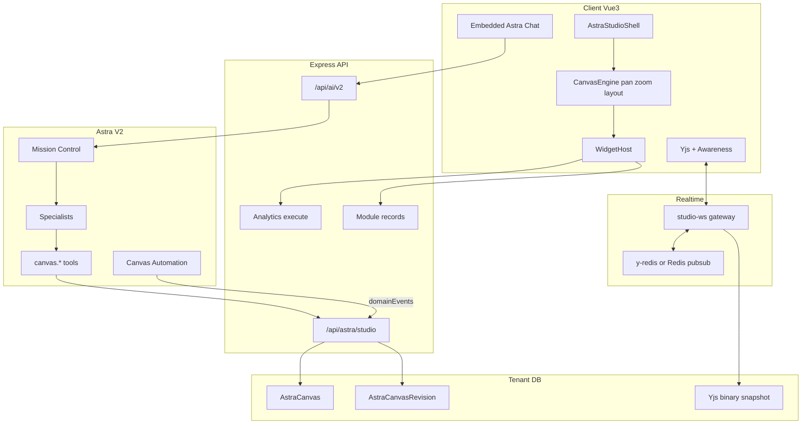
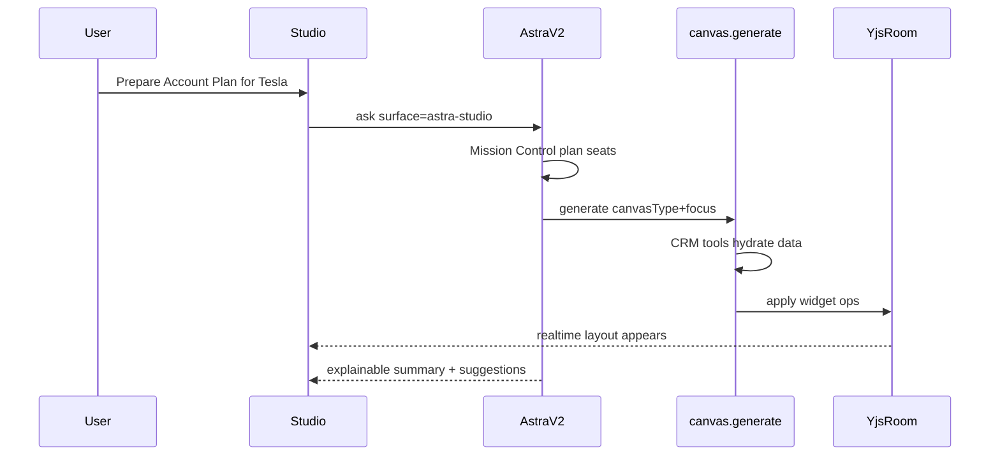

# Astra Studio — End-to-End Implementation Plan

## Product framing

| Name | Role |
|------|------|
| **Astra Studio** | Product shell in Arivu (route, nav, permissions, list/create/share) |
| **Living Canvas** | The spatial workspace runtime (engine + widgets + AI + live sync + multiplayer) |

Vision from the PRD: primary high-value workspace; CRM modules remain structured data stores. Feel: Notion + Miro + Figma + ChatGPT + Salesforce Generative Canvas — grounded in live Arivu data via Astra V2.

**Locked decisions (per your direction):**
- **Full PRD scope** (all canvas types, full widget library, explainable AI, automation, export, collab) — sequenced in delivery waves, not cut to an MVP.
- **Multiplayer from day one** — Yjs CRDT + Awareness (cursors, presence, selection) on a dedicated WebSocket channel; MongoDB persistence of docs + revision snapshots.
- **AI First** — users describe intent; Mission Control builds/mutates the canvas; no blank-canvas-first UX as the default path.

---

## Architecture (maps 1:1 to PRD layers)



### Layer 1 — Canvas Engine (greenfield)
Infinite pan/zoom viewport, sections, freeform absolute layout, drag/resize/group, z-index, templates, version restore, collaborative cursors.

**Choice:** Custom Vue 3 canvas viewport (camera transform + absolute widget frames). Do **not** use GridStack (12-col dashboards) or TipTap Content Studio (linear docs) as the board. Reuse interaction patterns from [`ProcessFlowCanvas.vue`](client/src/components/process-flow/ProcessFlowCanvas.vue) (pan/zoom/selection) and TipTap only **inside** content widgets.

### Layer 2 — Live Widget Engine
Each widget is a typed node: `{ id, type, frame, config, bindings, collapsed }`. Binding points to CRM record(s), analytics report/widget, or AI-generated content with source claims. Widgets refresh data without rewriting layout (preserves user edits).

### Layer 3 — AI Intelligence
Extend Astra V2 — do **not** fork a parallel AI stack. New surface `astra-studio`, canvas context in `contextPacket`, new tools `canvas.generate` / `canvas.mutate` / `canvas.export`, playbooks per canvas type. Specialists already exist for most PRD agents ([`defaultAgentCatalog.js`](server/services/astra/agents/defaultAgentCatalog.js)).

### Layer 4 — Automation
Subscribe to [`server/services/domainEvents.js`](server/services/domainEvents.js) (+ notification domain events). Match open canvases by focus/bindings → incremental widget refresh + dismissible Smart Suggestions (Yjs awareness or side-channel, not destructive layout overwrite).

---

## Reuse vs greenfield

| Reuse | Greenfield |
|-------|------------|
| Astra V2 orchestrator, Mission Control, 19 specialists, confirm/governance/credits | `AstraCanvas` model + Studio REST API |
| Analytics Report/Widget/Chart (`AnalyticsChartView`, KPI, funnel) | Infinite canvas engine + widget host |
| `pinAstraVisualToDashboard` pattern → adapt to **pin-to-canvas** | Yjs multiplayer gateway (no WS/Yjs in repo today) |
| TipTap (rich text / meeting notes widgets) | Canvas document schema + revision timeline |
| Vue Flow (workflow / process / mind-map / relationship graph widgets) | Widget registry + binding/refresh protocol |
| Module record APIs + permissions | Studio shell routes, i18n, RBAC |
| Record comments / presence patterns (evolve, don’t copy HTTP polling as primary) | Export pipeline (layout → PDF/PPT/DOCX/XLSX/HTML) |
| Domain events + `dataChangeService` | Canvas automation + Smart Suggestions service |

---

## Data model (tenant DB)

**`AstraCanvas`**
- `organizationId`, `title`, `canvasType` (enum of all PRD types)
- `focus` — `{ moduleKey, recordId }[]` (deal, org, meeting, etc.)
- `permissions` — owner, editors[], viewers[], linkShare `{ enabled, role }`
- `yjsState` — binary snapshot (or GridFS/S3 for large docs) + `yjsClock`
- `layoutMeta` — viewport defaults, section index
- `status` — `draft | active | archived`
- audit fields + soft delete

**`AstraCanvasRevision`**
- Immutable snapshots (title, yjs blob hash, actor, reason: `manual | ai | checkpoint | restore`)
- Pattern mirrors [`ProcessDefinitionVersion`](server/models/ProcessDefinitionVersion.js)

**`AstraCanvasSuggestion`**
- Proactive AI suggestions tied to canvas + triggering domain event; dismissible

**Widget binding contract (inside Yjs)**
```ts
type CanvasWidget = {
  id: string
  type: WidgetType
  frame: { x: number; y: number; w: number; h: number; z: number }
  sectionId?: string
  config: Record<string, unknown>
  bindings?: { moduleKey?: string; recordIds?: string[]; reportId?: string; widgetId?: string }
  ai?: { claims?: Claim[]; confidence?: number; sources?: SourceRef[] }
  lockedByAi?: boolean // rare; default false so users can edit
}
```

Yjs structure: `Y.Map` root with `widgets` (`Y.Map`), `sections` (`Y.Array`), `meta`. Content widgets store TipTap JSON in `Y.XmlFragment` or nested `Y.Map` for CRDT text where needed.

---

## Multiplayer (day one)

**Stack (concrete):**
- **Yjs** client + **y-protocols** Awareness (cursors, user color, selection, follow)
- **Server:** `ws` gateway process (or Express upgrade) at `/api/astra/studio/ws` with JWT + org + canvas ACL on connect
- **Room sync:** Redis-backed doc provider (`y-redis` or custom Redis pub/sub + in-memory `Y.Doc` per room) for multi-instance K8s
- **Persistence:** debounce write of encoded Yjs update to `AstraCanvas.yjsState`; periodic revision checkpoints
- **Separation of concerns:**
  - **Layout/content edits** → Yjs (multiplayer)
  - **Live CRM payloads** → separate `data` channel (WS message `widget.data` / HTTP refetch) so CRM updates never clobber concurrent human edits

**Permissions on every op:** server rejects updates if user lacks edit role; viewers get Awareness read-only + no Yjs write.

**Comments / mentions / AI comments:** canvas-anchored comment threads stored in Mongo (`AstraCanvasComment`) with optional widget/frame anchors; realtime fanout via WS; reuse mention UX patterns from record comments.

---

## AI integration (Astra V2 extension)

**New files / hooks (extend, don’t replace):**
- Context: surface `astra-studio` + `canvasId` + compact widget inventory in [`contextPacket.js`](server/services/astra/context/contextPacket.js)
- Tools family `canvas`:
  - `canvas.generate` — prompt → typed template layout + seeded widgets (first paint &lt;5s target via parallel tool fanout + progressive fill)
  - `canvas.mutate` — apply structured ops (`addWidget`, `move`, `updateConfig`, `remove`, `replaceSection`) to Yjs via server-side doc apply (broadcast to room)
  - `canvas.suggest` — create dismissible suggestions
  - `canvas.export` — queue export job
- Playbooks in [`playbooks.js`](server/services/astra/orchestrator/playbooks.js) per canvas type (Meeting Prep, War Room, QBR, …)
- Explainability: every AI widget must carry `claims[]` / sources (reuse grounded-claim pipeline from [`docs/ASTRA_V2_ARCHITECTURE.md`](docs/ASTRA_V2_ARCHITECTURE.md))
- Embedded Studio chat: reuse [`useAstraAsk.ts`](client/src/astra/composables/useAstraAsk.ts) with canvas context; AI always mutates current canvas

**Generation flow:**


---

## Canvas types (full PRD — all shipped)

Each type = template definition (sections + default widget set + playbook + focus resolver):

1. Meeting Preparation (+ live notes, post-meeting summary/tasks/email/CRM update)
2. Executive Report (live)
3. Customer 360
4. Opportunity War Room
5. Account Planning
6. Quarterly Business Review
7. Customer Success Plan
8. Renewal Workspace
9. Support Investigation
10. Project Workspace
11. Workflow Design (prompt → Process Flow graph; persist via existing process APIs where applicable)
12. Brainstorming (sticky / SWOT / mind map)
13. Strategy Workspace

Template registry: `server/services/astraStudio/templates/*.js` + client palette metadata.

---

## Widget library (full PRD)

Universal chrome: move, resize, refresh, duplicate, collapse, delete, configure.

| Family | Types | Implementation source |
|--------|-------|---------------------|
| CRM | Deal, Contact, Org, Lead, Case, Quote, Invoice, Product, Campaign, Project, Task | Compact record cards via module APIs + field capability engine |
| AI | Summary, Insights, Recommendations, Risk, NBA | Astra blocks / autonomous NBA adapted to widgets |
| Analytics | Charts, KPI, Leaderboard, Forecast, Funnel, Heatmap | Existing analytics execute + ECharts |
| Visualization | Timeline, Kanban, Calendar, Org Chart, Relationship Graph, Mind Map, Process, BPMN, UML, Whiteboard | Vue Flow / FullCalendar / new diagram widgets; whiteboard = freeform draw layer (Konva) |
| Content | Rich text, Markdown, Checklist, Table, Image, Video, PDF, Code, Document, Embed | TipTap + file/embed components |
| Communication | Email, Meeting Notes, Conversation Timeline, Call Summary | Inbox/meeting/conversation tools already in Astra |

Widget registry: `client/src/astraStudio/widgets/registry.ts` + server allow-list for AI-generated types.

---

## Client product shell

- Routes: `/astra-studio`, `/astra-studio/:canvasId`
- Nav entry under Astra / Platform (permission-gated)
- Screens: canvas list, create-from-prompt, shared link entry, Studio editor (board + left palette + right inspector + bottom/side AI chat + presence avatars)
- Module layout: `client/src/astraStudio/` (parallel to `client/src/astra/`, not mixed into chat-only surfaces)
- i18n: `client/src/locales/*/astraStudio.json`
- PostHog: canvas_created, widget_added, ai_generate, collab_session, export, suggestion_accepted

---

## Security, tenancy, audit

- Inherit CRM record ACLs when rendering bound data (widget shows empty/redacted if unauthorized — never leak via AI)
- Canvas ACL separate but AI outputs inherit workspace permissions
- Audit log: AI actions, widget changes, user edits, approvals, suggestions, generated content (extend Astra governance audit)
- Credits: canvas generate/mutate count as Astra turns

---

## Export

Server job queue (Bull/Redis): render layout snapshot →
- PDF (reuse PDF services patterns)
- HTML shareable snapshot
- XLSX (tabular widgets)
- PPTX / DOCX (new generators — `pptxgenjs` / `docx`)
- Shareable live link (existing canvas ACL)

---

## Performance targets (PRD)

| Metric | Target | Approach |
|--------|--------|----------|
| Initial generate | &lt;5s first useful layout | Progressive: skeleton sections first, widgets hydrate async |
| Widget refresh | &lt;1s after data ready | Cached execute + WS data push |
| Incremental AI mutate | &lt;2s | Structured ops, not full regen |
| 500+ widgets | No UI jank | Virtualize offscreen widgets, canvas culling, debounce Yjs persistence |

---

## Delivery waves (full product, sequenced)

### Wave 0 — Foundation (blocking)
- Models, permissions, REST CRUD, feature flag `ASTRA_STUDIO`
- WebSocket + Yjs Redis provider + Awareness
- Empty canvas engine (pan/zoom, select, frames, multiplayer cursors)
- Studio shell + create blank / open shared

### Wave 1 — AI generate + core live widgets
- `canvas.generate` / `canvas.mutate` + Mission Control playbooks for **Meeting Prep, War Room, Customer 360**
- Widget host: CRM cards, AI summary/insights, analytics chart/KPI, rich text, record list, timeline
- Embedded Studio chat
- Explainable claims on AI widgets
- Revision checkpoints

### Wave 2 — Remaining canvas types + template system
- All other PRD templates + template registry
- Post-meeting actions (tasks, follow-up email, CRM updates via confirm-gated Astra tools)
- Workflow Design → Vue Flow / process definition bridge

### Wave 3 — Living sync + Smart Suggestions + Automation layer
- Domain-event → binding matcher → widget data refresh
- Suggestion inbox (non-intrusive)
- Automation examples from PRD (reply → objection → risk refresh → task suggest)

### Wave 4 — Full visualization & communication widget set
- Kanban, calendar, org/relationship graphs, mind map, whiteboard (Konva), BPMN/UML subset
- Email / conversation / call summary widgets
- Comments, mentions, AI comments, approvals, read-only mode

### Wave 5 — Export, scale, polish
- PDF/HTML/XLSX/PPTX/DOCX + live link
- Virtualization, 500-widget load tests
- Eval harness for generate/mutate fidelity
- Docs: `docs/ASTRA_STUDIO_ARCHITECTURE.md` as SoT; update [`Architecture_Document.md`](Architecture_Document.md) pointer

### Explicitly later (PRD “Future Enhancements” — not Wave 0–5)
Voice, AI meeting copilot, screen share, live presentation mode, simulations, digital twins, marketplace, plugin SDK.

---

## Key extension points (existing code)

- [`server/services/astra/orchestrator/runOrchestrator.js`](server/services/astra/orchestrator/runOrchestrator.js)
- [`server/services/astra/experience/buildUiBlocks.js`](server/services/astra/experience/buildUiBlocks.js) — pattern for structured output; Studio uses canvas ops instead of chat blocks
- [`server/services/analytics/pinAstraVisualToDashboard.js`](server/services/analytics/pinAstraVisualToDashboard.js) — adapt to canvas pin
- [`server/services/domainEvents.js`](server/services/domainEvents.js) — live layer input
- [`client/src/astra/composables/useAstraAsk.ts`](client/src/astra/composables/useAstraAsk.ts)
- Analytics chart stack under `client/src/platform/analytics/` and `client/src/components/analytics/`

## New primary paths

- `server/services/astraStudio/` — canvas service, yjs persistence, templates, automation, export
- `server/routes/astraStudioRoutes.js` + controller + models
- `server/realtime/studioWsGateway.js` — WS auth + Yjs
- `client/src/astraStudio/` — shell, engine, widgets, collab composables

---

## Success metrics (instrument from Wave 1)

- Time spent in Studio vs module navigation (PostHog)
- % workspaces created from a single NL prompt
- Suggestion accept rate; AI action → CRM write completion rate
- Collab sessions with ≥2 editors / week
- Generate P50/P95 latency vs &lt;5s target
