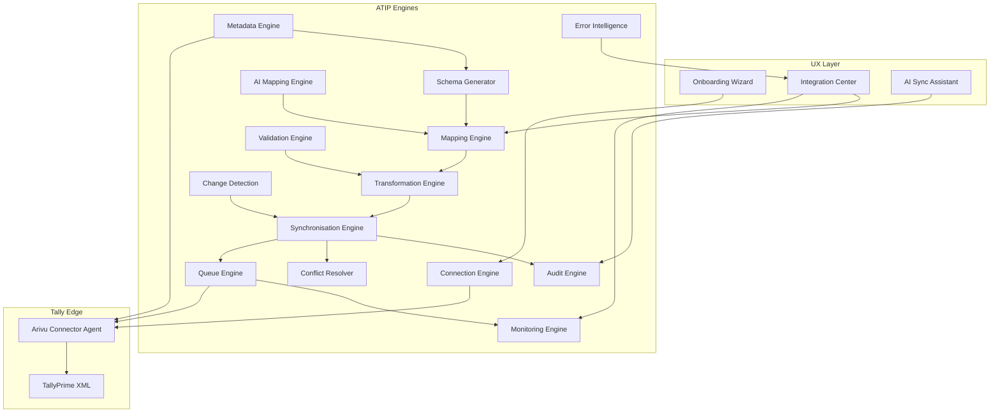

# ATIP End-to-End Rework Plan

## Locked decisions

- **1B — Fully dynamic:** Runtime schemas, fields, relationships, and mapping definitions come from **live Tally metadata discovery** stored/versioned in Arivu. Static catalogs ([`tallyFieldCatalog.js`](server/services/connectors/tally/tallyFieldCatalog.js), [`TALLY_VERIFIED_FIELD_SCHEMA.md`](docs/TALLY_VERIFIED_FIELD_SCHEMA.md)) become **golden regression fixtures + bootstrap hints**, not sync SoT. Hardcoded mappers are retired in favor of the Transformation Engine driven by stored mapping rules.
- **2C — Configurable inbound vouchers:** Defaults stay masters = bidirectional, vouchers = `arivu_to_tally`. When a tenant sets a voucher module to `tally_to_arivu` or `bidirectional`, **inbound create/update into CRM is a supported production path** (not catalog-only).
- **Non-negotiable topology** (from [`docs/TALLY_INTEGRATION_ARCHITECTURE.md`](docs/TALLY_INTEGRATION_ARCHITECTURE.md)): cloud never talks to `:9000`; Windows agent is sole XML client; one write in-flight per company GUID; tenant isolation + addon entitlement + audit retained.
- **Reuse, don’t fork:** Extend existing Integration Engine (`ConnectorOutbox`, `ConnectorSyncJob`, `ConnectorExternalObject`, `ConnectorFieldMapping`, `ConnectorConflict`, `ConnectorSyncEvent`) and Tally services under [`server/services/connectors/tally/`](server/services/connectors/tally/). Do not build a second queue/mapping stack.



---

## Current baseline (what we keep)

**Usable today:** pairing/heartbeat, company discover/bind, outbox + agent poll/ack, orchestrator drain + ordered pulls, module/tax/field mapping CRUD, sync run logs, core master + voucher **outbound** XML, domain outbox hooks, agent EXE + TDL pack, dry-run default.

**Must replace/complete:** static runtime catalogs; hardcoded mappers as SoT; unused field/tax maps at runtime; no AlterID watermarks; conflicts never created; inbound = catalog only; PO/SO/RN/DN thin; Center UI missing health/queue/conflicts/mapping center/wizard/AI; installer/auto-update ops gaps.

---

## Phase 0 — Platform contracts and data model

**Goal:** Codify ATIP engines as first-class services with versioned persistence so dynamic discovery is enforceable.

### New / extended models

| Model | Purpose |
|-------|---------|
| `TallyMetadataSnapshot` | Versioned per-binding discovery dump (objects, collections, methods, fields, enums, relationships, features, Tally version, TDL fingerprint, hash) |
| `TallyObjectSchema` | Normalized per-object schema derived from snapshot (fields, types, keys, children, parents) |
| `TallyGeneratedSchema` | CRM-facing generated module/DTO/validation/API mapping contracts linked to Arivu entity types |
| `TallyMappingVersion` | Versioned module + field mapping set (accept/reject history, confidence, transformation rules) |
| Extend `TallyModuleMapping` | Enforce syncWay including inbound voucher modes; `inboundCreatePolicy` (`draft` \| `posted_if_valid` \| `review_only`); watermark (`lastAlterId`, `lastMasterId`, `lastSyncAt`) actually advanced |
| Extend `TallyCompanyBinding` | Active metadataSnapshotId, schemaVersion, FY, multi-GSTIN flags, SoT overrides |
| Extend `ConnectorSyncEvent` / `TallySyncRunLog` | Correlation ID, before/after, duration, worker, problem/cause/resolution codes |

### Service skeleton (thin facades first)

Create engine entrypoints under `server/services/connectors/tally/engines/`:

- `connectionEngine.js`, `metadataEngine.js`, `schemaGenerator.js`, `mappingEngine.js`, `validationEngine.js`, `transformationEngine.js`, `synchronisationEngine.js` (wraps orchestrator), `changeDetectionEngine.js`, `conflictEngine.js`, `auditEngine.js`, `monitoringEngine.js`, `errorIntelligenceEngine.js`, `aiMappingEngine.js`

Each engine owns one responsibility; orchestrator only sequences them. Existing files become implementations behind these facades (no big-bang rewrite).

### Docs lock

Update [`docs/TALLY_INTEGRATION_ARCHITECTURE.md`](docs/TALLY_INTEGRATION_ARCHITECTURE.md) + ATIP section: 1B/2C decisions, engine boundaries, voucher inbound policy, cancellation-not-delete, voucher number policy, stock SoT.

**Exit:** Models + engine facades + architecture doc updated; no customer behavior change yet.

---

## Phase 1 — Connection Engine (production onboarding)

**Build on:** [`tallyConnectionService.js`](server/services/connectors/tally/tallyConnectionService.js), [`connectors/arivu-agent/`](connectors/arivu-agent/), [`TallyAddonSettings.vue`](client/src/components/settings/TallyAddonSettings.vue).

### Agent discovery (must be automatic)

Detect and report: Tally process running, listening ports `9000–9010`, version (reject ERP9 via [`tallyVersionMatrix.js`](server/constants/tallyVersionMatrix.js)), companies + GUID, FY, license status, TDL pack loaded, XML permissions, company open/closed.

### Cloud

- Multi-instance / multi-company bind (already partial) — harden reconnect, encrypted secrets rotation, company-change detection on heartbeat.
- Connection health state machine: `searching → found → metadata_pending → ready → degraded → offline`.
- Validation checklist persisted and returned by `/dashboard` + wizard APIs.

### UX

Ship 4–8 step wizard (PRD §24) in Integration Center (keys already in i18n): Connect → Detect company → Scan metadata → AI mappings → Review → Start sync → Live progress → Complete. Move pair/bind from Addon Settings into wizard primary path; Settings retains ops controls.

**Exit:** New customer can reach “Ready” in &lt;5 minutes with zero XML/TDL editing for standard TDL pack (TDL auto-prompt/install guidance if missing).

---

## Phase 2 — Metadata Engine (1B core)

**Goal:** Live catalogue replaces static field lists at runtime.

### Agent / TDL

Extend TDL pack ([`connectors/arivu-agent/tdl/`](connectors/arivu-agent/tdl/)) with introspection exports:

- Object list + collections
- Per-collection methods/fields/data types
- Parent/child relationships
- Enumerations / yes-no / GST enums
- Feature flags (GST, multi-currency, payroll, etc.)
- Custom TDL field discovery where exposed via XML

### Cloud `metadataEngine`

1. Enqueue `discover_metadata` job → agent executes introspection XML.
2. Normalize → write `TallyMetadataSnapshot` (immutable version) + upsert `TallyObjectSchema` rows.
3. Diff vs previous snapshot (added/removed/renamed fields) → audit event + mapping invalidation flags.
4. Refresh triggers: Tally version change, TDL fingerprint change, manual refresh, scheduled weekly.

### Deprecation path

- Stop reading [`tallyFieldCatalog.js`](server/services/connectors/tally/tallyFieldCatalog.js) in sync/UI; load from `TallyObjectSchema`.
- Keep verified schema MD + catalog as **CI fixtures**: discovery output for known TallyPrime versions must match golden set (≥N core fields). Fail CI on regression.

**Exit:** Binding has a versioned metadata snapshot; UI field pickers are discovery-driven; golden fixture tests green.

---

## Phase 3 — Schema Generator

**Goal:** From metadata, generate CRM-ready contracts automatically (PRD §7).

### Generator outputs (stored, not codegen to disk necessarily)

Per discovered Tally object → Arivu target candidates:

- Entity model mapping (Ledger→Organizations, Stock Item→Items, …) using **capability registry** of Arivu modules (not hardcoding Tally fields — registry maps *Arivu* entities; Tally side is dynamic).
- Field DTOs with types/constraints
- Validation model (required, GST/PAN patterns, voucher balance rules references)
- Default mapping definition stubs
- Sync eligibility (`supported` \| `reference_only` \| `discover_only` \| `unsupported`)

### Arivu capability registry

Maintain an **Arivu-side** registry (acceptable under 1B): Organizations, People, Items, CatalogCategory, InventoryLocation, Invoice (+types), SalesOrder, PurchaseOrder, PurchaseBill, Payment, JournalEntry, DeliveryNote, ReceiptNote, CostCentre, Tax, etc. Tally objects bind to these via generated schema + user/AI mapping — never assume fixed Tally tag lists in mappers.

### Module coverage (PRD §20) — all must appear in generated catalogue

Company, Groups, Ledgers, Cost Centres/Categories, Stock Groups/Categories/Items, Units, Godowns, Batches, Voucher Types, Currencies, Price Levels, GST Masters, Employees, Payroll Masters, Sales/Purchase Orders, Quotations, Delivery/Receipt Notes, Sales, Purchases, Receipts, Payments, Contra, Journal, Debit/Credit Notes, Stock Journal, Manufacturing Journal, Physical Stock, Payroll Vouchers, Attendance, Bank Transactions.

Unsupported Arivu targets (payroll, manufacturing, physical stock, bank txn where no CRM module) → `discover_only` / reference cache in `ConnectorExternalObject` until product modules exist — still discovered and visible.

**Exit:** After metadata scan, tenant has generated schemas for every discovered object with clear support tier.

---

## Phase 4 — Mapping Engine + AI Mapping Engine

**Build on:** [`tallyFieldMappingService.js`](server/services/connectors/tally/tallyFieldMappingService.js), [`tallyModuleMappingService.js`](server/services/connectors/tally/tallyModuleMappingService.js), [`TallyTaxMapping`](server/models/TallyTaxMapping.js).

### Mapping Engine

- Seed from Schema Generator + AI suggestions into `TallyMappingVersion` / `ConnectorFieldMapping`.
- User Accept / Reject / Modify / Custom map; every change versions.
- **Runtime sync MUST apply stored rules** (today seeds are ignored — this is the critical production gap).
- Tax mappings applied in voucher line GST transformation.
- Module filters enforced: parent groups, exclude system ledgers, postedOnly, dateWindowDays.

### AI Mapping Engine

- Inputs: discovered field names/labels/types, sample values (from metadata/sample pull), Arivu field registry, prior tenant mappings, user corrections.
- Outputs: confidence, suggested map, transform rule, validation recommendation.
- Phase 4a: improve heuristics + embedding/LLM assist behind feature flag.
- Auto-accept threshold from settings (`autoApproveMappingConfidence`, default 0.95); below threshold → review queue.
- Success metric: ≥90% fields auto-mapped on standard chart of accounts (per [`docs/tally_Connector.md`](docs/tally_Connector.md)).

### UI

Mapping Center: pending external objects, field map review, tax map, module direction — wire existing APIs into Vue (today mostly missing).

**Exit:** Changing a field map changes next sync behavior; AI suggestions shown with confidence; version history queryable.

---

## Phase 5 — Validation + Transformation Engines

### Validation Engine (pre-Tally and pre-CRM)

Never enqueue invalid payloads. Rules:

- Mandatory discovered fields
- GSTIN / PAN / HSN
- Duplicate ledger/name checks (against external objects + CRM)
- Invalid parent group
- Invalid stock unit / UOM
- Tax configuration / missing tax map
- Voucher balancing (Dr=Cr)
- FY open / company locked
- Inbound voucher: party/item resolution required before create

Failures return Error Intelligence payloads (problem/cause/resolution) — never raw XML errors to UI.

### Transformation Engine

Replace hardcoded [`mappers/*`](server/services/connectors/tally/mappers/) usage with rule interpreter:

- Boolean ↔ Yes/No
- Date ↔ Tally format
- Currency / qty precision
- Account type ↔ ledger group
- Address structured ↔ Tally ADDRESS list
- Custom transform DSL (expr + enum map + concat) stored on mapping rules

Keep old mappers as **compatibility adapters** until each module’s rule coverage ≥ golden fixture parity, then delete.

**Exit:** Push/pull path is validate → transform(rules) → queue; fixture tests for Ledger, Stock Item, Sales, Purchase, Receipt, CN/DN pass via rules only.

---

## Phase 6 — Change Detection + Synchronisation Engine

### Change Detection

- Prefer AlterID / MasterID / GUID cursors from Tally exports; advance watermarks on `TallyModuleMapping`.
- Detect new / updated / deleted / renamed (name change same GUID) / archived.
- Avoid full DB download after initial sync; full refresh is explicit ops action.

### Synchronisation modes (all first-class)

Initial, incremental, manual, scheduled ([`tallySyncScheduler.js`](server/services/connectors/tally/tallySyncScheduler.js)), background, selective (module/record/date/filter). Directions: CRM→Tally, Tally→CRM, two-way, read-only, write-only via `syncWay`.

### Object sync completeness

| Tier | Objects | Work |
|------|---------|------|
| A — GA masters | Ledger, Group, Stock*, Unit, Godown, Currency, Voucher Type, Cost*, GST masters, Batch | Rule-driven bi-dir + ref cache |
| B — GA commercial | Sales, Purchase, Receipt, Payment, CN, DN, Journal, Contra, SO, PO, DN, RN, Stock Journal | Outbound complete; inbound create when enabled (2C) |
| C — GA inventory extras | Price Levels → CatalogPriceBook; Physical Stock (reconcile); Manufacturing Journal (discover/ref until module) | |
| D — Discover/reference | Employee, Payroll, Attendance, Bank Transactions, Quotations if no CRM module | Catalog + Mapping Center only |

### Inbound voucher create (2C)

When `syncWay` ∈ {`tally_to_arivu`,`bidirectional`} and `inboundCreatePolicy` ≠ `review_only`:

1. Parse voucher via transformation rules.
2. Resolve party/item/godown links (auto-link or create masters per policy).
3. Create CRM draft (default) or posted-if-valid.
4. Idempotent on Tally GUID / MASTERID.
5. Conflicts if Arivu side also changed (Phase 7).
6. Remove hard block that disables sales/purchase inbound create; gate only on module settings.

Honor existing policies: cancel≠delete; Arivu number→REFERENCE; preserve IRN; no draft Arivu→Tally push; stock SoT via canonical inventory path.

**Exit:** Incremental sync uses watermarks; Tier A/B objects sync E2E in both configured directions; inbound invoice create works when enabled.

---

## Phase 7 — Queue, Conflict, Audit, Monitoring, Error Intelligence

### Queue Engine

Harden existing Bull + agent poll path:

- Priority, rate limit, batch, pause/resume/cancel, DLQ, parallel workers **per company affinity**, retry backoff ([`tallySyncConstants.js`](server/services/connectors/tally/tallySyncConstants.js)).
- Fix outbox `operation` enum mismatches (`push` vs create/update/delete/upsert).
- Wire unused `integrations:tally:agent-inbound` or delete and document agent-ack as sole inbound.

### Conflict Resolver

**Produce** conflicts (today only resolve):

- Policies: CRM wins, Tally wins, latest timestamp, ask user, rule-based, admin policy (per binding).
- Log every conflict; UI resolve (API exists).

### Audit Engine

Searchable logs: timestamp, user, module, record, operation, before/after, source/dest, duration, result, worker, correlation ID. Export CSV (partially exists).

### Monitoring Engine — wire UI to `/dashboard`

Connected companies, active/pending/success/failed jobs, retry queue, avg sync time, largest jobs, last sync, connection/API/worker/queue health.

### Error Intelligence

Map Tally/agent errors → business copy + recommendation + doc link + retry. Persist structured codes on sync events.

**Exit:** Operator can diagnose and recover from Integration Center without server logs; conflicts appear and resolve end-to-end.

---

## Phase 8 — Integration Center + AI Sync Assistant (UX)

**Files:** [`TallyIntegrationCenter.vue`](client/src/views/integrations/TallyIntegrationCenter.vue), [`TallyAddonSettings.vue`](client/src/components/settings/TallyAddonSettings.vue), i18n already ahead of UI.

Ship single pane:

1. Wizard (Phase 1)
2. Health dashboard (Phase 7 APIs)
3. Activity timeline (`/events`, `/sync/jobs`)
4. Mapping Center (external objects + field/tax maps)
5. Conflicts
6. Sync settings (modules, schedule, inbound policies)
7. Sync logs
8. Dry-run report UX (warnings before first live sync)
9. AI Sync Assistant panel: natural-language Q&A over audit/jobs (“Why didn’t INV-1045 sync?”, failed GST, duplicates, mapping suggestions) — RAG over tenant sync events + mapping versions; no cross-tenant data.

**Exit:** Spec in [`docs/tally_Connector.md`](docs/tally_Connector.md) matched by shipped Vue; orphaned i18n keys wired.

---

## Phase 9 — Agent production hardening

- Signed installer publish pipeline (CI → CDN/download API); remove placeholder-only [`client/public/connectors/README.txt`](client/public/connectors/README.txt) gap for GA.
- Auto-updater with signed manifests ([`updater.js`](connectors/arivu-agent/src/updater.js)).
- Offline queue durability + replay ([`offlineQueue.js`](connectors/arivu-agent/src/offlineQueue.js)).
- Single-flight XML sequencer stress-tested multi-company.
- Health checks surface in tray + cloud.
- Mock Tally server expanded for metadata introspection + voucher fixtures in CI.

**Exit:** Install → pair → sync path works from published EXE without engineering intervention.

---

## Phase 10 — Enterprise, security, performance, GA

### Enterprise (PRD §21)

Multi-org/tenant (exists), multi-company, multi-FY awareness, multi-user RBAC on integration actions, multi-godown, multi-currency, multi-GSTIN series, HA workers, backup/restore of mapping+metadata versions, disaster recovery runbook.

### Security (PRD §22)

Encrypted credentials, TLS agent↔cloud, RBAC, audit, IP allowlist option, session expiry, secrets management, least-privilege Tally user guidance, never expose `:9000` WAN.

### Performance (PRD §23)

Million-record strategy: batched pulls, watermark increments, parallel companies / serial writes per company, non-blocking UX, backpressure, long-run resume.

### Future ERP readiness (PRD §25)

Keep engine interfaces connector-agnostic (`MetadataEngine`, `MappingEngine`, …) with `connectorKey='tally'` adapter. No SAP/QB implementation in this program — only interface boundaries so ATIP ≠ Tally-only glue.

### GA test matrix

- Unit: transform/validate/rules
- Fixture: golden metadata vs discovery
- Agent integration: mock Tally + real TallyPrime 3.x/4.x lab
- E2E: wizard &lt;5 min, dry-run, live sync masters+vouchers, inbound voucher create, conflict, reconnect, FY lock failures
- Load: large ledger + voucher batch
- Security: tenant isolation tests on all new collections

### Success criteria (PRD)

| Criterion | Measurement |
|-----------|-------------|
| &lt;5 min connect | Timed E2E wizard test |
| AI maps majority | ≥90% auto-map on standard COA |
| Reliable/auditable/recoverable | Retry+DLQ+watermark+audit search |
| Business-user resolution | Error Intelligence + Assistant |
| SMB→Enterprise | Multi-company + HA workers |
| Future ERP | Engine interfaces + no Tally leaks in core queue/audit |

---

## Execution order (dependency-safe)

```text
P0 contracts
 → P1 Connection + Wizard shell
 → P2 Metadata (1B) ──→ P3 Schema Generator ──→ P4 Mapping+AI (runtime apply)
 → P5 Validation+Transformation (retire hardcoded mappers)
 → P6 Change detection + full object sync + inbound vouchers (2C)
 → P7 Queue/Conflict/Audit/Monitor/Errors
 → P8 Center UX + Assistant (can start UI shells earlier in parallel with P6)
 → P9 Agent hardening (parallel from P1)
 → P10 Enterprise/security/perf/GA
```

Parallel tracks after P0: **Agent/TDL**, **Cloud engines**, **Vue Center**.

---

## Explicit non-goals (this program)

- Replacing Integration Engine with a new framework
- Cloud direct-to-Tally XML
- IRN generation via GSP (preserve only)
- Building SAP/Dynamics/NetSuite connectors (interfaces only)
- Dual stock deduction paths
- Hard-delete of synced vouchers via connector

---

## Primary code touchpoints

- Cloud: [`server/services/connectors/tally/`](server/services/connectors/tally/), [`server/routes/tallyConnectorRoutes.js`](server/routes/tallyConnectorRoutes.js), [`server/models/Tally*.js`](server/models/), shared `Connector*` models/services
- Agent: [`connectors/arivu-agent/`](connectors/arivu-agent/)
- UI: [`TallyIntegrationCenter.vue`](client/src/views/integrations/TallyIntegrationCenter.vue), [`TallyAddonSettings.vue`](client/src/components/settings/TallyAddonSettings.vue)
- Docs: [`docs/TALLY_INTEGRATION_ARCHITECTURE.md`](docs/TALLY_INTEGRATION_ARCHITECTURE.md), [`docs/tally_Connector.md`](docs/tally_Connector.md), field mapping plan absorbed into generated schemas (not static matrices as SoT)
