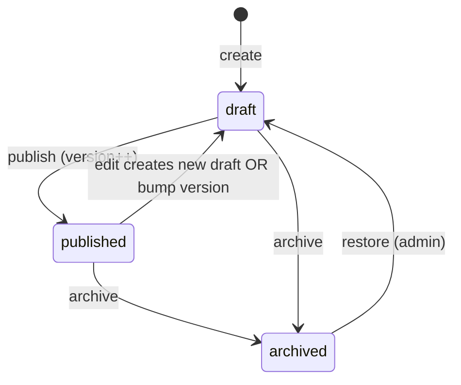

# Analytics Platform — Architecture (A0)

**Status:** A0 — Engineering source of truth  
**Date:** 2026-07-03  
**Roadmap:** [`ANALYTICS_PLATFORM_ROADMAP.md`](./ANALYTICS_PLATFORM_ROADMAP.md)

**Field specs:** [`Analytics Fields.md`](./Analytics%20Fields.md) · [`Analytics Widget Fields.md`](./Analytics%20Widget%20Fields.md) · [`Analytics Dashboard Fields.md`](./Analytics%20Dashboard%20Fields.md)

**Related codebase:** `Architecture_Document.md` · `platform-permission-contract.md` · `filterQueryAstCompiler.ts` · `rolePermissionCatalogService.js`

---

## 1. Executive summary

The Analytics Platform is a **platform-core capability** — not a SALES-only module. Three assets:

| Asset | Responsibility | Model |
|-------|----------------|-------|
| **Report** | Data definition — query, filters, grouping, aggregation | `AnalyticsReport` |
| **Widget** | Visualization — ECharts config bound to a report | `AnalyticsWidget` |
| **Dashboard** | Layout — GridStack placements + global variables | `AnalyticsDashboard` |

All execution flows through a **centralized Analytics Engine** with tenant isolation, module RBAC, and optional Redis cache + Bull async queue.

---

## 2. Architectural principles

| Principle | Rule |
|-----------|------|
| Platform-native | Routes under `/api/analytics/*`; not gated by `requireSalesApp` |
| Three-asset separation | Reports = data; Widgets = viz; Dashboards = layout only |
| Tenant isolation | `organizationId` on every asset + every query; `wrapTenantModel` + `tenantContext` |
| Metadata-driven fields | Field picker reads `ModuleDefinition` + field metadata — no hardcoded columns |
| Reuse platform filters | `filterTree` compiles via existing filter AST (`filterQueryAstCompiler`) |
| No eval | Formula engine uses whitelist AST only |
| Async heavy queries | `executionMode: async` → Bull worker when over threshold |
| Version pinning | Schedules and published widgets pin to **published** report version |
| Auditability | Publish/run/export events → platform activity trail |
| Legacy coexistence | `/api/reports` deprecated; migration to `/api/analytics/reports` |

---

## 3. System context

```text
┌─────────────────────────────────────────────────────────────────────────┐
│  client/ — Vue 3 SPA                                                     │
│  views/analytics/* · platform/analytics/echarts/* · GridStack designer │
└───────────────────────────────┬─────────────────────────────────────────┘
                                │ apiClient → /api/analytics/*
┌───────────────────────────────▼─────────────────────────────────────────┐
│  server/ — Express 5                                                     │
│  routes/analytics*Routes.js → controllers → services/analyticsEngine     │
│  middleware: protect → organizationIsolation → checkPermission           │
└───────────────────────────────┬─────────────────────────────────────────┘
                                │
        ┌───────────────────────┼───────────────────────┐
        ▼                       ▼                       ▼
  Tenant MongoDB            Redis cache              Bull queue
  analyticsreports          result TTL               analyticsExecute
  analyticswidgets                                   analyticsSchedule
  analyticsdashboards
  analyticsexecutions
  (source modules: deals, cases, people, …)
```

---

## 4. Data model

### 4.1 Collections (tenant DB)

| Collection | Model | Purpose |
|------------|-------|---------|
| `analyticsreports` | `AnalyticsReport` | Report definitions |
| `analyticswidgets` | `AnalyticsWidget` | Widget definitions |
| `analyticsdashboards` | `AnalyticsDashboard` | Dashboard layouts |
| `analyticsexecutions` | `AnalyticsExecution` *(A1)* | Execution audit log |
| `analyticsschedules` | `AnalyticsSchedule` *(A6)* | Cron jobs |
| `analyticssnapshots` | `AnalyticsSnapshot` *(A6)* | Materialized results |
| `analyticscollections` | `AnalyticsCollection` *(A5)* | Folders |

Constants: `server/constants/analytics.js`  
Types: `client/src/types/analytics.types.ts`

### 4.2 Asset lifecycle



**Rules:**
- Only **published** reports execute in production contexts (dashboards, schedules, API).
- Preview mode may execute **draft** with row cap (`rowLimit`).
- `version` increments on publish; widgets may pin `reportVersion`.
- Soft-delete via `status: archived`; hard-delete blocked when `widgetCount > 0`.

### 4.3 Entity relationships

```text
AnalyticsReport (1) ──→ (N) AnalyticsWidget
AnalyticsWidget (N) ──→ (N) AnalyticsDashboard  [via layout[].widgetId]
AnalyticsReport ──→ AnalyticsSchedule / Alert / API  [A6–A8]
```

---

## 5. Analytics Engine (A1)

### 5.1 Execution pipeline

```text
POST /api/analytics/reports/:id/execute
  │
  ├─ Load report (published or draft+preview)
  ├─ Resolve user permission on primaryModule (+ related modules)
  ├─ Compile filterTree → Mongo $match (reuse filter AST compiler port)
  ├─ Apply ownership / viewAll scope from runtimePermissionResolver
  ├─ Compile selectedFields, rowGroups, aggregations → aggregation pipeline
  ├─ Apply rowLimit / pagination
  ├─ Execute on tenant connection
  ├─ Write analyticsexecutions log
  ├─ Update report runtime stats (lastExecutedAt, executionCount, …)
  └─ Return { columns, rows, meta }
```

### 5.2 Module registry (MVP → expand)

| Phase | Modules |
|-------|---------|
| A1 MVP | `deals`, `people`, `tasks`, `cases`, `quotes` |
| A1.1 | + `events`, `organizations`, `items`, `forms` |
| A1.1 joins | 1-hop via `RelationshipInstance` |
| A8 | Cross-app joined reports |

Module → Mongoose model mapping lives in `server/services/analytics/analyticsModuleRegistry.js` *(A1)*.

### 5.3 Security

1. **Tenant boundary:** `organizationId` required on every pipeline stage.
2. **Module RBAC:** User must have `read` on `primaryModule` (via `runtimePermissionResolver`).
3. **Row-level:** Inject ownership filter when module lacks `viewAll` / `scope: all`.
4. **Field-level:** Strip `selectedFields` the user cannot read *(A1.1 — field metadata)*.
5. **Widget filterOverrides:** Cannot broaden beyond user's data scope.

### 5.4 Caching

| Key | TTL |
|-----|-----|
| `(orgId, reportId, version, filterHash, userScopeHash)` | `cacheDuration` minutes (report default 15) |

Invalidate on report publish/update. Dashboard `cacheSharedResults: true` shares cache across widgets on same filter set.

### 5.5 Async execution

| Condition | Mode |
|-----------|------|
| Estimated rows < 5k AND runtime < 3s | `sync` |
| Otherwise | `async` — Bull job `analyticsExecute`; poll `GET /api/analytics/executions/:id` |

---

## 6. API surface

Full route table: [`ANALYTICS_API.md`](./ANALYTICS_API.md)

Mount point (A1):

```javascript
// server/server.js
app.use('/api/analytics/reports', analyticsReportRoutes);
app.use('/api/analytics/widgets', analyticsWidgetRoutes);   // A3
app.use('/api/analytics/dashboards', analyticsDashboardRoutes); // A4
app.use('/api/analytics', analyticsMetaRoutes); // home, search, catalog, executions
```

**Not** mounted under SALES middleware chain. Uses:

```javascript
router.use(protect);
router.use(organizationIsolation);
router.use(checkFeatureAccess('analytics')); // org subscription flag — A1
// NO requireSalesApp
```

Legacy redirect (A1):

```javascript
app.use('/api/reports', legacyReportRoutes); // deprecated → proxy or 301 to analytics
```

---

## 7. Permissions

Authoritative matrix: [`ANALYTICS_PERMISSION_MATRIX.md`](./ANALYTICS_PERMISSION_MATRIX.md)  
Constants: `server/permissions/analyticsPermissions.js`

### 7.1 Integration with existing RBAC

LiteDesk today registers `reports` as a **platform-admin module** in `rolePermissionCatalogService.js` with actions: `read`, `create`, `update`, `delete`, `export`.

**A0 decision — transitional mapping:**

| Analytics action | Legacy `reports` envelope | New module key *(A1 catalog)* |
|------------------|---------------------------|-------------------------------|
| View list/detail | `read` | `analytics_reports.read` |
| Create/edit draft | `create` / `update` | `analytics_reports.create` / `.update` |
| Publish | *(new)* | `analytics_reports.publish` |
| Execute | `read` | `analytics_reports.execute` |
| Export | `export` | `analytics_reports.export` |
| Delete | `delete` | `analytics_reports.delete` |
| Schedule | *(new)* | `analytics_reports.schedule` |
| Widget CRUD | *(new)* | `analytics_widgets.*` |
| Dashboard CRUD | *(new)* | `analytics_dashboards.*` |
| Certify / admin | `settings` or owner | `analytics_admin.*` |

During transition, `checkPermission('reports', 'view')` aliases to `analytics_reports.read` via middleware adapter *(A1)*.

### 7.2 Feature entitlement

Add org feature flag `analytics` on `Organization.subscription.features` (same pattern as other modules). Checked by `checkFeatureAccess('analytics')`.

---

## 8. Frontend architecture

### 8.1 Route structure *(A2+)*

```text
/analytics                     → AnalyticsHome.vue
/analytics/reports             → ReportList.vue
/analytics/reports/:id         → ReportSummary.vue
/analytics/reports/:id/edit    → ReportBuilder.vue
/analytics/widgets             → WidgetLibrary.vue
/analytics/widgets/:id         → WidgetSummary.vue
/analytics/dashboards          → DashboardList.vue
/analytics/dashboards/:id      → DashboardView.vue
/analytics/dashboards/:id/edit → DashboardDesigner.vue
```

Register via platform sidebar — `navigation.analytics` i18n key; not under SALES-only nav.

### 8.2 ECharts integration

| Path | Purpose |
|------|---------|
| `client/src/platform/analytics/echarts/analyticsChartTheme.ts` | Design tokens → ECharts theme |
| `client/src/platform/analytics/echarts/useAnalyticsChart.ts` | Vue composable |
| `client/src/platform/analytics/echarts/chartStates.ts` | Empty / error / loading |
| `client/src/components/analytics/charts/*` | Typed chart wrappers *(A3)* |

**Dependency:** `echarts` + `vue-echarts` added in **A3** (not A0). Theme tokens drafted against Arivu Design Tokens v1.0 (`main.css` @theme).

### 8.3 GridStack

Reuse pattern from `client/src/components/common/SummaryView.vue` for Dashboard Designer.

### 8.4 i18n

Namespace: `analytics` in `client/src/locales/{lang}/analytics.json`.  
Empty states: `FIRST_TIME` / `NO_DATA` / `NO_ACCESS` / `NOT_CONFIGURED` per onboarding merge checklist.

---

## 9. Migration from legacy `Report`

Script: `server/scripts/migrateLegacyReportsToAnalytics.js`

| Legacy (`reports`) | Target (`analyticsreports`) |
|--------------------|-------------------------------|
| `entity` | `primaryModule` (`contacts` → `people`) |
| `filters[]` | `filterTree` (convert to AST) |
| `groupBy[]` | `rowGroups` |
| `metrics[]` | `aggregations` |
| `chartType` | → create default `AnalyticsWidget` |
| `reportType` | `category` / `type` mapping |
| `isPublic` | `visibility: organization` |
| `sharedWith[]` | `sharedWith` JSON |

See script header for dry-run usage. Legacy collection retained until migration verified.

---

## 10. Observability

| Event | PostHog *(client)* | Server log |
|-------|-------------------|------------|
| Report created | `analytics_report_created` | activity |
| Report published | `analytics_report_published` | activity |
| Report executed | `analytics_report_executed` | `analyticsexecutions` |
| Dashboard viewed | `analytics_dashboard_viewed` | `viewCount` increment |

---

## 11. Phase gates

| Phase | Entry | Exit |
|-------|-------|------|
| **A0** | PRS + field specs | This doc + API + permissions + wireframes + theme tokens ✅ |
| **A1** | A0 signed off | Engine executes Tabular/Summary on deals |
| **A2** | A1 | Report Builder UI |
| **A3** | A1 | Widget + ECharts |
| **A4** | A2 + A3 | Dashboard Designer |

---

## 12. Open decisions (post-A0)

| # | Decision | Recommendation |
|---|----------|----------------|
| 1 | Catalog keys: extend `reports` vs new `analytics_*` modules | Add `analytics_widgets`, `analytics_dashboards` to catalog in A1; alias `reports` → reports CRUD during transition |
| 2 | `analyticsexecutions` separate collection vs embedded | Separate collection (query history at scale) |
| 3 | Real-time dashboards | Defer to post-GA (WebSocket / polling only in A4) |

---

*A0 architecture v1 — 2026-07-03*
