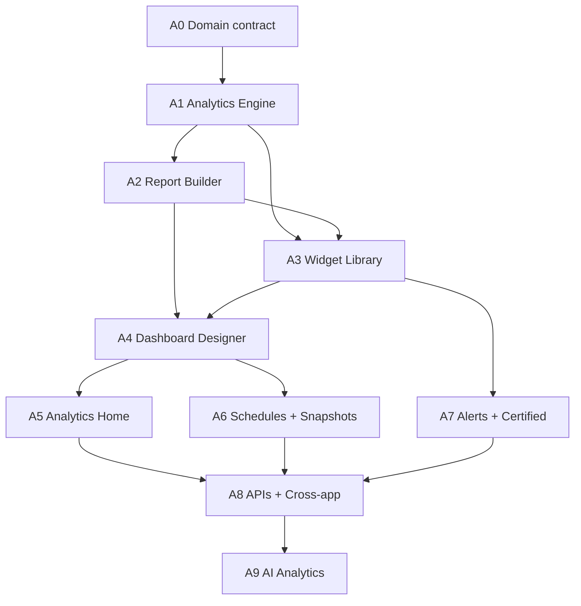

# Analytics Platform — Implementation Roadmap

**Source PRS:** Arivu Analytics Platform Product Requirements Specification (user-provided, 2026-07-03)

**Strategic direction:** Build a **platform-native Analytics Platform** in core — not a SALES-only reporting screen. Three first-class assets: **Reports** (datasets), **Widgets** (visualizations), **Dashboards** (layouts). Apache **ECharts** is the visualization standard for all new analytics UI.

**Prerequisite:** Existing platform contracts — `ModuleDefinition`, field metadata, `filterQueryAstCompiler`, `/api/relationships`, tenant isolation, RBAC.

**Out of scope (initial releases):** AI Analytics (Phase 8), embedded analytics SDK, real-time streaming dashboards.

**Field specs:** [`Analytics Fields.md`](./Analytics%20Fields.md) · [`Analytics Widget Fields.md`](./Analytics%20Widget%20Fields.md) · [`Analytics Dashboard Fields.md`](./Analytics%20Dashboard%20Fields.md)

**A0 docs:** [`ANALYTICS_PLATFORM_ARCHITECTURE.md`](./ANALYTICS_PLATFORM_ARCHITECTURE.md) · [`ANALYTICS_API.md`](./ANALYTICS_API.md) · [`ANALYTICS_PERMISSION_MATRIX.md`](./ANALYTICS_PERMISSION_MATRIX.md) · [`ANALYTICS_UX_WIREFRAMES.md`](./ANALYTICS_UX_WIREFRAMES.md)

**Models:** `server/models/AnalyticsReport.js` · `AnalyticsWidget.js` · `AnalyticsDashboard.js`  
**Types:** `client/src/types/analytics.types.ts`  
**Constants:** `server/constants/analytics.js` · `server/permissions/analyticsPermissions.js`  
**ECharts tokens:** `client/src/platform/analytics/echarts/`  
**Migration:** `server/scripts/migrateLegacyReportsToAnalytics.js`

**Last updated:** 2026-07-03

---

## Progress tracker

| Phase | Status | Deliverable |
|-------|--------|-------------|
| **A0** — Domain contract + architecture spec | ✅ Done | Asset model, permissions, API surface, ECharts standards |
| **A1** — Analytics Engine (MVP) | ✅ Done | Query compiler, execution, tenant-safe aggregation |
| **A2** — Report Builder (MVP) | ✅ Done | List, builder, filters, preview, publish, export, row actions, RBAC catalog |
| **A3** — Widget Library (MVP) | ✅ Done | ECharts, widget CRUD, builder, KPI thresholds, templates, list tabs/row actions |
| **A4** — Dashboard Designer (MVP) | ✅ Done | GridStack designer, date variables, drill-down, share, HELPDESK embed, sidebar |
| **A5** — Analytics Home + IA | ✅ Done | Home, search, favorites, folders, trash, settings; Reports only in sidebar |
| **A6** — Schedules + Snapshots | ✅ Done | Cron schedules, CSV email, snapshots, Bull worker, management UI |
| **A7** — Alerts + certified assets | ✅ Done | Threshold alerts, certification, usage counters |
| **A8** — APIs + cross-app + embed | ✅ Done | v1 API tokens, cross-app joins, embed, Helpdesk migration |
| **A9** — AI Analytics | 🔮 Future | NL query, anomaly detection, AI dashboard generation |

---

## 1. PRS analysis summary

### 1.1 Product vision

The PRS reframes “Reports” from a single module into a **unified Analytics Platform**:

| Asset | Role |
|-------|------|
| **Report** | Reusable analytical dataset — filters, grouping, formulas, dimensions, metrics |
| **Widget** | Reusable visual component bound to one report (+ formatting, thresholds, interactions) |
| **Dashboard** | Workspace of widgets — layout, variables, drill-down, templates |

Everything else (filters, formulas, alerts, schedules, permissions, exports, AI) **supports** these three assets.

### 1.2 Core philosophy (locked)

- No-code BI for operational CRM/helpdesk/audit data
- Assets are **reusable**, **versioned**, **shareable**, and **permissioned**
- Cross-application analytics (SALES, HELPDESK, PROJECTS, AUDIT, etc.)
- Certified reports for governance; usage analytics for adoption

### 1.3 Recommended information architecture

```
Analytics Home
├── Reports        (My · Shared · Scheduled · Drafts · Archived)
├── Dashboards     (Personal · Team · Executive · App Dashboards)
├── Widgets        (Library · Templates · Favorites)
├── Schedules
├── Alerts
├── Snapshots
├── Asset Library  (collections / folders)
├── Recycle Bin
└── Settings
```

### 1.4 PRS documentation phases (design deliverables)

| PRS Phase | Scope |
|-----------|-------|
| 1 — Product Vision | Personas, principles, asset lifecycle, report lifecycle |
| 2 — Information Architecture | Navigation, module hierarchy, permissions, asset organization |
| 3 — UX Specification | Landing pages, list views, builders, summary pages, a11y, keyboard, responsive |
| 4 — Report Builder | Data sources, relationship explorer, field picker, filters, formulas, grouping, preview, publish, versioning |
| 5 — Dashboard Designer | Drag-and-drop, widget management, variables, drill-down, responsive layouts, templates |
| 6 — Widget Library | Catalog, configuration, thresholds, formatting, interactions, visualization standards |
| 7 — Analytics Engine | Query engine, caching, scheduling, snapshots, execution queue, multi-tenant execution |
| 8 — AI Analytics | NL reporting, AI dashboards, anomaly detection, forecasting (Future) |

### 1.5 Additional capabilities (post-MVP backlog)

Analytics Home KPIs · Report/Dashboard/Widget summary pages · Global Analytics Search · Collections/folders · Data catalog & lineage · Execution history & performance metrics · Certified reports · Usage analytics · Real-time dashboards · Embedded analytics · Process Designer automation integration · AI-assisted creation

### 1.6 PRS implementation priority (mapped to engineering)

| PRS Priority | Engineering phase |
|--------------|-------------------|
| PRS + UX wireframes | **A0** |
| Report Builder | **A2** (depends on **A1**) |
| Dashboard Designer | **A4** (depends on **A2**, **A3**) |
| Widget Library | **A3** (parallel with **A2** after **A1**) |
| Analytics Engine | **A1** (foundation — build first) |
| APIs & Integrations | **A8** |
| AI Analytics | **A9** |

> **Report field spec:** [`Analytics Fields.md`](./Analytics%20Fields.md) defines the Report entity contract. Widget and Dashboard field specs to follow in A0. Reconcile any future Analytics Engine doc deltas against that file before **A1** coding starts.

---

## 2. Current state in Arivu

| Area | Status | Notes |
|------|--------|-------|
| `Report` model | 🟡 Stub | `server/models/Report.js` — basic schema; entities limited to deals/contacts/tasks/events/forms |
| Reports API | 🟡 Stub | CRUD works; `runReport` / `exportReport` are TODO stubs |
| Reports routes | 🟡 SALES-only | `requireSalesApp`, `checkFeatureAccess('reports')` — must become platform core |
| Dashboard layout | ✅ Pattern exists | GridStack in `SummaryView.vue` — reuse for Dashboard Designer |
| Charting | 🟡 Mixed | Chart.js in stack; **new analytics uses ECharts only** |
| Filter infrastructure | ✅ Reusable | `filterQueryAstCompiler`, `filterNormalizer`, field metadata |
| Relationships | ✅ Reusable | `/api/relationships`, `RelationshipInstance` — Report Builder join source |
| Async jobs | ✅ Reusable | Bull + Redis — schedules, exports, snapshot materialization |
| Siloed analytics | 🟡 Fragmented | Marketing reports, Helpdesk analytics, Form analytics, Live Chat reports, Notification analytics — migrate to platform widgets over time |
| KPIs / Targets | 🟡 Separate | `targets` / `targetassignments` — integrate as widget types in **A3** |
| Permissions | 🟡 Partial | `reports: view|create|edit|delete|export` on SALES routes only |

### Architectural gap

Today’s `Report` is a **saved query config** without an execution engine, widget layer, or dashboard composition. The PRS requires elevating analytics to a **first-class platform capability** with three linked asset types and a shared engine.

---

## 3. Architectural principles (locked)

| Principle | Implementation rule |
|-----------|---------------------|
| Platform-native | Analytics is a **core platform app/module**, not SALES-scoped; app dashboards consume the same engine |
| Three-asset model | Report → Widget → Dashboard; no orphan visualizations |
| Tenant isolation | Every query, cache key, snapshot, and asset scoped by `organizationId`; engine runs inside `tenantContext` |
| Permission parity | Server enforces asset ACLs; row-level data respects module RBAC + ownership filters |
| Metadata-driven | Field picker reads `ModuleDefinition` + field metadata; no hardcoded column lists per module |
| Reuse platform filters | Report filters compile to existing `filterQuery` AST where possible |
| ECharts standard | All new widgets use Apache ECharts via thin Vue wrappers; Chart.js remains for legacy surfaces until migrated |
| Async by default | Heavy queries, schedules, exports, snapshots run via Bull queue — never block HTTP |
| Versioned assets | Reports/dashboards/widgets support draft → published versions; execution uses published snapshot |
| Auditability | Create/update/publish/run/export events logged to platform activity/audit trail |

```text
┌─────────────────────────────────────────────────────────────────┐
│  Analytics Home · App Dashboards · Embedded (future)            │
└────────────────────────────┬────────────────────────────────────┘
                             │
┌────────────────────────────▼────────────────────────────────────┐
│  Dashboards (GridStack layout, variables, drill-down)          │
│       └── Widget instances → Widget definitions                 │
└────────────────────────────┬────────────────────────────────────┘
                             │
┌────────────────────────────▼────────────────────────────────────┐
│  Widgets (ECharts + table + KPI; thresholds, formatting)        │
│       └── bound to Report (version pin)                         │
└────────────────────────────┬────────────────────────────────────┘
                             │
┌────────────────────────────▼────────────────────────────────────┐
│  Analytics Engine                                               │
│  query compiler · relationship joins · aggregations · formulas  │
│  execution queue · result cache · snapshots · export renderers  │
└────────────────────────────┬────────────────────────────────────┘
                             │
┌────────────────────────────▼────────────────────────────────────┐
│  Platform data: Module records · Relationships · Custom fields  │
│  Tenant DB (MongoDB) · Redis cache · Bull workers               │
└─────────────────────────────────────────────────────────────────┘
```

---

## 4. Technology decisions

### 4.1 Apache ECharts

| Decision | Detail |
|----------|--------|
| Package | `echarts` + `vue-echarts` (or lightweight wrapper composable) |
| Scope | All Analytics Platform widgets — bar, line, area, pie, funnel, gauge, heatmap, scatter, combo |
| Theming | Single theme module aligned with Tailwind design tokens (light/dark) |
| Interactions | Drill-down, cross-filter, tooltip, zoom — configured per widget, not ad hoc |
| Legacy | Chart.js surfaces (forms analytics, helpdesk dashboard) **not migrated in MVP**; add migration epic post-**A4** |

### 4.2 Dashboard layout

Reuse **GridStack** (already in `client/package.json`, proven in `SummaryView.vue`).

### 4.3 Analytics Engine

Server-side query compilation to MongoDB aggregation pipelines:

- Primary entity module + optional relationship joins (1-hop MVP, 2-hop in **A1.1**)
- Filter AST from platform filter compiler
- Group-by dimensions, metric aggregations, calculated formulas (safe expression evaluator — no `eval`)
- Result shape: `{ columns[], rows[], meta: { totalRows, truncated, executionMs } }`
- Cache: Redis keyed by `(orgId, reportVersionId, filterHash, userScopeHash)` with TTL

---

## 5. Data model (target)

### 5.1 Core collections (tenant DB)

| Collection | Purpose |
|------------|---------|
| `analytics_reports` | Report definition + versions (replace/extend current `reports`) |
| `analytics_widgets` | Widget definition + chart/table config + report binding |
| `analytics_dashboards` | Dashboard layout JSON (GridStack), widget placements, variables |
| `analytics_executions` | Execution history, duration, row counts, errors |
| `analytics_snapshots` | Materialized result payloads (point-in-time) |
| `analytics_schedules` | Cron, recipients, format, linked report/dashboard |
| `analytics_alerts` | Threshold rules, notification channels |
| `analytics_collections` | Folders/collections for asset organization |

### 5.2 Report definition schema (`analytics_reports`)

Source: [`Analytics Fields.md`](./Analytics%20Fields.md). Arivu adaptations noted inline.

#### Basic information

| Field | Type | Req | Phase | Notes |
|-------|------|-----|-------|-------|
| `_id` | ObjectId | ✅ | A0 | Mongo primary key (spec uses UUID) |
| `organizationId` | ObjectId | ✅ | A0 | Tenant scope — required on all queries |
| `name` | String | ✅ | A0 | Display name |
| `apiName` | String | ✅ | A0 | Unique per org; slug for API/automation |
| `description` | String | | A0 | |
| `type` | Enum | ✅ | A1 | See §5.2.1 — MVP: Tabular, Summary, KPI |
| `category` | Enum | | A2 | Sales, Support, Inventory, Finance, Custom |
| `folderId` | ObjectId | | A5 | → `analytics_collections` |
| `status` | Enum | ✅ | A0 | `draft` \| `published` \| `archived` |
| `version` | Integer | ✅ | A0 | Increment on publish |
| `tags` | String[] | | A2 | Search |
| `favorite` | Boolean | | A5 | Per-user via preference or join table |
| `icon` | String | | A2 | |
| `color` | String | | A2 | Accent |

#### Data source

| Field | Type | Req | Phase | Notes |
|-------|------|-----|-------|-------|
| `primaryModule` | String | ✅ | A1 | Exactly one primary module (business rule) |
| `relatedModules` | String[] | | A1.1 | Joined / Cross Module types |
| `relationships` | JSON | | A1.1 | Relationship join definitions |
| `joinType` | Enum | | A1.1 | `inner` \| `left` \| `right` |
| `baseCollection` | String | | A1 | Derived from module registry — not user-editable |

#### Selected fields

| Field | Type | Req | Phase | Notes |
|-------|------|-----|-------|-------|
| `selectedFields` | JSON | ✅ | A1 | Column/dimension picker output |
| `hiddenFields` | JSON | | A2 | |
| `calculatedFields` | JSON | | A1.1 | Formula engine |
| `customLabels` | JSON | | A2 | Display label overrides |
| `displayOrder` | JSON | | A2 | Column ordering |

#### Filters

| Field | Type | Req | Phase | Notes |
|-------|------|-----|-------|-------|
| `filterTree` | JSON | | A1 | Platform `FilterGroupNode` AST |
| `filterLogic` | Enum | | A1 | `AND` \| `OR` at root |
| `dynamicFilters` | JSON | | A1.1 | Current User, Team, Role |
| `relativeDateFilters` | JSON | | A1 | Today, This Month, YTD |
| `runtimeFilters` | Boolean | | A2 | Prompt user before execute |

#### Sorting & grouping

| Field | Type | Req | Phase | Notes |
|-------|------|-----|-------|-------|
| `sorting` | JSON | | A1 | Multi-column sort |
| `rowGroups` | JSON | | A1 | Summary/Matrix types |
| `columnGroups` | JSON | | A1.2 | Matrix/Pivot |
| `groupOrder` | Enum | | A1 | `asc` \| `desc` |

#### Aggregation

| Field | Type | Req | Phase | Notes |
|-------|------|-----|-------|-------|
| `aggregations` | JSON | | A1 | SUM, AVG, COUNT, MIN, MAX |
| `showGrandTotal` | Boolean | | A1 | |
| `showSubTotals` | Boolean | | A1 | Summary type |
| `distinctCount` | Boolean | | A1.1 | |

#### Formula engine

| Field | Type | Req | Phase | Notes |
|-------|------|-----|-------|-------|
| `formulas` | JSON | | A1.1 | Whitelist expression AST |
| `variables` | JSON | | A1.1 | |
| `executionOrder` | JSON | | A1.1 | Dependency sort |

#### Time intelligence

| Field | Type | Req | Phase | Notes |
|-------|------|-----|-------|-------|
| `dateField` | String | | A1.1 | Trend type |
| `comparisonPeriod` | Enum | | A1.2 | Previous Month/Quarter/Year |
| `rollingWindow` | Integer | | A1.2 | Rolling N periods |

#### Output & performance

| Field | Type | Req | Phase | Notes |
|-------|------|-----|-------|-------|
| `pagination` | Boolean | | A2 | |
| `pageSize` | Integer | | A2 | |
| `rowLimit` | Integer | | A1 | Preview cap |
| `showRecordCount` | Boolean | | A2 | |
| `cacheEnabled` | Boolean | | A1 | Default true for published |
| `cacheDuration` | Integer | | A1 | Minutes; org default in settings |
| `executionMode` | Enum | | A1 | `sync` \| `async` — auto by row estimate |
| `queryTimeout` | Integer | | A1 | Seconds; org cap |

#### Scheduling & export (embedded vs normalized)

Report embeds schedule/export **preferences**; runtime jobs live in `analytics_schedules` (**A6**).

| Field | Type | Req | Phase | Notes |
|-------|------|-----|-------|-------|
| `schedulingEnabled` | Boolean | | A6 | |
| `schedule` | JSON | | A6 | Cron + timezone |
| `deliveryChannels` | JSON | | A6 | Email, Notification, Process |
| `lastRunAt` | Date | | A6 | Denormalized from schedule |
| `nextRunAt` | Date | | A6 | |
| `exportFormats` | String[] | | A2 | CSV MVP; PDF/XLSX in A6 |
| `defaultExport` | Enum | | A2 | |
| `printSettings` | JSON | | A6 | |

#### Sharing, permissions & dependencies

| Field | Type | Req | Phase | Notes |
|-------|------|-----|-------|-------|
| `ownerId` | ObjectId | ✅ | A0 | → `createdBy` at create |
| `visibility` | Enum | ✅ | A0 | `private` \| `team` \| `role` \| `organization` |
| `sharedWith` | JSON | | A0 | Users, teams, roles |
| `permissions` | JSON | | A0 | view, edit, clone, export, share |
| `widgetCount` | Integer | | A3 | Denormalized; block delete if > 0 |
| `dashboardCount` | Integer | | A4 | Indirect via widgets |
| `apiUsage` | Integer | | A8 | |

#### Audit & runtime statistics

| Field | Type | Req | Phase | Notes |
|-------|------|-----|-------|-------|
| `createdBy` | ObjectId | ✅ | A0 | |
| `createdAt` | Date | ✅ | A0 | |
| `updatedBy` | ObjectId | | A0 | |
| `updatedAt` | Date | | A0 | |
| `publishedAt` | Date | | A0 | Set on publish |
| `archivedAt` | Date | | A0 | Set on archive |
| `lastExecutedAt` | Date | | A1 | |
| `executionCount` | Integer | | A1 | |
| `averageRuntime` | Number | | A1 | ms |
| `lastRuntime` | Number | | A1 | ms |
| `lastExecutionStatus` | Enum | | A1 | `success` \| `failed` \| `running` |
| `lastError` | String | | A1 | |
| `lastRecordCount` | Integer | | A1 | |

Detailed execution history → `analytics_executions` collection (not duplicated on report doc).

#### 5.2.1 Report types — MVP scope

| Type | Description | Phase |
|------|-------------|-------|
| Tabular | Flat record table | **A1** MVP |
| Summary | Row groups + subtotals | **A1** MVP |
| KPI | Single/multi metric | **A1** MVP |
| Joined | Multi-dataset joins | A1.1 |
| Cross Module | Related module data | A1.1 |
| Trend | Time-series | A1.1 |
| Matrix | Row + column groups | A1.2 |
| Pivot | Dynamic pivot | A1.2 |
| Historical | Point-in-time | A6 (snapshots) |
| Snapshot | Frozen data | A6 |
| Exception | Anomaly/missing data | A7 |
| Ad-hoc | Temporary user reports | A2 (unsaved preview) |

#### 5.2.2 Business rules (from field spec)

- Exactly **one** `primaryModule` per report; optional `relatedModules` for joins.
- Widgets reference reports only — **never store data**.
- Report **cannot delete** while `widgetCount > 0` or referenced by schedule/alert.
- Lifecycle: **Draft → Published → Archived**; schedules always run latest **Published** version.
- Long-running reports → `executionMode: async` via Bull.
- All execution passes centralized Query Engine with module + field-level security.
- Dashboards never duplicate report logic — layout only.

### 5.3 Widget definition schema (conceptual)

```typescript
interface AnalyticsWidget {
  organizationId: ObjectId;
  name: string;
  reportId: ObjectId;
  reportVersion?: number;          // pin or "latest published"
  visualization: {
    type: 'table' | 'kpi' | 'bar' | 'line' | 'pie' | 'funnel' | 'gauge' | 'heatmap' | 'scatter';
    echartsOptions?: Record<string, unknown>;  // merged with server-safe defaults
    thresholds?: ThresholdSpec[];
    formatting?: FormatSpec;
  };
  interactions?: {
    drillDown?: DrillDownSpec;
    crossFilter?: CrossFilterSpec;
  };
}
```

### 5.4 Dashboard definition schema (conceptual)

```typescript
interface AnalyticsDashboard {
  organizationId: ObjectId;
  name: string;
  category: 'personal' | 'team' | 'executive' | 'app';
  appKey?: string;
  layout: GridStackLayoutItem[];   // { widgetId, x, y, w, h }
  variables?: DashboardVariable[]; // date range, picklist, user scope
  status: 'draft' | 'published' | 'archived';
}
```

### 5.5 Field group → phase summary

| Field group | MVP phase | Full phase |
|-------------|-----------|------------|
| Basic info + audit + sharing | A0 | A0 |
| Data source + selected fields + filters + sort + aggregation | A1 | A1.1 (joins, formulas) |
| Report Builder UI fields (labels, runtime filters, pagination) | A2 | A2 |
| Dependencies (widget/dashboard counts) | A3 / A4 | A3 / A4 |
| Folders, favorites, tags, icon | A5 | A5 |
| Scheduling + export (PDF/XLSX) + snapshots | A6 | A6 |
| Exception report type + alerts | A7 | A7 |
| API usage counters | A8 | A8 |
| Matrix, Pivot, time comparison | A1.2 | A1.2 |

### 5.6 Migration from existing `Report` model

- **Decision (locked):** New `analytics_reports` collection per field spec; deprecate `server/models/Report.js`.
- Legacy fields map: `entity` → `primaryModule`, `filters` → `filterTree`, `groupBy` → `rowGroups`, `metrics` → `aggregations`, `chartType` → moves to **Widget** (not Report).
- One-time migration script in **A0**; SALES `/api/reports` redirects to `/api/analytics/reports` during transition window.

---

## 6. Permissions & entitlements

| Permission key | Actions |
|----------------|---------|
| `analytics.reports` | view, create, edit, delete, publish, export, schedule |
| `analytics.widgets` | view, create, edit, delete |
| `analytics.dashboards` | view, create, edit, delete, publish |
| `analytics.admin` | certify, manage org settings, view execution metrics |

- Asset-level ACL: owner, `sharedWith[]`, visibility tier
- Data-level: engine applies module permissions before aggregation (user cannot see deals they cannot view)
- Feature flag: `analytics` platform entitlement (org subscription)

---

## 7. Phase specifications

### A0 — Domain contract + architecture spec (2 weeks)

**Goal:** Single engineering source of truth before code.

| Deliverable | Detail |
|-------------|--------|
| Architecture doc | `docs/ANALYTICS_PLATFORM_ARCHITECTURE.md` — engine, models, API, ECharts standards |
| OpenAPI sketch | `/api/analytics/*` route table |
| Permission matrix | Role defaults per persona (Admin, Manager, Rep, Agent) |
| ECharts design tokens | Color palette, typography, empty/error/loading states |
| UX wireframes | Analytics Home, Report list, Report Builder, Dashboard Designer (PRS Phase 2–3) |
| Asset lifecycle | Draft → Published → Archived; version pinning rules |

**Exit criteria:** Engineering sign-off; no **A1** work without published schema contracts.

---

### A1 — Analytics Engine MVP (4–6 weeks)

**Goal:** Execute a report definition against tenant data and return structured results.

| Workstream | Tasks |
|------------|-------|
| Query compiler | Module field resolution via metadata; filter AST → Mongo match; group/aggregate |
| Relationship joins | 1-hop join via `RelationshipInstance` (MVP); expand in A1.1 |
| Formula engine | Safe calculated columns (sum, ratio, date diff — whitelist functions) |
| Execution API | `POST /api/analytics/reports/:id/execute` + ad-hoc preview endpoint |
| Row-level security | Module permission + ownership filter injection |
| Caching | Redis result cache with invalidation on config change |
| Execution log | `analytics_executions` — duration, row count, error, user |
| Worker | Bull job for long-running queries (>3s or >10k rows) |

**MVP data sources:** `deals`, `people`, `tasks`, `cases`, `quotes` (expand per app rollout).

**Exit criteria:**
- [x] Execute published report with filters, group-by, 3+ metrics
- [x] Tenant A cannot read tenant B data (`organizationId` on every match)
- [x] User without module permission → 403 (no cross-tenant leakage)
- [x] Execution history visible to report owner (`GET /api/analytics/executions`)

---

### A2 — Report Builder MVP (4–5 weeks)

**Goal:** Self-service report creation without code.

| Workstream | Tasks |
|------------|-------|
| Report list | My / Shared / Drafts / Archived tabs; search; empty states |
| Report summary page | Metadata, lineage, usage, last run, schedules |
| Builder UI | Data source picker → relationship explorer → field picker → filters → group/sort |
| Live preview | Debounced execute against engine (preview mode, row limit) |
| Publish flow | Draft save, version bump on publish, immutable published versions |
| CRUD API | `/api/analytics/reports` — full lifecycle |
| i18n | All builder strings; empty-state classification (`FIRST_TIME` / `NO_DATA` / `NO_ACCESS`) |
| PostHog | `analytics_report_created`, `analytics_report_published`, `analytics_report_executed` |

**Exit criteria:**
- [ ] Create, preview, publish, re-run report on deals pipeline by stage
- [ ] Share report with teammate (view-only)
- [ ] Export result to CSV (sync, <5k rows)

---

### A3 — Widget Library MVP (3–4 weeks)

**Goal:** Bind reports to reusable ECharts visualizations.

| Workstream | Tasks |
|------------|-------|
| ECharts integration | `client/src/platform/analytics/echarts/` — theme, composable, base components |
| Widget types (MVP) | Table, KPI card, Bar, Line, Pie, Funnel |
| Widget catalog | List + templates (e.g. “Pipeline by Stage”, “Cases by Priority”) |
| Widget builder | Pick report → map dimensions/metrics → chart options → thresholds |
| Widget summary page | Preview, linked dashboards, edit |
| CRUD API | `/api/analytics/widgets` |
| Formatting | Number/date/currency format; conditional color thresholds |

**ECharts wrapper contract:**

```typescript
// client/src/platform/analytics/echarts/useAnalyticsChart.ts
interface AnalyticsChartProps {
  widgetId: string;
  dataset: { dimensions: string[]; source: Record<string, unknown>[] };
  visualization: WidgetVisualizationConfig;
  theme?: 'light' | 'dark';
  loading?: boolean;
  onDrillDown?: (payload: DrillDownPayload) => void;
}
```

**Exit criteria:**
- [ ] Create bar chart widget from published report
- [ ] KPI widget with red/amber/green thresholds
- [ ] Widget renders correctly in light and dark mode

---

### A4 — Dashboard Designer MVP (4–5 weeks)

**Goal:** Compose widgets into shareable dashboards.

| Workstream | Tasks |
|------------|-------|
| Dashboard list | Personal / Team / Executive / App categories |
| Designer | GridStack drag-resize; add widget from library; remove/replace |
| Dashboard variables | Global date range filter applied to all widgets |
| Drill-down | Click chart segment → filter dashboard or open report detail |
| Templates | 3–5 starter dashboards (Sales pipeline, Helpdesk SLA, Executive summary) |
| View mode | Read-only rendered dashboard for consumers |
| CRUD API | `/api/analytics/dashboards` |
| App dashboards | HELPDESK home dashboard slot (first cross-app consumer) |

**Exit criteria:**
- [x] Build 6-widget dashboard, save, share with team
- [x] Date range variable refreshes all widgets
- [x] Responsive layout (desktop + tablet)

---

### A5 — Analytics Home + IA (2–3 weeks) ✅

**Goal:** Unified entry point and navigation.

| Workstream | Tasks | Status |
|------------|-------|--------|
| Analytics Home | Recent activity, favorites, KPI strip, quick actions | ✅ |
| Sidebar module | Reports only in platform core sidebar; Analytics hub via `/analytics` | ✅ |
| Global search | Search reports, widgets, dashboards by name/tag | ✅ |
| Collections | Folder organization for assets | ✅ |
| Recycle Bin | Soft-delete restore via existing trash pattern | ✅ |
| Settings | Org defaults (cache TTL, export limits, fiscal year, date preset) | ✅ |
| Onboarding | `FIRST_TIME` empty states per merge checklist | ✅ |

**Exit criteria:**
- [x] Analytics Home loads with recent assets and KPI strip
- [x] Navigation matches PRS IA hierarchy (Reports in sidebar; hub at `/analytics`)
- [x] Module visit tracking + PostHog funnel instrumentation
- [x] Favorites, folders, trash, org settings APIs + UI
- [x] Report list folder filter + folder assignment in builder

---

### A6 — Schedules + Snapshots (3 weeks) ✅

**Goal:** Automated delivery and point-in-time results.

| Workstream | Tasks | Status |
|------------|-------|--------|
| Schedules | Cron (daily/weekly/monthly); email with CSV attachment | ✅ |
| Snapshot materialization | Store execution result at schedule time | ✅ |
| Schedule management UI | List, create, edit, pause, run-now, delete, history | ✅ |
| Export renderers | CSV delivery + snapshot CSV download | ✅ |
| Bull workers | `analytics-schedule` queue + worker | ✅ |
| PDF/XLSX | Optional — deferred post-A6 | ⬜ |

**Exit criteria:**
- [x] Weekly report emailed to recipients (CSV attachment; supports multiple recipients)
- [x] Snapshot viewable without re-querying source data

---

### A7 — Alerts + certified assets (2–3 weeks) ✅

**Goal:** Proactive insights and governance.

| Workstream | Tasks |
|------------|-------|
| Alerts | Threshold on widget metric → in-app notification + optional email | ✅ |
| Certified reports | Admin badge; restrict edit to owners + analytics.admin | ✅ |
| Usage analytics | View count, last viewed (server counters + PostHog) | ✅ |
| Data catalog (lite) | `GET /api/analytics/catalog` — modules + default fields | ✅ |

**Exit criteria:**
- [x] Alert fires when widget metric crosses threshold on execute (1h cooldown)
- [x] Certified report cannot be edited by non-owner/non-admin

---

### A8 — APIs + cross-app + automation (3–4 weeks) ✅

**Goal:** Integrate analytics into platform ecosystem.

| Workstream | Tasks |
|------------|-------|
| REST API | Stable `/api/analytics/v1/*` for execute, export, list assets | ✅ |
| API tokens | Org-scoped tokens with scopes; settings UI | ✅ |
| Process Designer | Action: “Run report and attach CSV to case/deal” | ✅ |
| Cross-app analytics | 1-hop joins (cases ↔ people/organizations) + catalog | ✅ |
| Embed (internal) | Read-only dashboard embed tokens + `/analytics/embed/dashboard` | ✅ |
| Migrate siloed analytics | Helpdesk settings analytics → platform dashboard embed | ✅ |

**Exit criteria:**
- [x] API token executes report with scoped permissions
- [x] Process Designer automation runs report on deal stage change (via `run_analytics_report` action)

---

### A9 — AI Analytics (Future)

Per PRS Phase 8 — defer until **A1–A5** adoption metrics justify investment:

- Natural language → report definition
- AI dashboard generation from prompt
- Anomaly detection on scheduled snapshots
- Forecasting (time-series models on aggregated metrics)
- Insight cards on Analytics Home

Requires: LLM integration policy, prompt guardrails, tenant data minimization, human-in-the-loop publish.

---

## 8. API surface (target)

| Method | Path | Purpose |
|--------|------|---------|
| GET | `/api/analytics/home` | KPIs, recent activity, favorites |
| GET/POST | `/api/analytics/reports` | List / create |
| GET/PUT/DELETE | `/api/analytics/reports/:id` | CRUD |
| POST | `/api/analytics/reports/:id/publish` | Publish version |
| POST | `/api/analytics/reports/:id/execute` | Run report |
| POST | `/api/analytics/reports/:id/export` | Export CSV/XLSX/PDF |
| GET/POST | `/api/analytics/widgets` | Widget CRUD |
| GET/POST | `/api/analytics/dashboards` | Dashboard CRUD |
| POST | `/api/analytics/dashboards/:id/execute` | Resolve all widgets |
| GET/POST | `/api/analytics/schedules` | Schedule CRUD |
| GET/POST | `/api/analytics/alerts` | Alert CRUD |
| GET | `/api/analytics/catalog` | Available modules, fields, relationships |
| GET | `/api/analytics/search?q=` | Global asset search |
| GET | `/api/analytics/executions` | Execution history |

All routes: `protect` → `organizationIsolation` → `checkPermission('analytics.*')` → engine.

---

## 9. Siloed analytics consolidation plan

Migrate incrementally after **A4** — do not block MVP.

| Current surface | Target |
|-----------------|--------|
| `MarketingReports.vue` | Dashboard template + widgets |
| `HelpdeskAnalyticsDashboard.vue` | App dashboard (HELPDESK) |
| `FormAnalytics.vue` / form widgets | Widget templates bound to `responses` module |
| `LiveChatReportsView.vue` | Report + widget pack |
| `notificationAnalyticsService` | KPI widgets |
| `caseAnalytics.js` | Engine aggregation functions (reuse in compiler) |
| Legacy `Report` model + SALES routes | Deprecated; redirect to `/analytics/reports` |

---

## 10. Dependency graph



**Critical path:** A0 → A1 → A2 → A3 → A4 → A5

**Parallelizable after A1:** A2 and A3 (widget catalog can use seed reports)

---

## 11. Recommended delivery timeline

Assuming 2 full-stack engineers + 0.5 designer:

| Quarter | Phases | Outcome |
|---------|--------|---------|
| Q3 2026 | A0, A1 | Engine executes reports; architecture signed off |
| Q4 2026 | A2, A3 | Report Builder + Widget Library live internally |
| Q1 2027 | A4, A5 | Dashboard Designer + Analytics Home — **beta release** |
| Q2 2027 | A6, A7 | Schedules, snapshots, alerts — **GA** |
| Q3 2027 | A8 | APIs, cross-app, Process Designer integration |
| 2028+ | A9 | AI Analytics (data-driven gate) |

---

## 12. Risks & mitigations

| Risk | Mitigation |
|------|------------|
| Query performance on large tenants | Row limits, aggregation pushdown, Redis cache, async execution |
| Relationship join complexity | MVP 1-hop only; explicit join UI; reject unsafe many-to-many explosions |
| Formula injection | Whitelist expression AST; no raw JS eval |
| ECharts + Vue 3 bundle size | Lazy-load chart modules per widget type; code-split analytics routes |
| Permission leaks in aggregations | Engine unit tests per module; security review gate before GA |
| Fragmented legacy analytics | Consolidation epic post-GA; don’t rewrite during MVP |
| Missing Analytics Engine detail doc | Block **A1** field-level scope on A0 reconciliation when doc arrives |

---

## 13. Success metrics (GA)

| Metric | Target |
|--------|--------|
| Time to first published report | < 10 minutes (guided template) |
| Report execution p95 | < 5s (10k rows aggregated) |
| Weekly active analytics users | 30% of licensed users within 90 days of GA |
| Dashboards created per tenant | ≥ 2 avg within 60 days |
| Schedule delivery success rate | > 99% |
| Support tickets tagged “reports” | ↓ 50% vs siloed analytics baseline |

---

## 14. Immediate next steps (post-A8 close-out)

1. ~~A0–A8 platform analytics~~ — **complete** (engine, builder, widgets, dashboards, home, schedules, alerts, v1 API, embed, cross-app joins).
2. **A1.1 delivered in close-out:** `events`, `organizations`, `items`, `forms` modules; field-level security; formula engine; joined/trend/matrix/exception types; deals↔people↔organizations + 2-hop cases→org joins.
3. **A2/A6 export:** CSV, XLSX, PDF on reports, v1 export, and schedule delivery (report + dashboard schedules).
4. **A7 close-out:** unique viewer IDs, 15m alert scheduler, widget/dashboard certification UI routes.
5. **A8 close-out:** v1 widgets/dashboards endpoints, SALES app dashboard seed, `/api/reports` deprecation headers, removed legacy `HelpdeskAnalyticsDashboard.vue`.
6. **A9 / remaining consolidation (deferred):** AI analytics (data-driven gate) · Marketing/Form/LiveChat silo surfaces · generic `RelationshipInstance` join resolver · legacy `Report`→`AnalyticsReport` migration script · real-time dashboards.

---

*Roadmap v1 — derived from Arivu Analytics Platform PRS (2026-07-03) and Arivu architecture inventory.*
