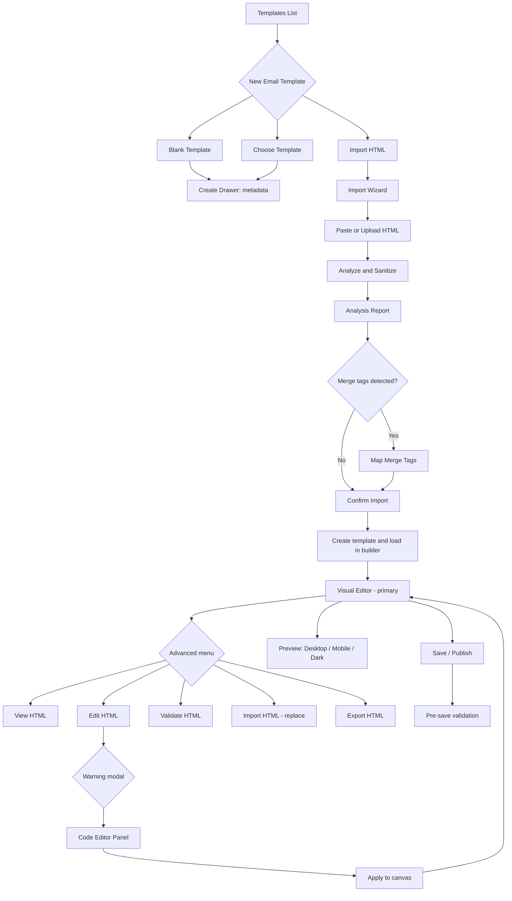

# Email Template Builder — HTML Import & Advanced HTML Mode

**Module:** Templates / Marketing  
**Version:** 1.0  
**Status:** Phase 1 complete — import wizard, analyze API, advanced HTML toolbar (2026-07-01)  
**Related docs:** [MARKETING_APPLICATION_ROADMAP.md](./MARKETING_APPLICATION_ROADMAP.md) · [Architecture_Document.md](../Architecture_Document.md) · [IN_PRODUCT_EMAIL_PLAN.md](./IN_PRODUCT_EMAIL_PLAN.md)

**Last updated:** 2026-07-01

---

## Table of contents

1. [Executive summary](#1-executive-summary)
2. [Complete UX flow](#2-complete-ux-flow)
3. [User journeys](#3-user-journeys)
4. [Screen designs](#4-screen-designs)
5. [Wireframes](#5-wireframes)
6. [Component specifications](#6-component-specifications)
7. [Interaction states](#7-interaction-states)
8. [Error states](#8-error-states)
9. [Empty states](#9-empty-states)
10. [Success notifications](#10-success-notifications)
11. [Validation rules](#11-validation-rules)
12. [Technical considerations](#12-technical-considerations)
13. [Accessibility guidelines](#13-accessibility-guidelines)
14. [Developer implementation notes](#14-developer-implementation-notes)
15. [Acceptance criteria](#15-acceptance-criteria)
16. [Competitive parity reference](#16-competitive-parity-reference)

---

## 1. Executive summary

This specification extends the Arivu **Email Template Builder** (GrapesJS-based `TemplateBuilderPage`, `CreateTemplateDrawer`) to support:

- **HTML import** via a guided wizard (paste or upload)
- **Merge tag detection and mapping** from popular ESP/CRM platforms
- **Advanced HTML mode** (view, edit, validate, export)
- **Email-safe sanitization** with transparent analysis reports
- **Desktop / mobile preview** for email templates

The **visual editor remains the primary editing experience**. HTML editing is an advanced, opt-in capability with explicit irreversibility warnings.

### Objectives

| Objective | Description |
|-----------|-------------|
| Visual-first editing | GrapesJS canvas is default after any import path |
| HTML import | Paste or upload `.html`; analyze, sanitize, map merge tags |
| Developer-friendly | Professional code editor with validation and export |
| Email client compatibility | Gmail, Outlook, Apple Mail, Yahoo Mail safe HTML |
| Security | Strip JavaScript, iframes, forms; server-authoritative sanitization |
| Migration assistance | Detect and map merge tags from Mailchimp, HubSpot, Salesforce, etc. |

### Design principles

| Principle | Rule |
|-----------|------|
| Visual first | Default mode after import; HTML never auto-opens |
| Progressive disclosure | Import wizard only when user chooses Import HTML |
| Non-destructive preview | Analysis/sanitization runs on a copy until user confirms |
| Reversibility warning | Shown before Edit HTML and before replacing existing content |
| Security by default | Sanitize server-side; client shows what was removed |
| Tenant isolation | All import/analyze/export endpoints scoped to organization |

### Existing codebase alignment

| Area | Current implementation |
|------|------------------------|
| Visual builder | `client/src/modules/template/pages/TemplateBuilderPage.vue` |
| Creation drawer | `client/src/components/templates/CreateTemplateDrawer.vue` |
| Editor engine | GrapesJS via `useGrapesEditor` (headless — Vue owns chrome) |
| Email canvas | 600px width (`EMAIL_CANVAS_WIDTH_PX` in `contentPageSettings.ts`) |
| Merge tokens | `{{field.path}}` syntax via `mergeTokens.ts` |
| Output format | `outputFormat: 'email'` on ContentTemplate |

GrapesJS default import/export commands (`gjs-open-import-webpage`, `export-template`) are stripped in headless mode — this spec replaces them with Arivu-native UX.

---

## 2. Complete UX flow



### Flow summary

| Step | User action | System behavior |
|------|-------------|-----------------|
| 1 | New template → Email format | Show three start options: Blank, Choose Template, Import HTML |
| 2 | Select Import HTML → Continue | Open Import Wizard (does not create template yet) |
| 3 | Paste or upload HTML → Analyze | Server sanitizes, analyzes, returns report |
| 4 | Review report, map merge tags | Client displays mapping UI; replacements applied on confirm |
| 5 | Confirm import | Create draft ContentTemplate; convert HTML → Grapes definition; navigate to builder |
| 6 | Edit visually | Standard GrapesJS experience |
| 7 | Advanced → Edit HTML (optional) | Warning modal → code editor → apply to canvas |
| 8 | Save / Publish | Pre-save validation; errors block publish |

---

## 3. User journeys

### Journey A — Marketing manager (non-technical)

**Persona:** Marketing manager migrating from Mailchimp  
**Goal:** Reuse an existing newsletter in Arivu without writing code

1. Templates → **New template** → selects **Email** format.
2. Chooses **Import HTML** (card with code icon + “Paste or upload existing email HTML”).
3. Pastes HTML exported from Mailchimp → **Analyze**.
4. Reviews report: ✓ tables, ✓ inline CSS, ⚠ external CSS ignored, ⚠ 3 merge tags need mapping.
5. Maps `*|FNAME|*` → Contact → First Name; skips unknown tags as plain text.
6. **Import & open editor** → visual blocks appear; tweaks headline in canvas.
7. **Preview** → Mobile → satisfied → **Save** → **Publish**.
8. Uses template in Marketing campaign send drawer.

**Success metric:** Import → publish without opening HTML mode.

---

### Journey B — Developer / agency

**Persona:** Agency developer delivering custom HTML emails  
**Goal:** Import custom HTML, fine-tune in code, export for client handoff

1. Creates email template → **Import HTML** → uploads `.html` file.
2. Reviews analysis report including unsupported CSS list.
3. Skips merge mapping (will add Arivu `{{contact.firstName}}` syntax manually).
4. Opens **Advanced → Edit HTML** → accepts irreversibility warning.
5. Edits in Monaco (dark mode, search/replace).
6. **Validate** → fixes missing table widths via suggestions panel.
7. **Apply changes** → accepts partial visual fidelity loss.
8. **Export → Download ZIP** (HTML + asset files where resolvable).

**Success metric:** Round-trip import → edit → export with zero script tags in output.

---

### Journey C — Existing template maintainer

**Persona:** Template owner updating a published email  
**Goal:** Replace body HTML without rebuilding from scratch

1. Opens published email template in builder.
2. **Advanced → Import HTML** → warning: “This replaces current template content.”
3. Pastes new HTML → analysis → confirm.
4. Continues visual edits; uses **View HTML** (read-only) to verify merge tags.

**Success metric:** Content replaced without creating a new template record.

---

### Journey D — First-time user (empty state)

**Persona:** New Arivu user with no templates  
**Goal:** Understand creation options

1. Empty templates list shows **Create your first email template** with three cards: Blank, Gallery, Import HTML.
2. Import card copy: “Bring templates from Mailchimp, HubSpot, or your agency.”

**Success metric:** User selects appropriate start path without support contact.

---

## 4. Screen designs

Design language aligns with Arivu: indigo primary (`indigo-600`), neutral surfaces, HeadlessUI dialogs/drawers, dark mode parity, 600px email canvas.

### 4.1 Creation entry — Email format selected

When `outputFormat === 'email'`, replace the flat gallery grid with **three equal selection cards** (radio group):

```
┌─────────────────────────────────────────────────────────────┐
│  Create template                                        ✕   │
├─────────────────────────────────────────────────────────────┤
│  START FROM                                                 │
│  ┌──────────────┐ ┌──────────────┐ ┌──────────────┐        │
│  │ ○ Blank      │ │ ○ Choose     │ │ ○ Import     │        │
│  │   Template   │ │   Template   │ │   HTML       │        │
│  │  Start from  │ │  Gallery     │ │  Paste or    │        │
│  │  scratch     │ │  starters    │ │  upload .html│        │
│  └──────────────┘ └──────────────┘ └──────────────┘        │
│                                                             │
│  [Name] [Purpose] [Category] [Module scope]                 │
│  Output format: Email (locked when Import selected)          │
│                                                             │
│                              [Cancel]  [Continue / Create]  │
└─────────────────────────────────────────────────────────────┘
```

| Start option | Behavior |
|--------------|----------|
| Blank Template | Create on submit → navigate to empty builder |
| Choose Template | Gallery selection → create with `jsonDefinition` from gallery item |
| Import HTML | **Continue** opens Import Wizard; template created on wizard confirm only |

---

### 4.2 Import Wizard — Step 1: Source

**Container:** Full-screen modal or wide drawer (`max-w-4xl`)

```
┌─────────────────────────────────────────────────────────────┐
│  Import HTML                                    Step 1 of 3 │
│  ─────────────────────────────────────────────────────────  │
│  [ Paste HTML ]  [ Upload file ]          ← tab switcher    │
│                                                             │
│  ┌─────────────────────────────────────────────────────┐   │
│  │ 1 │ <!DOCTYPE html>                                  │   │
│  │ 2 │ <html>...                                        │   │
│  │   │     (Monaco / CodeMirror — min-height 320px)     │   │
│  └─────────────────────────────────────────────────────┘   │
│  Drop .html here · Max 2 MB                                 │
│                                                             │
│  Template name: [________________]  (prefill from <title>)  │
│                                                             │
│                              [Cancel]  [Analyze HTML →]     │
└─────────────────────────────────────────────────────────────┘
```

**Upload tab:** Drag-drop zone + file picker; on select, populate editor (filename chip with remove action).

---

### 4.3 Import Wizard — Step 2: Analysis & merge mapping

```
┌─────────────────────────────────────────────────────────────┐
│  Import HTML                                    Step 2 of 3 │
│  ─────────────────────────────────────────────────────────  │
│  ANALYSIS REPORT                                            │
│  ┌─────────────────────────────────────────────────────┐   │
│  │ ✓ HTML valid          ✓ Inline CSS found            │   │
│  │ ✓ Images detected (12) ✓ Tables detected (3)         │   │
│  │ ✓ Links found (8)     ✓ Merge tags found (4)         │   │
│  │ ⚠ Unsupported CSS (2)  ⚠ JavaScript removed (1)      │   │
│  │ ⚠ External CSS ignored (1 stylesheet)                │   │
│  │ ⚠ Forms removed (1) — optional detail expand         │   │
│  └─────────────────────────────────────────────────────┘   │
│  [Expand all issues]                                        │
│                                                             │
│  MERGE TAG MAPPING (4 detected)                             │
│  ┌──────────────────┬──────────────────────────────────┐   │
│  │ Detected         │ Map to Arivu field            │   │
│  ├──────────────────┼──────────────────────────────────┤   │
│  │ {{FirstName}}    │ [Contact ▾] → [First Name ▾]     │   │
│  │ *|FNAME|*        │ [Contact ▾] → [First Name ▾]     │   │
│  │ %COMPANY%        │ [Organization ▾] → [Name ▾]      │   │
│  │ [[unsubscribe]]  │ [Skip · Keep as text ▾]          │   │
│  └──────────────────┴──────────────────────────────────┘   │
│  ☑ Remember mappings for this organization                  │
│                                                             │
│                    [← Back]  [Continue →]                   │
└─────────────────────────────────────────────────────────────┘
```

---

### 4.4 Import Wizard — Step 3: Confirm

- Thumbnail preview (sandboxed iframe, no scripts).
- Summary line: “3 warnings, 0 errors — safe to import.”
- Primary CTA: **Import & open in editor** (creates draft template, navigates to builder).

---

### 4.5 Visual Editor — Email mode toolbar

Extend `EditorToolbar` when `isEmailFormat`:

```
[← Back]  Template Name · Saved          [Undo][Redo] | [Preview ▾] [Advanced ▾] [Save] [Publish]
```

| Menu | Items |
|------|-------|
| Preview ▾ | Desktop · Mobile · Dark mode |
| Advanced ▾ | View HTML · Edit HTML · Validate HTML · Import HTML · Export HTML |

Canvas: existing 600px centered frame; component library shows email-safe blocks only.

---

### 4.6 Advanced — Edit HTML (split view)

```
┌──────────────────────────────────────────────────────────────┐
│ ⚠ HTML editing mode                                          │
│ Changes may not be fully reversible in the visual editor.    │
│ [Switch to visual only]                    [Apply] [Discard] │
├────────────────────────────┬─────────────────────────────────┤
│  Code editor (60%)         │  Live preview (40%)             │
│  line numbers, folding     │  sandboxed iframe               │
└────────────────────────────┴─────────────────────────────────┘
```

**Entry gate:** Blocking confirmation modal before first Edit HTML session (optional “Don’t show again” stored in user preferences / localStorage).

---

### 4.7 Validation panel

Drawer or modal with grouped accordion:

| Group | Color | Save behavior |
|-------|-------|---------------|
| Errors | Red | Block save and publish |
| Warnings | Amber | Allow save; require acknowledgment on publish |
| Suggestions | Blue | Informational only |

Each item: message, location (line number or component id), **Jump to** / **Fix** where automatable.

---

### 4.8 Export modal

```
Export HTML
─────────────────────────
○ Download .html file
○ Copy to clipboard
○ Download ZIP (HTML + assets/)

☐ Include Arivu merge tag syntax in export

[Cancel]  [Export]
```

---

## 5. Wireframes

### 5.1 Templates list — empty state

```
┌────────────────────────────────────────────────────────┐
│ Templates                              [+ New template]│
│ Design email, PDF, and print templates                 │
├────────────────────────────────────────────────────────┤
│                                                        │
│     📧  No email templates yet                         │
│     Create from scratch or import existing HTML        │
│                                                        │
│   [Blank]    [From gallery]    [Import HTML]           │
│                                                        │
└────────────────────────────────────────────────────────┘
```

### 5.2 Mobile preview chrome

```
        ┌─────────────┐
        │  ○  ▂▂▂  🔋  │
        ├─────────────┤
        │             │
        │  [email     │
        │   body      │
        │   320px]    │
        │             │
        └─────────────┘
     Toggle: Desktop | Mobile | Dark
```

### 5.3 Analysis report — collapsed vs expanded

```
Collapsed:
  ✓ 6 checks passed   ⚠ 3 warnings   [Details]

Expanded:
  ⚠ Unsupported CSS
    · position: fixed on .header (line 42)
    · flexbox gap in .row (line 88) — degraded in Outlook
  ⚠ JavaScript removed
    · <script src="..."> (line 3)
```

---

## 6. Component specifications

### 6.1 `EmailTemplateStartCards`

| Prop | Type | Description |
|------|------|-------------|
| `modelValue` | `'blank' \| 'gallery' \| 'import'` | Selected start mode |
| `disabled` | `boolean` | Disable while saving |

**Events:** `update:modelValue`  
**Accessibility:** `role="radiogroup"`; each card `role="radio"`; arrow-key navigation

---

### 6.2 `HtmlImportWizard`

| Prop | Type | Description |
|------|------|-------------|
| `open` | `boolean` | Wizard visibility |
| `initialMetadata` | `{ name, moduleScope, ... }` | Pre-filled from create drawer |
| `mode` | `'create' \| 'replace'` | New template vs replace existing content |

**Events:** `close`, `complete(templateId)`, `error`  
**Internal steps:** `source` → `analysis` → `confirm`  
**State:** `htmlSource`, `analysisResult`, `mergeMappings`, `sanitizedHtml`

---

### 6.3 `HtmlCodeEditor`

| Prop | Type | Default |
|------|------|---------|
| `modelValue` | `string` | — |
| `language` | `'html'` | `'html'` |
| `readOnly` | `boolean` | `false` |
| `theme` | `'light' \| 'dark' \| 'system'` | `'system'` |
| `maxLength` | `number` | 2MB char budget |

**Features:** Syntax highlighting, line numbers, code folding, find/replace (Cmd+F), auto-indent, tab size 2  
**Implementation:** `@monaco-editor/loader` or CodeMirror 6 — lazy-loaded chunk

---

### 6.4 `HtmlAnalysisReport`

| Prop | Type | Description |
|------|------|-------------|
| `result` | `HtmlAnalysisResult` | Server analysis payload |
| `expanded` | `boolean` | Show issue details |

Displays check rows with icons. Expandable detail lists with line references.

---

### 6.5 `MergeTagMappingTable`

| Prop | Type | Description |
|------|------|-------------|
| `detectedTags` | `DetectedMergeTag[]` | Tags found in HTML |
| `mappings` | `Record<string, MergeMapping>` | User selections |
| `fieldSchema` | Module field schema | From `useTemplateMergeTagSchema` |

**Row actions:** Map to field · Skip · Map to system token (e.g. unsubscribe URL)

---

### 6.6 `HtmlValidationPanel`

| Prop | Type | Description |
|------|------|-------------|
| `results` | `ValidationResult[]` | Grouped validation output |
| `blocking` | `boolean` | True when errors present |

**Events:** `jumpToLine`, `jumpToComponent`, `applyFix`

---

### 6.7 `EmailPreviewFrame`

| Prop | Type | Description |
|------|------|-------------|
| `html` | `string` | Sanitized preview HTML |
| `viewport` | `'desktop' \| 'mobile'` | Preview width |
| `colorScheme` | `'light' \| 'dark'` | Dark mode preview |

Sandboxed iframe: `sandbox="allow-same-origin"` only — **no** `allow-scripts`.

---

### 6.8 `AdvancedHtmlMenu`

Dropdown in `EditorToolbar` (email format only). Items disabled when `saveStatus === 'saving'`.

---

### 6.9 `IrreversibleHtmlWarningModal`

HeadlessUI `Dialog`. Stores dismiss preference in user preferences (`emailHtmlWarningDismissed`).

---

## 7. Interaction states

| Component | State | Visual treatment |
|-----------|-------|------------------|
| Import card | default / hover / selected / disabled | Indigo border + background tint when selected |
| Analyze button | idle / loading / success / error | Spinner + “Analyzing…” label |
| Analysis check row | pass / warn / fail | Green / amber / red icon + label |
| Merge mapping row | unmapped / mapped / skipped | Amber indicator until mapped or explicitly skipped |
| Continue (step 2) | enabled / disabled | Disabled until required mappings complete or user confirms skip |
| Code editor | pristine / dirty | Dirty indicator on Apply button |
| Edit HTML mode | visual-only / split / code-fullscreen | Toolbar badge “HTML mode” |
| Preview toggle | desktop / mobile / dark | Active pill highlight |
| Save / Publish | normal / blocked | Inline banner when validation errors block publish |
| Export copy | idle / copied | “Copied!” toast for 2 seconds |

---

## 8. Error states

| Scenario | User message | Recovery action |
|----------|--------------|-----------------|
| Empty HTML on analyze | “Paste or upload HTML to continue.” | Focus editor |
| Invalid / unparseable HTML | “Could not parse HTML. Check for unclosed tags.” | Show parser line if available |
| File too large (>2MB) | “File exceeds 2 MB limit.” | Choose smaller file |
| Wrong file type | “Upload an .html or .htm file.” | Re-upload |
| Analysis API failure | “Analysis failed. Try again.” | Retry button |
| Import create API failure | Toast + wizard remains open | Retry or Cancel |
| HTML → Grapes conversion partial | “Some sections could not be converted to blocks. Content preserved as HTML block.” | Banner in builder |
| Edit HTML apply failure | “HTML could not be applied. Reverted to last saved version.” | Remain in editor with last good state |
| Export ZIP missing assets | “Some images could not be downloaded (external URLs). Listed in export log.” | Allow download with log |
| Network offline on save | Use existing `builderSaveStatusError` pattern | Retry save |

---

## 9. Empty states

| Location | Title / message | CTA |
|----------|-----------------|-----|
| Templates list (no email templates) | “No email templates yet” | Three start cards |
| Import paste tab (no content) | “Paste your HTML email here or upload a file” | Illustration + upload zone |
| Merge mapping (none detected) | “No merge tags detected. Add Arivu fields from the Variables panel later.” | Continue enabled |
| Validation (clean) | “No issues found. This template follows email best practices.” | Green check state |
| Gallery (email format) | Existing gallery items + “Or import your own HTML” link | Opens import wizard |

---

## 10. Success notifications

Use existing `useNotifications()` toast pattern. i18n keys under `templates.htmlImport.*`.

| Action | Toast message key (semantic) | Duration |
|--------|------------------------------|----------|
| Template created from import | `templates.htmlImport.createSuccess` | 4s |
| HTML applied in editor | `templates.htmlImport.applySuccess` | 3s |
| Template saved | `templates.createSuccess` (existing) | 3s |
| HTML downloaded | `templates.htmlImport.downloadSuccess` | 3s |
| HTML copied | `templates.htmlImport.copySuccess` | 2s |
| Org merge mappings saved | `templates.htmlImport.mappingsSaved` | 4s |
| Template published | `templates.publishSuccess` (existing) | 4s |

---

## 11. Validation rules

### 11.1 Import-time sanitization (server authoritative)

**Remove silently (log in analysis report):**

- `<script>` tags and inline event handlers (`onclick`, `onerror`, etc.)
- `<iframe>`, `<object>`, `<embed>`
- `<form>` (warn user; optional tenant setting: strip vs block import)
- `javascript:` URLs
- `<meta http-equiv="refresh">`, external `<base>` tags

**Transform / warn:**

- External `<link rel="stylesheet">` → strip + warn
- `<style>` blocks → preserve but scan for unsupported properties
- Relative image URLs → warn; suggest upload to Assets panel

---

### 11.2 Merge tag detection patterns

| Platform | Pattern (conceptual) | Notes |
|----------|---------------------|-------|
| Arivu / Handlebars | `\{\{\s*[\w.]+?\s*\}\}` | Native syntax |
| Mailchimp | `\*\|[A-Z0-9_]+\|\*` | Common in legacy templates |
| HubSpot | `\{%[\s\S]*?%\}` | Logic blocks warn — not supported in v1 |
| Salesforce | `\{\![\s\S]*?\!\}` / `%FIELD%` | Percent-wrapped fields |
| Custom brackets | `\[\[[\w]+\]\]` | Generic bracket tokens |

HubSpot `` conditional blocks: **warn** — conditionals not supported in phase 1; offer strip or convert to static content.

---

### 11.3 Pre-save / validate checks

| ID | Severity | Rule |
|----|----------|------|
| `ERR_SCRIPT` | Error | Any script content after sanitization |
| `ERR_MISSING_BODY` | Error | No `<body>` content |
| `WARN_NO_ALT` | Warning | `` without `alt` attribute |
| `WARN_TABLE_WIDTH` | Warning | `<table>` without `width` attribute or inline width |
| `WARN_LARGE_IMAGE` | Warning | Image reference > 200KB or dimension > 1200px |
| `WARN_EXTERNAL_FONT` | Warning | `@font-face` or Google Fonts link |
| `WARN_BROKEN_LINK` | Warning | `href="#"` or empty `href` |
| `WARN_UNSUPPORTED_CSS` | Warning | flexbox gap, position:fixed, problematic floats |
| `WARN_SINGLE_PIXEL_IMAGE` | Suggestion | Tracking pixel detected |
| `SUG_PREHEADER` | Suggestion | Hidden preheader block recommended |
| `SUG_INLINE_STYLES` | Suggestion | Critical elements with class but no inline style |

**Grouped output:** Errors block Publish; Warnings show confirm dialog on Publish; Suggestions informational only.

---

### 11.4 Email client compatibility matrix

Reference for warning generation:

| Feature | Gmail | Outlook | Apple Mail | Yahoo |
|---------|-------|---------|------------|-------|
| Table layout | ✓ | ✓ (prefer fixed) | ✓ | ✓ |
| Inline CSS | ✓ | ✓ | ✓ | ✓ |
| `<style>` in head | ✓ | Partial | ✓ | ✓ |
| Flexbox | ✓ | ✗ | ✓ | Partial |
| Web fonts | Partial | ✗ | ✓ | Partial |
| JavaScript | ✗ | ✗ | ✗ | ✗ |

---

## 12. Technical considerations

### 12.1 Architecture

```
Client                              Server
──────                              ──────
HtmlImportWizard                    POST /api/templates/html/analyze
  → paste / upload                    → sanitize (DOMPurify + custom rules)
  → display analysis                  → detect merge tags
  → merge mapping UI                  → return report + sanitizedHtml
  → confirm                           POST /api/templates (create with definition)
                                        → htmlToGrapesDefinition()
TemplateBuilderPage
  → GrapesJS loadProject()
  → Advanced HTML modes
                                        POST /api/templates/:id/html/validate
                                        GET  /api/templates/:id/export?format=zip
```

---

### 12.2 HTML → Grapes conversion

1. Parse sanitized HTML with `DOMParser` (client preview) or `node-html-parser` (server).
2. Walk DOM tree:
   - `table` / `tr` / `td` → Grapes table components
   - `img` → image block
   - Text nodes → text components
   - Unknown wrappers → **HTML component** (preserves raw snippet)
3. Inline styles → Grapes style attributes.
4. Apply merge tag replacements from mapping table before conversion.
5. Wrap in single Page root (email constraint: max one Page node).

---

### 12.3 Grapes ↔ HTML sync

| Action | Implementation |
|--------|----------------|
| View HTML | `editor.getHtml()` + `editor.getCss()` merged for email export |
| Edit HTML apply | `editor.setComponents(html)` + re-run validation |
| Audit trail | Set `importMetadata.source = 'html-edit'` on definition |
| Irreversibility | Complex nested tables may not round-trip; optional `importSnapshot` for rollback (phase 2) |

---

### 12.4 Security

- All HTML processing **server-side** for create/analyze endpoints.
- Client-side sanitize for preview only — never trusted for persistence.
- DOMPurify config: `FORBID_TAGS: ['script','iframe','form',...]`, `FORBID_ATTR: ['onerror','onclick',...]`.
- Preview iframes: CSP, no script execution.
- ZIP asset fetch: SSRF protection — block private IPs, HTTPS only, size cap per asset.

---

### 12.5 Performance

- Lazy-load Monaco (~500KB) on first HTML interaction.
- Explicit **Analyze** button for v1 (no debounced auto-analyze on paste).
- Max HTML size: 2MB; analyze timeout: 10 seconds.

---

### 12.6 i18n

All user-visible strings via `templates.htmlImport.*`. Run `npm run i18n:sync-keys` after adding en keys. Reuse `actions.*`, `states.*`, `validation.*` where phrases exist.

---

### 12.7 Permissions

Reuse existing template create/edit permissions. No new permission keys for v1. Marketing module consumes same ContentTemplate API via `useMarketingTemplates`.

---

### 12.8 Analytics (PostHog)

| Event | Trigger |
|-------|---------|
| `email_template_import_started` | Wizard opened |
| `email_template_import_completed` | Template created from import |
| `email_template_html_mode_entered` | Edit HTML confirmed |
| `email_template_validated` | Validate HTML run |
| `email_template_exported` | Export action completed |

Align with new module/app merge checklist (PostHog instrumentation required).

---

## 13. Accessibility guidelines

| Area | Requirement |
|------|-------------|
| Wizard modal | Focus trap; return focus to trigger on close |
| Step indicator | `aria-current="step"`; `aria-label="Step 2 of 3: Review analysis"` |
| Analysis report | `role="status"` on completion; warnings use `aria-describedby` |
| Code editor | Monaco ARIA bindings; announce line count on load |
| Status colors | Pass/warn/error never rely on color alone — icon + text always |
| Keyboard | Advanced menu navigable; Esc closes modals |
| Preview iframe | `title="Email preview"` |
| Merge mapping table | `<table>` with `<th scope="col">`; labeled selects |
| Motion | Respect `prefers-reduced-motion` on step transitions |
| Live regions | Import success: polite announcement “Template imported, visual editor loaded” |

**Target:** WCAG 2.1 AA for all new surfaces.

---

## 14. Developer implementation notes

### 14.1 Phase 1 — MVP

| # | Task |
|---|------|
| 1 | Extend `CreateTemplateDrawer.vue` — email start cards + launch `HtmlImportWizard` |
| 2 | New composable `useHtmlImport.ts` — wizard state, API calls |
| 3 | Server: `htmlSanitizerService.js`, `htmlAnalysisService.js`, `mergeTagDetector.js` |
| 4 | Server: `htmlToGrapesDefinition.js` — bridge to existing `jsonDefinition` schema |
| 5 | Extend `EditorToolbar.vue` — Advanced + Preview menus when `isEmailFormat` |
| 6 | `HtmlCodeEditor.vue` — lazy Monaco wrapper |
| 7 | `EmailPreviewModal.vue` — email preview (replace PDF preview action for email format) |
| 8 | i18n keys + PostHog events |

**Covers acceptance criteria AC-1 through AC-6, AC-11 (desktop/mobile preview), AC-13, AC-14.**

---

### 14.2 Phase 2

- Org-level merge mapping persistence (`Organization.emailMergeTagMappings`)
- ZIP export with asset fetching
- Dark mode preview
- Rollback to import snapshot (`template.importSnapshot`)

---

### 14.3 Phase 3

- Email client preview (Litmus / Email on Acid integration)
- HubSpot conditional block handling
- Inline external CSS fetch with domain allowlist

---

### 14.4 Proposed file structure

```
client/src/modules/template/
  components/html/
    HtmlImportWizard.vue
    HtmlCodeEditor.vue
    HtmlAnalysisReport.vue
    MergeTagMappingTable.vue
    HtmlValidationPanel.vue
    EmailPreviewFrame.vue
    EmailTemplateStartCards.vue
    IrreversibleHtmlWarningModal.vue
  composables/
    useHtmlImport.ts
    useHtmlValidation.ts
  services/
    htmlImportApi.ts

server/services/contentPlatform/
  htmlSanitizerService.js
  htmlAnalysisService.js
  htmlToGrapesDefinition.js
  mergeTagDetector.js

server/controllers/
  templateHtmlController.js   (analyze, validate, export)

server/routes/
  templateHtmlRoutes.js
```

---

### 14.5 Dependencies

| Package | Usage |
|---------|-------|
| `isomorphic-dompurify` or `dompurify` + `jsdom` | Server sanitization |
| `@monaco-editor/loader` | Client code editor (dynamic import) |
| `jszip` | ZIP export (client or server) |
| `node-html-parser` | Server DOM walk for analysis/conversion |

---

### 14.6 Testing

| Layer | Coverage |
|-------|----------|
| Unit | Merge tag regex fixtures (Mailchimp, HubSpot, Arivu, Salesforce) |
| Unit | Sanitizer removes script, iframe, form, event handlers |
| Integration | Import HTML → create template → rendered HTML contains mapped merge tags |
| Snapshot | Known newsletter HTML → expected Grapes definition structure |
| E2E | Wizard flow: paste → analyze → map → confirm → builder loads |

---

## 15. Acceptance criteria

### AC-1: Creation flow — Import HTML option

- [ ] When output format is Email, user sees Blank / Choose Template / Import HTML cards.
- [ ] Import HTML opens wizard without creating a template until confirm step.
- [ ] Blank and Choose Template behavior unchanged for PDF/HTML formats.

### AC-2: Paste and upload

- [ ] User can paste HTML into syntax-highlighted editor.
- [ ] User can upload `.html` / `.htm` file ≤ 2MB; content loads into editor.
- [ ] Empty input disables Analyze with inline validation message.

### AC-3: Analysis report

- [ ] After Analyze, user sees pass/warn rows for: validity, inline CSS, images, tables, links, merge tags.
- [ ] Warnings shown for unsupported CSS, removed JavaScript, ignored external CSS, removed forms.
- [ ] Expandable details include line numbers or selectors where feasible.

### AC-4: Sanitization

- [ ] Script tags and event handlers never persist to stored template.
- [ ] iframes and `javascript:` URLs removed.
- [ ] User informed of all removals in analysis report.

### AC-5: Merge tag mapping

- [ ] Detects `{{}}`, `*|*|`, `%FIELD%`, `[[]]` patterns.
- [ ] Each detected tag mappable to Arivu merge field via module scope schema.
- [ ] User can skip individual tags.
- [ ] Mapped tags replaced in HTML before Grapes conversion.

### AC-6: Visual editor handoff

- [ ] Confirm creates draft email template and opens builder.
- [ ] Imported content visible as editable blocks where conversion supports it.
- [ ] Non-converted sections appear as HTML blocks without data loss.

### AC-7: Advanced menu

- [ ] Email builder toolbar includes Advanced dropdown with: View HTML, Edit HTML, Validate HTML, Import HTML, Export HTML.
- [ ] PDF templates do not show email HTML menu items.

### AC-8: Edit HTML warning

- [ ] Modal shown before first Edit HTML entry (dismissible permanently).
- [ ] Modal copy: “Changes made in HTML may not be fully reversible in the visual editor.”

### AC-9: Code editor

- [ ] Syntax highlighting, line numbers, auto-indent, search/replace, code folding.
- [ ] Respects light/dark theme from app preference.
- [ ] Apply updates canvas; Discard reverts to pre-edit snapshot.

### AC-10: Validation

- [ ] Validate HTML runs all checks in §11.3.
- [ ] Results grouped: Errors / Warnings / Suggestions.
- [ ] Errors block Publish; Warnings require acknowledgment on Publish.

### AC-11: Preview

- [ ] Desktop preview at 600px width.
- [ ] Mobile preview at 320px with device chrome.
- [ ] Preview uses sanitized HTML only (no script execution).

### AC-12: Export

- [ ] Download HTML produces valid single-file email HTML.
- [ ] Copy HTML copies to clipboard with success toast.
- [ ] ZIP export includes HTML + resolvable local assets (phase 2 acceptable deferral).

### AC-13: i18n and accessibility

- [ ] No hardcoded English strings in new components.
- [ ] Wizard and modals pass keyboard navigation and screen reader spot-check.

### AC-14: Security and tenant isolation

- [ ] Analyze/import endpoints require auth and organization context.
- [ ] No SSRF in asset fetch; sanitized output stored with `tenantId` on template.

---

## 16. Competitive parity reference

| Capability | HubSpot | Mailchimp | BeeFree | Arivu (this spec) |
|------------|---------|-----------|---------|----------------------|
| Visual builder primary | ✓ | ✓ | ✓ | ✓ GrapesJS |
| Import HTML | ✓ | ✓ | ✓ | ✓ Wizard |
| Merge tag mapping | ✓ | ✓ | Limited | ✓ Multi-platform |
| Code edit | ✓ | ✓ | ✓ | ✓ Monaco + warning |
| Validation | ✓ | Basic | ✓ | ✓ Grouped rules |
| Client preview | Paid add-on | ✓ | Partner | Phase 3 |
| Export HTML/ZIP | ✓ | ✓ | ✓ | ✓ Phase 1/2 |

---

## Revision history

| Version | Date | Author | Changes |
|---------|------|--------|---------|
| 1.0 | 2026-07-01 | — | Initial design specification |
