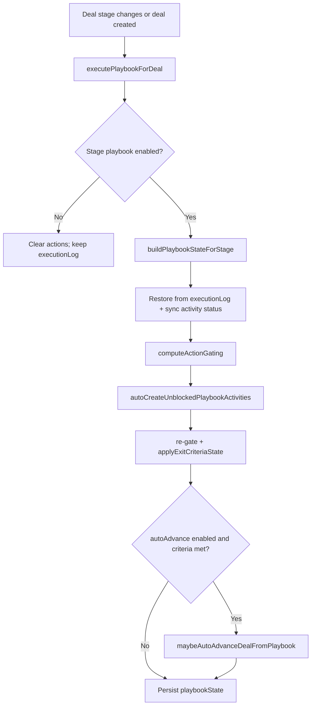

# Playbooks Architecture

**Status:** Implemented (runtime MVP + phased extensions)

**Scope:** Sales pipeline stage playbooks on Deals — configuration, runtime execution, deal record UX, and list/kanban visibility.

**Explicitly out of scope (deferred):**

- Full analytics dashboards (MVP summary API implemented)
- Non-deal modules (playbooks are Deals / pipeline-stage scoped today)
- Process Designer integration

**Configuration surface:** Settings → Sales → Playbooks (`SalesPlaybooks.vue`). The legacy playbooks tab under Modules & Fields was removed.

**Last updated:** 2026-06-07

---

## 1. Goals

1. Let admins define **stage-entry playbooks** per pipeline stage (activities, dependencies, exit criteria).
2. **Auto-create** linked tasks/events when a deal enters a stage (idempotent).
3. Persist **runtime state** on the deal (`playbookState`) separate from pipeline configuration.
4. **Sync completion** from linked activities back to the deal checklist (and manual toggle → task).
5. **Gate** activities via sequential mode and explicit dependencies.
6. **Evaluate exit criteria** and optionally **auto-advance** the deal to the next stage.
7. Surface playbook progress on **deal record**, **list**, and **kanban** without requiring analytics.

---

## 2. Design Principles

| Principle | Rule |
|---|---|
| Config vs runtime | Pipeline `stage.playbook` is tenant configuration. `Deal.playbookState` is per-deal runtime. Never mutate config during execution. |
| Tenant isolation | All reads/writes scoped by `organizationId`. Assignment resolution validates users/roles/teams in-tenant. |
| Idempotency | `executionLog` keyed by `stageKey` + `actionKey` prevents duplicate auto-created activities on re-entry. |
| Side-effect boundaries | List fetch reconcile uses `skipSideEffects` — sync + gating only; no auto-create or auto-advance on `GET /deals`. |
| Activity as source of truth | Linked task/event completion drives playbook action status when `createdActivityId` is set. |
| Preserve history | Leaving a stage without an enabled playbook clears runtime actions but **retains** `executionLog` for future idempotency. |
| Smallest safe change | Reuse pipeline settings storage (`ModuleDefinition.pipelineSettings`); no separate playbook collection. |

---

## 3. Configuration Model

Playbooks live on each pipeline stage inside the Deals module definition:

```text
ModuleDefinition (key: deals)
  └── pipelineSettings[]
        └── stages[]
              └── playbook
                    ├── enabled: boolean
                    ├── mode: 'sequential' | 'non_sequential'
                    ├── autoAdvance: boolean
                    ├── exitCriteria
                    │     ├── type: 'manual' | 'all_actions_completed' | 'any_action_completed' | 'custom'
                    │     ├── nextStageKey: string
                    │     └── customDescription / conditions (config only for custom)
                    ├── notes: string
                    └── actions[]
                          ├── key, title, description, actionType, dueInDays
                          ├── required, autoCreate
                          ├── assignment { type, targetId, targetName, targetType }
                          ├── dependencies: actionKey[]
                          ├── trigger { type, sourceActionKey, delay, conditions, description }
                          ├── alerts[] (config only — not executed)
                          └── resources[] { name, type, url, description }
```

### 3.1 Assignment types

| Type | Resolution |
|---|---|
| `deal_owner` | `deal.ownerId` |
| `stage_owner` | `stageHistory` entry for current stage `changedBy`, else latest history, else actor |
| `specific_user` | `assignment.targetId` → active user in tenant |
| `role` | `targetId` or case-insensitive `targetName` → Role; prefers deal owner in role, else first active user |
| `team` | `targetId` or `targetName` → Group; prefers deal owner in team, else lead, else first member |

Config UI (`PlaybookActivityModal`) uses pickers for user/role/team and persists `targetId` + `targetName`.

### 3.2 Trigger types (config)

| Type | Runtime support |
|---|---|
| `stage_entry` | **Implemented** — eligible for auto-create on stage entry / unlock |
| `after_action` | **Implemented** — gated on `sourceActionKey`; auto-create on unlock via reconcile |
| `time_delay` | **Implemented** — `PlaybookScheduleJob` + minute cron; anchor = `playbookState.startedAt` |
| `custom` | **Deferred** — config only |

### 3.3 Action types

`task`, `call`, `meeting`, `email`, `event`, `document`, `approval`, `alert`, `other`.

Auto-create currently materializes **tasks** (default) or **events** (`event`, `meeting` action types).

---

## 4. Runtime Model (`Deal.playbookState`)

System field — excluded from custom field surfaces and generic create drawers.

```text
playbookState
  ├── stageKey, stageName, pipelineKey
  ├── startedAt
  ├── mode: 'sequential' | 'non_sequential'
  ├── exitCriteriaType, exitCriteriaMet, exitCriteriaMetAt
  ├── autoAdvanceEnabled, autoAdvancedAt, autoAdvancedToStageKey
  ├── actions[]
  │     ├── actionKey, title, actionType, dueAt
  │     ├── required, status: pending | completed | blocked
  │     ├── completedAt
  │     ├── dependencies[], blockedBy[]
  │     ├── createdActivityId, createdActivityType: task | event
  │     └── resources[] (synced from config on reconcile)
  └── executionLog[]
        └── stageKey, actionKey, createdActivityId, createdActivityType, createdAt
```

`playbookState` is **not** a user-editable custom field. Completion is toggled via dedicated API or activity sync.

---

## 5. Execution Engine

**Primary service:** `server/services/playbookExecutionService.js`

**Resolver:** `server/utils/playbookResolver.js` — loads `pipelineSettings`, resolves `resolveStagePlaybook(pipeline, stage)`.

**Assignment:** `server/utils/playbookAssignmentResolver.js`

### 5.1 Stage entry flow



### 5.2 Entry hooks

| Hook | Location |
|---|---|
| Deal create | `dealController.createDeal` |
| Deal update (stage change) | `dealController.updateDeal` |
| Explicit stage update | `dealController.updateStage` |
| Auto-advance chain | `maybeAutoAdvanceDealFromPlaybook` → re-runs `executePlaybookForDeal` on next stage |

### 5.3 Gating

`computeActionGating(actionStates, playbookActions, mode)`:

1. **Dependencies** — action stays `blocked` until all `dependencies` are `completed`.
2. **Sequential mode** — only the first non-completed action in definition order is actionable; others are `blocked` with `blockedBy` including the gate action key.

Blocked actions:

- Cannot be manually completed (`409 PLAYBOOK_ACTION_BLOCKED`).
- Do not receive auto-create until unblocked.

### 5.4 Auto-create rules

Auto-create runs when **all** are true:

- `action.autoCreate !== false`
- `trigger.type === 'stage_entry'` or `'after_action'` (when unblocked; reconcile path)
- Action status is `pending` (not `blocked`)
- No `createdActivityId` yet for this stage/action
- Assignee resolves to a valid user

Creates Task or Event linked to the deal; writes `executionLog` entry.

### 5.5 Exit criteria

| Type | Evaluation |
|---|---|
| `all_actions_completed` | All **required** actions completed (falls back to all actions if none required) |
| `any_action_completed` | At least one action completed |
| `manual` | Never auto-met |
| `custom` | **Implemented** — deal `conditions[]` AND required actions completed |

When met: sets `exitCriteriaMet`, `exitCriteriaMetAt`. If `autoAdvance` and `exitCriteria.nextStageKey` are set, moves deal stage, logs `playbook auto-advance`, runs next stage playbook.

### 5.6 Reconcile

`reconcilePlaybookForDeal(deal, options)`:

1. Sync each action with `createdActivityId` from Task/Event status.
2. Recompute gating.
3. Unless `skipSideEffects: true`: auto-create newly unblocked activities, evaluate exit criteria, maybe auto-advance.
4. Sync `resources[]` from latest playbook definition.

**Freshness:**

| Surface | Behavior |
|---|---|
| `GET /deals/:id` | Full reconcile + save |
| `GET /deals` (list/kanban) | `refreshPlaybookStatesForDealList` — max 50 deals with active playbooks; `skipSideEffects` |
| Task/event status update | `syncDealPlaybookFromActivity` → full reconcile |

---

## 6. Activity Sync (Bi-directional)

### 6.1 Activity → Deal

Hooks in `taskController` and `eventController` on status change call `syncDealPlaybookFromActivity`.

Completed task statuses: `completed`, `done`, `closed`, `complete`.

### 6.2 Deal → Activity

`updatePlaybookActionStatus` — when marking a linked **task** complete, updates task `status` + `completedDate`, then reconciles.

Events: manual completion on deal does not yet write back to event status (task path only).

---

## 7. API Surface

| Method | Route | Purpose |
|---|---|---|
| `GET` | `/api/deals/playbooks/analytics` | Runtime playbook aggregates (optional `pipeline` filter) |
| `GET` | `/api/deals` | List/kanban; bounded playbook freshness refresh |
| `GET` | `/api/deals/:id` | Record; full playbook reconcile |
| `PATCH` | `/api/deals/:id/playbook-state/actions/:actionKey` | Toggle action `pending` / `completed` (`deals.edit`) |

Config persistence uses existing module settings API from Sales Playbooks (`pipelineSettings` on deals module).

---

## 8. Client Surfaces

| Surface | File(s) | Role |
|---|---|---|
| Config | `SalesPlaybooks.vue`, `PlaybookActivityModal.vue`, `usePlaybookStageActions.js` | CRUD stage playbooks |
| Assignment pickers | `usePlaybookAssignmentTargets.js` | Load users/roles/teams; persist `targetId` |
| Deal record | `PlaybookStageSection.vue`, `dealRecordAdapter.js`, `DealRecordPage.vue` | Checklist, resources, completion toggle |
| List/kanban badge | `DealPlaybookStatusBadge.vue`, `dealPlaybookStatus.js`, `Deals.vue` | Progress summary from `playbookState` |

### 8.1 Badge variants

Derived by `getDealPlaybookStatusSummary`:

- `complete` — exit criteria met or all required actions done
- `blocked` — no pending, some blocked
- `in_progress` — otherwise

---

## 9. Invariants

1. **No playbook without enabled flag** — `resolveStagePlaybook` returns null when `playbook.enabled !== true`.
2. **Execution log survives stage exit** — prevents duplicate tasks when returning to a stage.
3. **List fetch never auto-advances** — `skipSideEffects` on batch refresh.
4. **Blocked actions are server-enforced** — UI disables toggle; API returns 409.
5. **playbookState is system infrastructure** — listed in `DEAL_SYSTEM_FIELDS`, excluded from module field builder and generic adapters.
6. **Pipeline settings are canonical config** — runtime resources refreshed from definition on reconcile; editing config updates deals on next reconcile/GET.

---

## 10. Test Coverage

| Suite | File | Count |
|---|---|---|
| Execution engine | `server/services/__tests__/playbookExecutionService.test.js` | 15 |
| Delay scheduler | `server/services/__tests__/playbookSchedulingService.test.js` | 4 |
| Alert scheduler | `server/services/__tests__/playbookAlertSchedulingService.test.js` | 4 |
| Assignment resolver | `server/utils/__tests__/playbookAssignmentResolver.test.js` | 5 |
| Analytics | `server/services/__tests__/playbookAnalyticsService.test.js` | 1 |
| Exit criteria evaluator | `server/utils/__tests__/playbookExitCriteriaEvaluator.test.js` | — |

Covers: stage entry auto-create, `after_action` unlock + auto-create, idempotent re-entry, activity sync, sequential/dependency gating, blocked manual complete, exit criteria, auto-advance, `skipSideEffects`, list freshness, resources sync, assignment resolution.

---

## 11. Implementation Roadmap (Remaining)

| Priority | Item | Status |
|---|---|---|
| 7 | **Analytics** — MVP runtime summary API + Sales Playbooks header metrics | Implemented (MVP) |
| 8 | **Hardening & adoption** — config validation, adoption banner, save warnings | Implemented |
| 9 | **`after_action` auto-create** — unlock + create on source completion | Implemented |
| 10 | **Custom exit conditions UI** — deal field conditions in Sales Playbooks | Implemented |
| 11 | **Assignment picker i18n** — loading/placeholder strings in all locales | Implemented |

### 11.5 Hardening & adoption

- `playbookConfigValidation.js` — warnings for empty playbooks, missing assignment targets, invalid `after_action` sources, custom exit without conditions, auto-advance without next stage.
- Sales Playbooks UI shows adoption banner (no enabled stages) and inline warning list; save confirms when warnings exist.

### 11.6 `after_action` auto-create

- `computeActionGating` treats `trigger.sourceActionKey` as an implicit dependency.
- `autoCreateUnblockedPlaybookActivities` uses `shouldAutoCreateWhenUnblocked` (`stage_entry` + `after_action`).
- Initial stage entry still only auto-creates `stage_entry` actions.

### 11.7 Custom exit conditions UI

- Sales Playbooks stage settings: condition builder (field, operator, value) when `exitCriteria.type === 'custom'`.
- Reuses server evaluator operators; conditions normalized on load/save via `usePlaybookStageActions`.

### 11.8 Assignment picker i18n

- `modFieldsAssignmentTargetsLoading`, `modFieldsSelectAssignmentTargetPh` in all supported locales.
- `PlaybookActivityModal` placeholders use assignment option labels (not raw type keys).

### 11.1 Time-delay triggers (implemented)

- Model: `PlaybookScheduleJob` — dedupe key `pbjob:{org}:{deal}:{stageKey}:{actionKey}:{startedAt}`.
- Enqueued on `executePlaybookForDeal` via `syncPlaybookDelayJobsForDeal`.
- Cancelled when deal leaves stage or playbook disabled.
- Cron: `ENABLE_PLAYBOOK_DELAY_SCHEDULER` (default on), every minute → `processDuePlaybookDelayJobs`.
- `runAt` = `playbookState.startedAt` + `trigger.delay` (`minutes` | `hours` | `days`).
- Fire path: `autoCreateSingleDelayedPlaybookAction` → reconcile (no list-fetch side effects).

### 11.2 Alerts (implemented)

- Model: `PlaybookAlertScheduleJob` — dedupe key `pbalert:{org}:{deal}:{stageKey}:{actionKey}:{alertIndex}:{startedAt}`.
- Enqueued on `executePlaybookForDeal` via `syncPlaybookAlertJobsForDeal`.
- `runAt` = `action.dueAt` (or `playbookState.startedAt`) + `alert.offset`.
- Cron: `ENABLE_PLAYBOOK_ALERT_SCHEDULER` (default on), every minute → `processDuePlaybookAlertJobs`.
- Delivery: `PLAYBOOK_ACTION_ALERT` via `emitNotification` with channel override (`in_app` / `email` / `sms`).
- Recipients: `alert.recipients` (email/username/user id) with fallback to deal owner.
- Skips when action is `completed` or deal left stage.

### 11.4 Analytics (MVP)

- `GET /api/deals/playbooks/analytics?pipeline={key}` — tenant-scoped runtime aggregates from `Deal.playbookState`.
- Metrics: active deals, action completion rate, overdue/blocked counts, per-stage breakdown, exit-criteria-met count.
- UI: Sales → Playbooks pipeline header shows runtime summary alongside config coverage.

### 11.3 Custom exit criteria (implemented)

- Evaluator: `playbookExitCriteriaEvaluator.js` — `equals`, `contains`, numeric compares, `exists`, `in`.
- `custom` met when all `exitCriteria.conditions` pass on the deal **and** required actions are completed.
- No conditions configured → never auto-met (`customDescription` is display-only on deal record).
- `exitCriteriaCustomDescription` synced to `playbookState` on reconcile.
- Deal update (non-stage) triggers reconcile to re-evaluate custom conditions.

---

## 12. File Map

| Layer | Path |
|---|---|
| Config UI | `client/src/components/settings/SalesPlaybooks.vue` |
| Activity modal | `client/src/components/settings/PlaybookActivityModal.vue` |
| Config composable | `client/src/composables/usePlaybookStageActions.js` |
| Assignment targets | `client/src/composables/usePlaybookAssignmentTargets.js` |
| Deal checklist | `client/src/components/record-page/sections/PlaybookStageSection.vue` |
| Deal adapter | `client/src/components/record-page/adapters/dealRecordAdapter.js` |
| List badge | `client/src/components/deals/DealPlaybookStatusBadge.vue` |
| Badge helper | `client/src/utils/dealPlaybookStatus.js` |
| Execution engine | `server/services/playbookExecutionService.js` |
| Delay scheduler | `server/services/playbookSchedulingService.js`, `server/models/PlaybookScheduleJob.js` |
| Alert scheduler | `server/services/playbookAlertSchedulingService.js`, `server/models/PlaybookAlertScheduleJob.js` |
| Alert utils | `server/utils/playbookAlertUtils.js` |
| Trigger utils | `server/utils/playbookTriggerUtils.js` |
| Exit criteria evaluator | `server/utils/playbookExitCriteriaEvaluator.js` |
| Analytics | `server/services/playbookAnalyticsService.js` |
| Resolver | `server/utils/playbookResolver.js` |
| Assignment | `server/utils/playbookAssignmentResolver.js` |
| Model | `server/models/Deal.js` (`playbookState`) |
| Controller | `server/controllers/dealController.js` |
| Routes | `server/routes/dealRoutes.js` |
| Config normalize | `server/controllers/moduleController.js` (`normalizeActionResources`, pipeline save) |
| Activity hooks | `server/controllers/taskController.js`, `server/controllers/eventController.js` |

---

## 13. Related Documents

- `Architecture_Document.md` — platform source of truth (tenant isolation, module model)
- `docs/architecture/module-settings-doctrine.md` — settings vs runtime separation
- `Business_Rules.md` — deal/pipeline business rules when extending exit criteria
