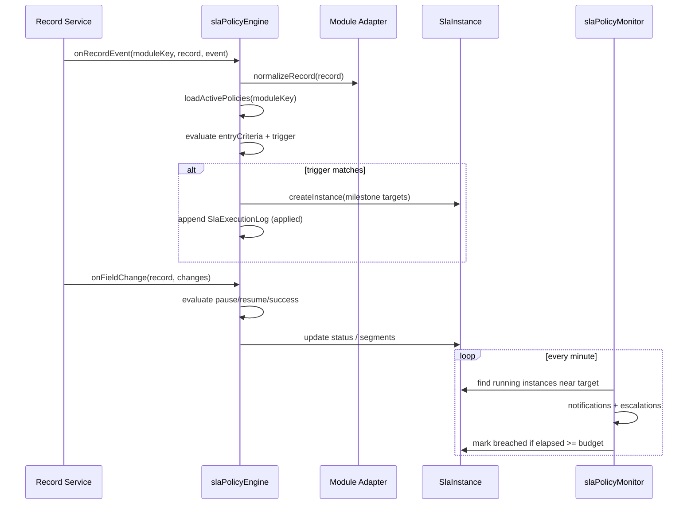

# Generic SLA Policy Engine — Architecture

Metadata-driven, event-based SLA engine for all modules (Cases, Deals, Orders, custom objects). Aligns with ServiceNow SLA Definitions and Salesforce Entitlements.

## 1. Architecture Overview

```
┌─────────────────────────────────────────────────────────────────────────┐
│                           Settings UI (Vue)                               │
│  SlaPolicyHub → SlaPolicyEditor (sections) → ConditionBuilder, etc.    │
└───────────────────────────────────┬─────────────────────────────────────┘
                                    │ REST
┌───────────────────────────────────▼─────────────────────────────────────┐
│                     slaPolicyController                                  │
│  CRUD · metadata · simulate · coverage preview                          │
└───────────────────────────────────┬─────────────────────────────────────┘
                                    │
┌───────────────────────────────────▼─────────────────────────────────────┐
│                      slaPolicyEngine (orchestrator)                      │
│  match policies · start/pause/resume/complete · breach evaluation       │
└───┬──────────────┬──────────────┬──────────────┬────────────────────────┘
    │              │              │              │
    ▼              ▼              ▼              ▼
slaModule    slaCondition   slaPolicyClock  slaPolicyMonitor
Registry     Evaluator      Service         Service
(adapters)                  (business hrs)  (alerts/escalations)
    │
    ▼
Record lifecycle hooks · domain events · scheduled tick · API events
```

**Principles**

- **Metadata-driven scope**: `slaModuleRegistry` resolves module fields, milestones, and record-type options from `ModuleDefinition` + tenant config.
- **Plugin adapters**: Each module registers `ISlaModuleAdapter` (normalize record, extract context, lifecycle hooks).
- **Policy vs runtime**: `SlaPolicy` (config) separated from `SlaInstance` (per-record timer state).
- **Tenant isolation**: All collections scoped by `organizationId`; models use `wrapTenantModel`.
- **Backward compatibility**: `casesSlaAdapter` bridges embedded `currentSlaCycle` during migration.

## 2. Database Design

### 2.1 `SlaPolicy` (configuration)

| Field | Type | Description |
|-------|------|-------------|
| `organizationId` | ObjectId | Tenant |
| `policyKey` | String | Stable key (unique per org) |
| `name` | String | Display name |
| `active` | Boolean | Enabled |
| `precedence` | Number | Higher wins in `highest_priority` mode |
| `isDefault` | Boolean | Fallback when no match |
| `executionMode` | Enum | `first_match` \| `all_matches` \| `highest_priority` |
| `scope` | Object | `{ moduleKey, appKey, recordType? }` |
| `entryCriteria` | ConditionGroup | Nested AND/OR |
| `trigger` | Object | `{ type, field?, eventName?, config? }` |
| `targets` | Array | Milestone targets by priority dimension |
| `pauseConditions` | ConditionGroup[] | Timer suspend rules |
| `resumeConditions` | ConditionGroup[] | Timer resume rules |
| `successCriteria` | ConditionGroup | SLA completion |
| `breachConditions` | ConditionGroup | Optional explicit breach (default: target exceeded) |
| `notifications` | Array | Alert rules (before/at/after breach) |
| `escalations` | Object | Steps, cooldown, actions |
| `calendar` | Object | Business hours / 24×7 / holiday set / priority overrides |
| `advanced` | Object | Version, tags, metadata |
| `version` | Number | Optimistic concurrency |

**ConditionGroup** (recursive):

```json
{
  "combinator": "all",
  "clauses": [{ "field": "priority", "operator": "equals", "value": "Critical" }],
  "groups": [{ "combinator": "any", "clauses": [...] }]
}
```

**Trigger types**: `record_created`, `field_change`, `date_field_reached`, `custom_event`

**Milestone keys**: `first_response`, `resolution`, `approval`, or custom string per module adapter.

### 2.2 `SlaInstance` (runtime)

| Field | Type | Description |
|-------|------|-------------|
| `organizationId` | ObjectId | Tenant |
| `policyId` | ObjectId | Ref SlaPolicy |
| `policyKey` | String | Denormalized |
| `policySnapshot` | Mixed | Frozen policy at apply time |
| `moduleKey` | String | e.g. `cases` |
| `recordId` | ObjectId | Target record |
| `milestoneKey` | String | e.g. `first_response` |
| `cycleNo` | Number | Reopen cycle |
| `status` | Enum | `pending` \| `running` \| `paused` \| `met` \| `breached` \| `cancelled` |
| `startedAt` | Date | Trigger time |
| `targetAt` | Date | Computed deadline |
| `metAt` | Date | Success time |
| `breachedAt` | Date | Breach time |
| `pausedAt` | Date | Current pause start |
| `pauseSegments` | Array | `{ from, to }` |
| `stoppedAt` | Date | Terminal |
| `elapsedMinutes` | Number | Cached on stop |
| `alertsSent` | Mixed | Dedup keys |
| `escalationState` | Mixed | Step index, last fired |

**Indexes**: `{ organizationId, moduleKey, recordId, status }`, `{ organizationId, status, targetAt }` (monitor tick).

### 2.3 `SlaExecutionLog` (audit & analytics)

| Field | Type |
|-------|------|
| `organizationId`, `instanceId`, `policyKey`, `moduleKey`, `recordId` |
| `eventType` | `applied` \| `triggered` \| `paused` \| `resumed` \| `met` \| `breached` \| `escalated` \| `notified` |
| `payload` | Mixed |
| `occurredAt` | Date |
| `actorId` | ObjectId (optional) |

## 3. API Contracts

Base: `/api/settings/automation/sla-policies`

| Method | Path | Description |
|--------|------|-------------|
| GET | `/metadata?moduleKey=` | Operators, milestones, modules, channels |
| GET | `/` | List policies (filter: moduleKey, active) |
| GET | `/:policyKey` | Single policy |
| PUT | `/:policyKey` | Upsert policy |
| DELETE | `/:policyKey` | Soft-delete / deactivate |
| POST | `/simulate` | Coverage preview — `{ moduleKey, sampleRecord }` |
| POST | `/migrate-helpdesk` | One-time import from TenantAppConfiguration |

**Policy DTO** mirrors `SlaPolicy` schema. Responses include `metadata` block for UI option labels.

## 4. Event Flow



**Event sources**

1. Record create/update hooks in module controllers
2. Domain events (`CASE_STATUS_CHANGED`, etc.) via thin subscriber
3. Custom API: `POST /api/sla/events` with `{ moduleKey, recordId, eventName }`
4. Scheduler: date-field triggers scanned hourly

## 5. SLA Evaluation Algorithm

```
function evaluatePolicies(record, event, policies, mode):
  matches = []
  for policy in policies sorted by precedence desc:
    if !policy.active: continue
    if !evaluateGroup(policy.entryCriteria, record): continue
    if !triggerMatches(policy.trigger, record, event): continue
    matches.push(policy)
    if mode == FIRST_MATCH: break
  return matches

function tickInstance(instance, now, schedule):
  if instance.status in [met, breached, cancelled]: return
  elapsed = clock.elapsed(instance, schedule, now)  // excludes pause segments
  budget = instance.policySnapshot.budgetMinutes
  if successCriteriaMet(record): markMet(instance)
  else if elapsed >= budget: markBreached(instance)
  else processAlerts(instance, elapsed/budget)
```

**Pause/resume**: On each record update, evaluate `pauseConditions` before `resumeConditions`. Open pause sets `pausedAt`; resume closes segment into `pauseSegments`.

**Multiple SLAs**: `executionMode` on policy set (tenant-level default + per-policy override). `all_matches` creates one instance per policy per applicable milestone.

## 6. Background Job Strategy

| Job | Cadence | Responsibility |
|-----|---------|----------------|
| `slaPolicyMonitorTick` | 1 min | Warning/breach alerts, escalation steps |
| `slaDateTriggerScan` | 15 min | `date_field_reached` policies |
| `slaAnalyticsRollup` | 1 hr | Aggregate metrics to reporting collection |
| `slaInstanceReconcile` | daily | Orphan/stale instance cleanup |

Jobs are org-batched (limit 500 instances/tick), idempotent via `alertsSent` / `escalationState` keys. Reuse `scheduledJobs.js` pattern from helpdesk SLA.

## 7. UI Component Structure

```
client/src/components/settings/sla/
  SlaPolicyHub.vue           # List + drawer shell (module selector)
  SlaPolicyEditor.vue        # Section-based form (wraps helpdesk editor)
  SlaConditionBuilder.vue    # Reusable AND/OR + nested groups
  SlaPolicyScopeSection.vue  # Module + record type chips
  SlaPolicyTriggerSection.vue
  SlaPolicyMilestoneGrid.vue # Generic target grid (reuse HelpdeskSlaTargetGrid)
  SlaPolicyAlertCards.vue    # Re-export HelpdeskSlaAlertCards
  SlaPolicyEscalationTimeline.vue
  SlaPolicyCoveragePreview.vue
```

**Flow**: General → Scope → Entry Criteria → Trigger → Targets → Pause/Resume → Notifications → Escalations → Coverage Preview → Advanced → Save.

Helpdesk execution settings remain as a **module-scoped shortcut** (`moduleKey=cases`) until full migration.

## 8. Module Plugin Interface

```javascript
// server/services/sla/slaModuleRegistry.js
registerAdapter(moduleKey, {
  appKey,
  milestoneKeys: ['first_response', 'resolution'],
  priorityDimension: 'priority',        // field used for target matrix
  normalizeRecord(record) => plain object for conditions,
  getScheduleContext(record, policy) => calendar resolution,
  onInstanceMet(instance, record) => optional side effects,
  legacyBridge: { enabled, readCycle, writeCycle }  // migration only
});
```

New modules: add adapter + register in bootstrap; UI picks up module from `/metadata`.

## 9. Migration Strategy (Helpdesk → Generic)

| Phase | Action |
|-------|--------|
| **0** | Ship generic models + API + UI behind feature flag |
| **1** | `migrateHelpdeskPolicies()` copies `TenantAppConfiguration.settings.slaPolicies` → `SlaPolicy` with `scope.moduleKey=cases` |
| **2** | `slaPolicyEngine` reads `SlaPolicy` first; falls back to legacy `helpdeskSlaService` |
| **3** | Dual-write: new instances in `SlaInstance`; sync summary to `currentSlaCycle` for UI badges |
| **4** | Switch case UI to read `SlaInstance`; deprecate embedded cycle fields |
| **5** | Remove legacy `slaPolicies` from TenantAppConfiguration |

**Mapping**

| Legacy | Generic |
|--------|---------|
| `caseTypes/channels/priorities` chips | `entryCriteria` + scope filters |
| `priorityTargets` | `targets[]` by milestone + priority |
| `useCalendarTime` / `businessHours` | `calendar` |
| `alerts` / `escalationSteps` | `notifications` / `escalations` |
| `currentSlaCycle` | `SlaInstance` rows |

Rollback: keep legacy path until Phase 4 validation complete.

## 10. State Transitions (SlaInstance)

```
pending → running → met
                 → breached
                 → cancelled
running ↔ paused
```

Terminal states: `met`, `breached`, `cancelled`. Reopen creates new `cycleNo` instances.
