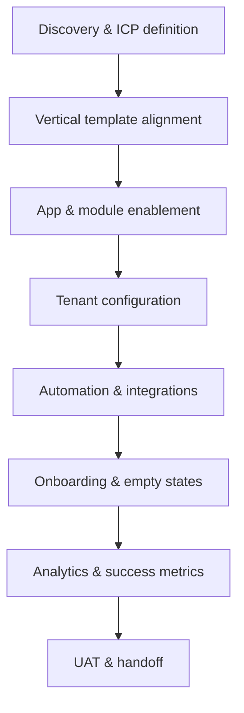

# Arivu Vertical Implementation Guide

**Audience:** Implementation, Solutions, CS, and Engineering  
**Purpose:** End-to-end playbook for configuring and delivering Arivu for a business vertical (industry)  
**Status:** Living document  
**Last updated:** 2026-09-01  
**Hands-on playbooks:** [VERTICAL_IMPLEMENTATION_PLAYBOOKS.md](./VERTICAL_IMPLEMENTATION_PLAYBOOKS.md) — step-by-step lab guide per vertical

---

## 1. What “vertical” means in Arivu

In Arivu, a **vertical** is the customer’s industry, captured at signup as `Organization.industry` (registration field: `vertical`).

It drives:

| Layer | What vertical affects |
|-------|------------------------|
| Onboarding | Goal options, checklist emphasis, sample-data offer, empty-state copy |
| App selection | Primary app (`SALES`, `AUDIT`, etc.) |
| Module emphasis | Which modules appear first in setup and Platform Home |
| Demo conversion | Pre-seeded workspace shape (optional) |
| Analytics | Funnel segmentation by industry (PostHog) |

Vertical is **not** a separate product fork. All vertical behavior is expressed through:

- Tenant configuration (fields, pipelines, picklists, automation)
- App/module enablement
- Optional sample data templates
- i18n copy keys

**Principle (from platform architecture):** Do not hardcode vertical-specific business logic in core modules. Prefer tenant-configurable metadata (custom fields, pipeline stages, catalog categories, process rules).

---

## 2. Supported verticals (current catalog)

These values must match exactly between signup UI and server templates.

| Vertical (signup label) | Template key | Primary app | Primary modules |
|-------------------------|--------------|-------------|-----------------|
| *(none / unknown)* | `sales_default` | SALES | people, deals |
| Retail (Fashion, Electronics, Footwear, etc.) | `retail` | SALES | people, deals, items |
| Real Estate | `real_estate` | SALES | people, deals, organizations |
| Service-Based (Gyms, Salons) | `services` | SALES | people, tasks |
| Education Institutes | `education` | SALES | people, tasks, events |
| Healthcare Clinics | `healthcare` | SALES | people, tasks |
| IT & SaaS Agencies | `saas` | SALES | people, deals, tasks |
| Auditing Firms / Inspection Services | `audit` | AUDIT | assignments |
| Automotive Dealers | `automotive` | SALES | people, deals, organizations |
| Event Management Firms | `events` | SALES | people, events, tasks |
| Pest Control / Facility Maintenance | `field_service` | SALES | people, tasks |

**Source of truth:**

- Signup options: `client/src/components/auth/RegistrationForm.vue`
- Server mapping: `server/services/onboardingVerticalTemplates.js`

If these drift, onboarding personalization breaks silently (falls back to `sales_default`).

---

## 3. End-to-end delivery model

Use this sequence for every vertical engagement — self-serve, demo-converted, or enterprise.



### Phase 0 — Discovery (before configuration)

Capture and document:

| Item | Example questions |
|------|-------------------|
| Primary job-to-be-done | Pipeline sales? Admissions funnel? Field inspections? |
| Primary app | SALES, HELPDESK, AUDIT, INVENTORY, MARKETING |
| Core modules | people, deals, tasks, events, items, cases, assignments |
| Record types & fields | What is a “lead” vs “contact”? What custom attributes matter? |
| Pipeline / lifecycle | Stages, statuses, SLAs |
| Commercial flow | Quotes → Orders → Invoices → Payments? |
| Integrations | Email, WhatsApp, Tally, payment gateway, calendar |
| Roles & permissions | Owner, manager, agent, field exec, read-only |
| Success metric | First record in 24h? First deal won in 30d? First audit submitted? |

**Output:** One-page vertical solution brief (attach to demo request or CS ticket).

---

### Phase 1 — Platform provisioning

| Path | Steps |
|------|-------|
| **Self-serve signup** | User selects vertical → org created with 15-day trial, SALES enabled by default |
| **Demo → tenant** | Admin converts demo request → optional industry carry-over → activation email → `/onboarding` |
| **Enterprise / multi-app** | Enable apps via `Organization.enabledApps`; verify seat/plan limits |

**Verify after provision:**

- [ ] `Organization.industry` matches selected vertical label
- [ ] Tenant DB initialized (`database.initialized`)
- [ ] Owner can log in and reach `/onboarding` or Platform Home
- [ ] `GET /api/users/me/onboarding` returns expected `verticalTemplate`

---

### Phase 2 — App & module enablement

Map discovery to Arivu apps (`server/constants/appKeys.js`):

| App | When to enable |
|-----|----------------|
| SALES | CRM, pipeline, commercial docs, catalog |
| HELPDESK | Ticket/case management, SLAs, support inbox |
| AUDIT | Inspections, forms, assignments, offline mobile |
| INVENTORY | Stock, fulfillment, purchase/sales logistics |
| MARKETING | Campaigns, audiences, content |
| PROJECTS | Delivery/project tracking |
| PORTAL | External customer/partner portal |
| LMS | Training (if entitled) |

**Module enablement** is per-app via tenant module configuration and registry — not hardcoded per vertical.

**Vertical template** only suggests **emphasis** (`primaryModules`), not exclusive access.

---

### Phase 3 — Tenant configuration (core implementation work)

This is where most vertical differentiation happens. Work module-by-module.

#### 3.1 People & Organizations

| Configure | Vertical examples |
|-----------|-------------------|
| Person types / participations | Lead vs Contact (SALES); Patient (healthcare) via custom fields |
| Organization types | Customer, Partner, Vendor; Property Developer (real estate) |
| Custom fields | Admission grade (education), Property type (real estate), Vehicle model (automotive) |
| Assignment rules | Round-robin by territory, group, or skill |
| Import templates | CSV column map aligned to vertical vocabulary |

**Settings path:** `/settings?tab=core-modules&moduleKey=people` (and organizations)

#### 3.2 Deals & pipeline (SALES verticals)

| Configure | Notes |
|-----------|-------|
| Pipeline stages | Match customer’s sales process verbatim |
| Stage → probability | For forecasting |
| Lost reasons | Vertical-specific churn reasons |
| Deal custom fields | Unit, project, course, property ID, etc. |
| Deal ↔ People / Org relationships | Primary contact rules per Architecture_Document |

**Reference:** Deal stage vs status — stage is tenant-owned; status (`Open`/`Won`/`Lost`) is platform-owned.

#### 3.3 Tasks & Events

Common for services, healthcare, education, field service, events verticals.

| Configure | Examples |
|-----------|----------|
| Task statuses / priorities | Service visit, follow-up, admission call |
| Event types | Open day, inspection, site visit, class session |
| Scheduling | Public booking links if customer self-schedules |
| Related-to links | Task → Person, Event → Deal |

#### 3.4 Catalog & Items (retail, automotive)

| Configure | Notes |
|-----------|-------|
| Categories | Tenant-configurable — no vertical hardcoding in code |
| Attributes & variants | Size, color, SKU, model year |
| Price books | B2B vs B2C if needed |
| Lifecycle labels | Active / Discontinued |

**Reference:** `docs/CATALOG_ROADMAP.md` — categories and attributes are metadata, not code branches.

#### 3.5 Helpdesk (support-heavy verticals)

| Configure | When |
|-----------|------|
| Case lifecycle & SLAs | Customer support, post-sale service |
| Assignment rules | Queue by product line or region |
| Response templates | Standard replies |
| Inbound email / live chat | If support channel is email or web chat |

**Reference:** `docs/SLA_POLICY_ENGINE_ARCHITECTURE.md`

#### 3.6 Audit (inspection verticals)

| Configure | When |
|-----------|------|
| Form definitions | Checklists, scoring, conditional logic |
| Assignments | Field auditor workflows |
| Mobile offline sync | Field inspections |
| Execution surfaces | Submit, review, approve |

**Reference:** `docs/architecture/form-architecture-design.md`, Audit app in `Architecture_Document.md`

#### 3.7 Commercial documents (when revenue is invoiced)

Enable and configure in order:

```text
Deal (+ lines) → Quote → Sales Order → Invoice → Payment
```

| Vertical | Typical commercial pattern |
|----------|---------------------------|
| Retail / Automotive | Quote → SO → Invoice; catalog line items |
| Real Estate | Deal amount manual; milestone invoicing |
| IT & SaaS | Subscription-like deal fields; recurring invoices (if configured) |
| Services | Task completion triggers quote/invoice (via automation) |

**References:** `docs/SALES_ORDER_ARCHITECTURE.md`, `docs/INVOICE_ARCHITECTURE.md`, `docs/PAYMENTS_ARCHITECTURE.md`

#### 3.8 Automation & processes

Express vertical business rules without custom code where possible:

| Use case | Mechanism |
|----------|-----------|
| Stage change → task | Process engine / automation rules |
| New lead → assign owner | Assignment rules |
| Case SLA breach → notify | SLA policy engine |
| Form fail → escalation | Audit process rules |
| Won deal → create invoice draft | Commercial conversion + automation |

**Reference:** `server/services/PROCESS_ENGINE_STEP_0.md`

---

### Phase 4 — Onboarding & first-run experience

Align founder journey with vertical template.

| Step | Vertical-aware behavior |
|------|-------------------------|
| Signup | Vertical selected → stored as `industry` |
| Wizard goal | sales / support / audit / explore |
| First value action | Emphasize `primaryModules` from template |
| Sample data | Opt-in; template key drives contact names (`onboardingSampleDataService`) |
| Platform Home checklist | Org-level progress (profile, first record, email, invite, import) |
| Empty states | Classify: `FIRST_TIME` / `NO_DATA` / `NO_ACCESS` / `NOT_CONFIGURED` / `DISABLED` |

**Onboarding maintenance rules:** Extend `onboardingService` only — no parallel onboarding frameworks. See `docs/USER_ONBOARDING_ARCHITECTURE.md`.

**New module merge checklist (required for any vertical-facing module work):**

- [ ] i18n complete
- [ ] FIRST_TIME empty state
- [ ] Module visit tracking
- [ ] PostHog analytics events
- [ ] Platform Home alignment (if applicable)
- [ ] Permissions validated
- [ ] Empty-state classification reviewed

---

### Phase 5 — Roles, permissions & sharing

| Task | Detail |
|------|--------|
| Define roles | Map customer titles → Arivu roles |
| App permissions | Per-app module CRUD + scope (all/team/own) |
| Profiles | Field-level restrictions if needed |
| Sharing rules | Manager sees team records; agent sees own |
| Portal users | External access if PORTAL app enabled |

**References:** `docs/architecture/RBAC_IMPLEMENTATION_PLAN.md`, `docs/architecture/platform-permission-contract.md`

---

### Phase 6 — Integrations & channels

| Integration | Vertical relevance |
|-------------|------------------|
| Email (Gmail / inbound) | Helpdesk, sales follow-up |
| Live chat addon | Retail, SaaS support |
| Payment gateway | Invoicing verticals |
| Tally | India accounting (`docs/TALLY_INTEGRATION_ARCHITECTURE.md`) |
| Webforms | Lead capture (education admissions, real estate inquiries) |
| Public scheduling | Services, healthcare appointments |
| Mobile (Capacitor) | Field service, audit |

Verify tenant isolation and permission checks on every integration path.

---

### Phase 7 — Analytics & success metrics

Instrument vertical funnels in PostHog:

| Event / dimension | Use |
|-------------------|-----|
| `organization.industry` | Segment conversion by vertical |
| Onboarding step completion | Drop-off diagnosis |
| `first_record_created` | Time-to-value |
| Module visits | Adoption of emphasized modules |
| Trial limits | Upgrade triggers |

Define **vertical-specific success criteria** upfront, e.g.:

| Vertical | Primary success metric |
|----------|------------------------|
| Retail | First deal with catalog line item |
| Real Estate | First deal linked to organization (property developer) |
| Education | First event + 10 people imported |
| Audit | First assignment submitted on mobile |
| Field service | First task completed with geo check-in |

---

## 4. Vertical playbooks (quick reference)

> **Full step-by-step labs:** See [VERTICAL_IMPLEMENTATION_PLAYBOOKS.md](./VERTICAL_IMPLEMENTATION_PLAYBOOKS.md) for numbered implementation steps, UAT scripts, and success metrics per vertical.

### 4.1 Sales-led verticals (Retail, Real Estate, Automotive, IT & SaaS)

**Apps:** SALES (+ INVENTORY if stock tracked, + MARKETING if campaigns needed)

**Configure:**

1. People + Organizations field model
2. Deal pipeline matching customer stages
3. Items/catalog if product-led
4. Assignment rules for sales team
5. Quotes/invoices if billing in-platform
6. Import template for legacy CRM data

**First win:** Create contact + deal (or import ≥3 rows)

---

### 4.2 Service & operations verticals (Gyms, Healthcare, Pest Control)

**Apps:** SALES (people/tasks) ± HELPDESK

**Configure:**

1. Task types and statuses (visit, follow-up, renewal)
2. Scheduling if appointments matter
3. People custom fields (membership, plan, location)
4. Automation: task overdue → notify assignee
5. Mobile access for field staff

**First win:** Create person + scheduled task

---

### 4.3 Education

**Apps:** SALES (+ MARKETING for admissions campaigns)

**Configure:**

1. People: admission stage picklist, course interest, source
2. Events: open days, counseling sessions
3. Tasks: follow-up calls, document collection
4. Webforms: inquiry capture
5. Pipeline or task board for admission funnel

**First win:** Import inquiry list or create event with registrants

---

### 4.4 Events management

**Apps:** SALES

**Configure:**

1. Events module: event types, venues, dates
2. People: attendees, sponsors, vendors
3. Tasks: pre-event checklist per event
4. Deals: sponsorship / ticket revenue (if applicable)

**First win:** Create event + link people

---

### 4.5 Audit & inspection

**Apps:** AUDIT (+ mobile)

**Configure:**

1. Enable AUDIT app (not SALES-only)
2. Form definitions per inspection type
3. Assignments and execution workflow
4. Roles: auditor vs reviewer vs admin
5. Offline sync tested on target devices

**First win:** Complete sample assignment on mobile

---

## 5. Adding or extending a vertical (engineering)

When product adds a **new industry option**:

| # | Task | File / area |
|---|------|-------------|
| 1 | Add exact label to signup picklist | `client/src/components/auth/RegistrationForm.vue` |
| 2 | Add template entry | `server/services/onboardingVerticalTemplates.js` |
| 3 | Optional: sample contact set | `SAMPLE_DATA_SETS` in same file |
| 4 | i18n for any new onboarding copy | `client/src/locales/en/onboarding.json` |
| 5 | PostHog property validation | onboarding events |
| 6 | Update this guide’s catalog table | `docs/VERTICAL_IMPLEMENTATION_GUIDE.md` |
| 7 | QA: register test tenant, verify `verticalTemplate` in onboarding API |

**Do not:**

- Branch core module logic on industry string
- Add vertical-specific API routes
- Skip tenant isolation or permission checks

---

## 6. QA checklist (pre-handoff)

### Platform

- [ ] Correct apps enabled for plan
- [ ] All configured modules visible in sidebar for test roles
- [ ] Tenant A cannot see Tenant B data (spot check)

### Configuration

- [ ] Custom fields appear in create/edit/list as designed
- [ ] Pipeline stages match signed-off process doc
- [ ] Automation rules fire on test records
- [ ] Import works with customer CSV sample

### Onboarding

- [ ] New signup with vertical lands on `/onboarding`
- [ ] `verticalTemplate.primaryModules` matches expectation
- [ ] Sample data offer behaves correctly (available only when people count = 0)
- [ ] Platform Home checklist reflects org progress

### Vertical-specific smoke

- [ ] “First win” scenario completes in <10 minutes for a new user
- [ ] Mobile flows tested (if field/audit vertical)
- [ ] Commercial doc flow tested end-to-end (if billing vertical)

### Observability

- [ ] PostHog events visible for test tenant
- [ ] No PII in analytics payloads beyond policy

---

## 7. Roles & responsibilities

| Role | Owns |
|------|------|
| **Solutions / CS** | Discovery brief, pipeline/field design, UAT scripts, customer training |
| **Implementation engineer** | Tenant config, automation, integrations, demo conversion |
| **Product engineering** | New vertical template entries, onboarding/sample data, module gaps |
| **QA** | Checklist in §6, cross-tenant isolation |
| **Customer (founder)** | Pipeline stage names, field labels, role mapping sign-off |

---

## 8. Key file reference

| Concern | Location |
|---------|----------|
| Architecture overview | `Architecture_Document.md` |
| Onboarding architecture | `docs/USER_ONBOARDING_ARCHITECTURE.md` |
| Vertical templates | `server/services/onboardingVerticalTemplates.js` |
| Vertical preset packs | `server/services/verticalPresets.js`, `server/services/verticalPresetService.js` |
| Vertical catalog (labels) | `server/constants/verticalCatalog.js`, `client/src/constants/verticalOptions.js` |
| Audit/items initializers | `server/services/auditAppInitializer.js`, `server/services/itemsModuleInitializer.js` |
| Golden tenant seed | `server/scripts/seedVerticalGoldenTenant.js` |
| Sample data seeding | `server/services/onboardingSampleDataService.js` |
| Onboarding API/state | `server/services/onboardingService.js` |
| Signup vertical picklist | `client/src/components/auth/RegistrationForm.vue` |
| App keys | `server/constants/appKeys.js` |
| Module settings doctrine | `docs/architecture/module-settings-doctrine.md` |
| RBAC | `docs/architecture/RBAC_IMPLEMENTATION_PLAN.md` |
| Catalog (tenant metadata) | `docs/CATALOG_ROADMAP.md` |
| Commercial stack | `docs/SALES_ORDER_ARCHITECTURE.md`, `docs/INVOICE_ARCHITECTURE.md` |
| i18n | `client/docs/I18N_GUIDELINES.md` |

---

## 9. Appendix — vertical solution brief template

Copy for each customer engagement:

```markdown
## Customer
- Company:
- Vertical (Arivu label):
- Plan / apps entitled:

## Job-to-be-done
- Primary outcome:
- Secondary outcomes:

## Module map
| Module | Purpose | Custom fields | Notes |
|--------|---------|---------------|-------|
| people | | | |
| deals | | | |
| tasks | | | |

## Pipeline / lifecycle
- Stages:
- Automation on stage change:

## Integrations
- Email:
- Payments:
- Other:

## Roles
| Customer title | Arivu role | App access |
|----------------|------------|------------|

## First win (UAT)
1.
2.
3.

## Success metric (30 days)
-
```

---

## 10. Open items / roadmap

| Item | Status | Notes |
|------|--------|-------|
| Vertical-specific sample data beyond contacts + 1 deal | Done | All 11 template keys have sample contacts; demo convert auto-seeds |
| Vertical-specific empty-state copy keys | Done | `emptyStateCopyKey` per template + `onboarding.emptyState*` i18n keys |
| Education admissions packaged LP | Not started | Competitor pattern — requires funnel data before build |
| Vertical admin presets at demo conversion | Done | `verticalPresets.js` + `verticalPresetService.js`; preview API + convert override |

Propose new vertical mechanics only with evidence: funnel drop-off, support tickets, or activation/retention data (see onboarding maintenance rules in `Architecture_Document.md`).
