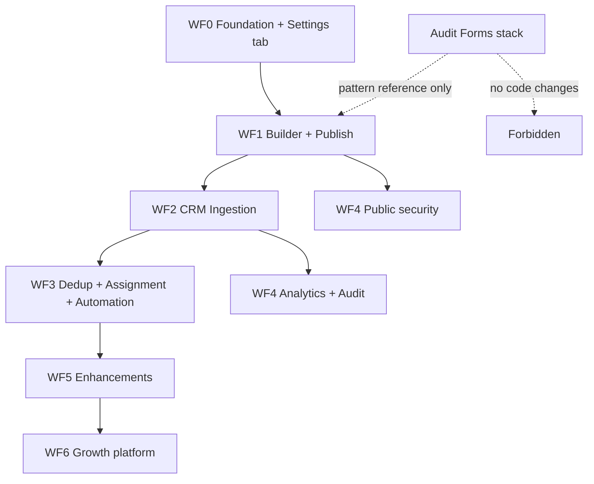

# Webform Builder — Implementation Roadmap

**Source PRD:** `Arivu_Webform_Builder_Complete_PRD.docx` (June 2026)

**Product goal:** CRM-native lead capture — publish hosted/embeddable forms that create or update CRM records, trigger assignment, notifications, tasks, and webhooks.

**Availability:** Settings sidebar for **all tenants** (including Arivu master org). Not gated to internal-only.

**Last updated:** 2026-06-16 (WF5 complete — multi-step button polish, file uploads)

---

## Separation doctrine (locked)

> **Audit forms and Webforms are different products.** This initiative must not disturb Audit form behavior, routes, models, or UI.

| | **Audit forms** (existing — do not touch) | **Webforms** (this roadmap) |
|---|-------------------------------------------|-----------------------------|
| **Purpose** | Field audits, scoring, corrective actions, event check-in | Lead capture, CRM ingestion, marketing/sales intake |
| **Admin entry** | Audit app + `/forms` platform module | **Settings → Webforms** |
| **Models** | `Form`, `FormResponse` | **`Webform`, `WebformSubmission`** (new collections) |
| **API** | `/api/forms`, `/api/audit/forms`, `/api/public/forms` | **`/api/webforms`, `/api/public/webforms`** |
| **Public routes** | `/forms/public/:slug` | **`/webforms/public/:slug`, `/webforms/embed/:slug`** |
| **Builder UI** | `FormBuilder.vue`, `SectionsBuilder`, audit scoring/evidence | **New Settings-scoped builder** (`WebformBuilder*`) |
| **Submission pipeline** | `formProcessingService` (scoring, KPIs, corrective tasks) | **`webformProcessingService`** (CRM map, dedup, assignment) |
| **i18n namespace** | `forms.*` | **`webforms.*`** |

### Hard rules for contributors

1. **No edits** to Audit-specific paths unless fixing an unrelated bug — and never to add Webform behavior:
   - `server/models/Form.js`, `FormResponse.js`
   - `server/controllers/formController.js`, `formResponseController.js`
   - `server/services/formProcessingService.js`, `formScoringService.js`
   - `client/src/views/FormBuilder.vue`, `FormFill.vue`, `FormResponseDetail.vue`
   - `client/src/components/forms/SectionsBuilder.vue` and audit question types
   - `/api/audit/forms/*`, Audit app routes
2. **Do not add** `formType: 'Webform'` to the existing `Form` model.
3. **Reuse platform services as consumers only** — assignment rules engine, automation engine, notification service, module field metadata, rate limiting, upload middleware.
4. **Copy UX patterns** from Forms/Booking where helpful; implement in **new files** under `webforms/` namespaces.

---

## Progress tracker

| Phase | Status | Target |
|-------|--------|--------|
| **WF0** — Foundation & Settings entry | ✅ Done | Models, routes, Settings tab, list hub |
| **WF1** — Builder & publish (MVP core) | ✅ Done | Builder wizard, public page, embed snippets, submission storage, builder polish (see below) |
| **WF2** — Submission & CRM ingestion | ✅ Done | CRM create/update, submissions UI, timeline activity; idempotency header |
| **WF3** — Dedup, assignment, automation | ✅ Done | Dedup, assignment, in-app + email notify, webhook, task template, automation trigger |
| **WF1 polish** — Public UX & reliability | ✅ Done | Client validation, CRM picklist sync, public-link save fix, i18n, hosted URL load |
| **WF4** — Security & analytics | ✅ Done | Rate limits, CAPTCHA, XSS, analytics, audit log, PostHog, webhook docs |
| **WF4 polish** — CAPTCHA on hosted URL | ✅ Done | Widget mount timing, CSP allowlist, script `ready()` race, auth-fallback site key |
| **WF5** — Enhancements (PRD Phase 2) | ✅ Complete | Embed · prefill · branding · conditional logic · multi-step · file uploads · step button config |
| **WF6** — Growth platform (PRD Phase 3) | ❌ Not started | A/B, ad sync, AI, templates, journey analytics |

**PRD timeline mapping:** WF0–WF4 ≈ PRD Phase 1 (6–8 weeks) · WF5 ≈ Phase 2 (8–10 weeks) · WF6 ≈ Phase 3 (10–12 weeks)

---

## Goals (from PRD)

- Reduce third-party form dependency (Typeform, Jotform, HubSpot Forms)
- Improve lead conversion via CRM-native capture and assignment
- Accelerate response times (auto-assignment + notifications)
- Enable no-code automation on submission (tasks, webhooks, automation rules)

**Personas:** Admin, Manager, User, Viewer — mapped to existing role/permission model.

---

## Current state (Audit forms — baseline reference only)

The platform already ships a mature **Audit / Survey / Feedback** forms stack. That stack is **out of scope** for Webform work except as a **pattern reference**.

| Capability | Audit stack (exists) | Webform (needed) |
|------------|----------------------|------------------|
| Form definition model | `Form` with sections, scoring, KPIs | Flat/step schema, CRM field bindings |
| Public submit | `/api/public/forms/:slug/submit` | `/api/public/webforms/:slug/submit` |
| Hosted page | `PublicFormView.vue` | `WebformPublicView.vue` |
| Embed / iframe | ❌ (Booking has embed pattern) | New embed route + snippet generator |
| CRM record create/update | Stub (`mapFormDataToContact`) | First-class field mapping + dedup |
| Assignment | Partial on `Form.autoAssignment` | Assignment rules engine integration |
| Notifications / tasks on submit | TODO stubs in `triggerWorkflows` | Full implementation in `webformProcessingService` |
| Webhooks | ❌ | Per-webform outbound webhook |
| Analytics | Form KPIs / compliance | Submission funnel + conversion metrics |
| CAPTCHA / rate limit | Global middleware only | Per-webform public submit hardening |

---

## Architecture

### Data model (new)

**`Webform`** — tenant-scoped definition

- Identity: `webformId`, `name`, `description`, `organizationId`
- Lifecycle: `status` (`Draft` \| `Active` \| `Archived`), `publishedAt`
- Target: `targetModuleKey` (`people` \| `organizations` \| `cases` \| `deals`, extensible)
- Fields: ordered field list (type, label, required, validation, CRM `fieldKey` binding, `stepId`, conditional `visibility`)
- Multi-step (WF5): `multiStep.enabled`, `multiStep.showProgress`, `steps[]` (title, description, order)
- Form actions: submit / next / back / reset / cancel — label, color, width, align per button
- Outcomes: create vs update, dedup config, assignment rule set ref, notification recipients, task template, webhook config
- Public: `publicLink.enabled`, `publicLink.slug`, thank-you message, redirect URL
- Branding (WF5): theme tokens
- Analytics counters: `totalSubmissions`, `lastSubmissionAt`

**`WebformSubmission`** — tenant-scoped instance

- `webformId`, `organizationId`, `submittedAt`, `ipAddress`, `userAgent`
- `fieldValues` (key → value map)
- `crmOutcome`: `{ moduleKey, recordId, action: 'created' \| 'updated' \| 'skipped' }`
- `dedupOutcome`: `{ matched: boolean, matchedRecordId?, action }`
- `assignmentOutcome`: optional ref to assignment execution log
- `status`: `processed` \| `failed` \| `duplicate_rejected`
- Audit metadata for compliance

### API surface (follows app conventions)

Uses existing middleware stack: `protect`, `organizationIsolation`, `checkTrialStatus`, `checkFeatureAccess`, `checkPermission`, public rate limiters.

| Purpose | Method | Route | Auth |
|---------|--------|-------|------|
| List webforms | GET | `/api/webforms` | JWT + `webforms.view` |
| Create | POST | `/api/webforms` | JWT + `webforms.create` |
| Get / update / delete | GET / PUT / DELETE | `/api/webforms/:id` | JWT + permission |
| Duplicate | POST | `/api/webforms/:id/duplicate` | JWT + `webforms.create` |
| Enable public link | POST | `/api/webforms/:id/enable-public` | JWT + `webforms.edit` |
| Analytics | GET | `/api/webforms/:id/analytics` | JWT + `webforms.view` |
| Submissions list | GET | `/api/webforms/:id/submissions` | JWT + `webforms.view` |
| Staff preview (auth) | GET | `/api/webforms/preview-by-slug/:slug` | JWT (tenant-scoped; no public flag required) |
| Public schema | GET | `/api/public/webforms/:slug` | None |
| Public submit | POST | `/api/public/webforms/:slug/submit` | None + CAPTCHA |
| Settings metadata | GET | `/api/settings/webforms/modules` | JWT + `settings.edit` |

Mount in `server.js`:

- Protected: `app.use('/api/webforms', webformRoutes.protected)`
- Public: `app.use('/api/public/webforms', webformRoutes)`

Pattern mirrors `/api/forms` + `/api/public/forms` — **separate routers**, no shared controllers with Audit.

### Client routes

| Route | Component | Notes |
|-------|-----------|-------|
| `/settings?tab=webforms` | `WebformsSettings.vue` | Hub list |
| `/settings?tab=webforms&webformId=:id` | `WebformBuilder.vue` | Builder (Settings deep view) |
| `/settings?tab=webforms&webformId=:id&view=submissions` | `WebformSubmissionsPanel.vue` | Submission list + CRM outcome links |
| `/webforms/staff-preview/:slug` | `WebformStaffPreviewView.vue` | Authenticated preview (opens from builder **Preview** button) |
| `/webforms/public/:slug` | `WebformPublicView.vue` | Hosted fill page (external visitors) |
| `/webforms/embed/:slug` | `WebformPublicView.vue` (`embed` meta) | iframe-friendly chromeless layout |

Settings integration follows `AutomationSettings.vue` hub + deep-link query pattern (`Settings.vue` rail tab, `canAccessSettingsTab`).

### Permissions (new module key)

Add `webforms` permission bundle (view, create, edit, delete) — same shape as `forms` but **independent** so Audit permissions are not conflated with Webform admin.

Settings tab access: `settings.edit` (same bar as Automation), plus `webforms.view` for read-only managers.

### Platform integrations (consumer only)

| Service | Webform usage |
|---------|---------------|
| `assignmentRulesEngine` | Run on CRM record after create/update |
| `automationEngine` | Domain event `webform.submission.processed` |
| Notification service | Notify configured users on submit |
| `ModuleDefinition` / field metadata | Validate CRM field bindings in builder |
| `sourceResolver` | Tag submissions `source: web_form` |
| Rate limit middleware | Per-slug public submit limiter |
| Upload middleware | WF5 file fields |

---

## Phase WF0 — Foundation & Settings entry (1 week)

**Exit criteria:** Every tenant sees Settings → Webforms; API CRUD works; no Audit files modified.

- [x] `server/models/Webform.js`, `WebformSubmission.js`
- [x] `server/controllers/webformController.js`, `webformSubmissionController.js`
- [x] `server/routes/webformRoutes.js` + `server/routes/settingsRoutes.js` metadata endpoint
- [x] `server/services/webformProcessingService.js` (skeleton)
- [x] Permission seed: `webforms.view|create|edit|delete`
- [x] Settings rail tab + landing card (`Settings.vue`, `SettingsLandingPage.vue`, `settingsTabAccess.ts`)
- [x] `WebformsSettings.vue` — list with empty state (`FIRST_TIME`)
- [x] i18n: `client/src/locales/en/webforms.json` + sync keys
- [x] PostHog: `webforms_settings_viewed`

**Permission fix (2026-06-16):** `canManageWebforms()` in `settingsTabAccess.ts` — Owner/Admin, workspace settings admins, or explicit `webforms.*`; stale sessions get `webforms` envelope via `rolePermissionProjection.js`.

---

## Phase WF1 — Builder & publish (MVP core) (1.5 weeks)

**Exit criteria:** Admin publishes a webform with CRM field bindings in under 5 minutes.

- [x] `WebformBuilder.vue` — wizard (4 steps):
  1. **Build** — details, header image (URL or upload), field palette, canvas, field inspector, form button settings
  2. **Configure** — record action (create / update / upsert), dedup, thank-you / redirect
  3. **Automate** — notify on submit, outbound webhook
  4. **Publish** — enable public link, hosted URL, embed snippets, live preview
- [x] Field types — loaded from platform metadata (`GET /settings/webforms/field-types`); 17 webform-capable types (excludes Auto-Number, Formula, Rollup, Lookup)
- [x] `WebformBuilderCanvas.vue` — drag-drop field layout; canvas preview aligned with live/public fill UI
- [x] `WebformBuilderFieldLibrary.vue` — dynamic palette from API
- [x] Form button customization — `formActions` (submit / next / back / reset / cancel: label, color, width, align; cancel redirect URL; next/back shown when multi-step enabled)
- [x] `WebformFormActionsBar.vue` + `webformFormActions.js` — shared actions bar (builder canvas, live preview, public fill)
- [x] Header image — URL input + file upload (`webformHeaderImageUpload.js`); resolved via `resolveWebformImageUrl()`
- [x] Collapsible sidebar sections — form settings, form buttons
- [x] Save draft — `PUT /api/webforms/:id` via `findOneAndUpdate`; stale GET guard (`draftSyncGeneration`); success/error toasts
- [x] `WebformPublicView.vue` — responsive single-page fill; locale preload, relative `/api` fetch, auth fallbacks (2026-06-16)
- [x] Client-side validation — required, email, phone (`webformFieldValidation.js`); server parity in `webformProcessingService`
- [x] CRM picklist binding — auto-populate options from CRM field metadata when picklist is bound (`webformCrmFieldUtils.js`)
- [x] `publicLink` save fix — dot-notation update only (no MongoDB path conflict on new saves)
- [x] Public slug registry — fast path only on public GET (no full tenant DB scan unless `scanTenants: true`)
- [x] Embed: iframe snippet + JS loader reference (loader script deferred)
- [x] `POST /api/webforms/:id/enable-public`
- [x] Thank-you / success message config
- [x] `POST /api/public/webforms/:slug/submit` — validate + persist submission + CRM ingestion
- [x] `WebformLivePreview.vue` — inline draft preview on Publish step (uses `WebformFillForm`)
- [x] `WebformStaffPreviewView.vue` + `/webforms/staff-preview/:slug` — authenticated fallback preview route (legacy)
- [x] Builder **Preview** / hosted link — opens `/webforms/public/:slug?webformId=…` after save; auth fallbacks if public slug lookup is slow
- [x] `WebformFillForm.vue` — shared fill UI for public, live preview, and canvas static preview
- [x] Public slug registry — `WebformPublicRegistry` (master DB) + `webformPublicRegistryService.js`
- [x] `webformPublicService.js` — resolve by slug (registry → current tenant context); optional `scanTenants` for repair only
- [x] Standalone public route handling — `standaloneRoutes.js`, tab-system skip, shell-less App layout
- [x] i18n — deferred `webforms.*` namespace loaded on public/staff views (non-blocking)
- [x] `/embed/webform.js` loader script — auto-resize iframe, forwards parent query params + `data-prefill` JSON
- [x] **Prefill** — query params → field values on public/embed (`webformPrefill.js`; keys: CRM field key, field ID, label slug, `field_<id>`)
- [x] **Branding** — logo, accent color, page background, font on public/embed/canvas/live preview (`webformBranding.js`)

**Preview vs hosted URL (current behavior)**

| Entry | Route | Audience | CAPTCHA |
|-------|-------|----------|---------|
| **Live preview** (Publish step) | Inline in builder | Draft from memory; `WebformFillForm` + `preview` mode | No |
| **Preview** button (builder) | `/webforms/public/:slug?webformId=:id` | Saves draft, opens public page; logged-in fallbacks: `GET /webforms/:id`, then `preview-by-slug` | Yes (if enabled + configured) |
| **Hosted URL** link | `/webforms/public/:slug` | Anonymous/public; `GET /api/public/webforms/:slug` + slug registry | Yes (if enabled + configured + Active) |
| **Staff preview** (legacy route) | `/webforms/staff-preview/:slug` | Still available; builder no longer opens this by default | No |

---

## Phase WF2 — Submission & CRM ingestion (1.5 weeks)

**Exit criteria:** Public submit creates or updates a CRM record with correct field values.

- [x] `server/services/webformCrmIngestionService.js` — map field bindings → CRM payload
- [x] `webformProcessingService.processSubmission()` calls CRM ingestion after validation
- [x] **Create** / **update** / **create_or_update** via `recordAction`
- [x] Modules: `people`, `organizations`, `cases`, `deals`
- [x] Persist `WebformSubmission.crmOutcome`; `source: web_form` via `sourceResolver`
- [x] People: identity + SALES participation (`Lead` / `New`); org relationship sync
- [x] Assignment hook via `runImmediateAssignmentForRecord` (best-effort)
- [x] `WebformSubmissionsPanel.vue` — Settings → Submissions; CRM record deep links via `buildCrmRecordPath()`
- [x] `GET /api/webforms/:id/submissions` — paginated list with `crmOutcome`
- [x] Tests: `webformCrmIngestionService.test.js`
- [x] Link submission to created record timeline/activity (`webformPostProcessingService.logSubmissionActivity`)
- [x] Idempotency key header support (optional client retry safety)

**WF2 exit:** CRM ingestion + submissions review UI + record timeline activity are production-usable. Dedup is implemented under WF3.

---

## What's next — recommended order

**Phase 1 (WF0–WF4) and WF5 are complete.** Next work is **WF5 backlog** (optional polish) or **WF6** (growth platform).

### WF5 backlog (optional polish)

| Item | Notes |
|------|-------|
| reCAPTCHA v3 | Score threshold + v2 fallback |
| Save & resume | Draft submission + resume token/email link |
| Embedded analytics widgets | Extra charts in Settings detail |
| CAPTCHA in inline live preview | Hosted/preview URL already works |

### WF6 — Growth platform (recommended next initiative)

| Priority | Item | Notes |
|----------|------|--------|
| **G1** | **Template marketplace** | Master-org templates; tenant clone — fastest win for adoption |
| **G2** | **Advanced webhook builder** | Retries, delivery log, payload mapping UI |
| **G3** | **Journey analytics** | View → start → step → submit → CRM stage funnel |
| **G4** | **A/B testing** | Variants + traffic split metrics |
| **G5** | **Facebook / LinkedIn Lead Ads sync** | Inbound webhook integrations |
| **G6** | **AI-assisted form generation** | Field suggestions from prompt |

### WF5 delivered (reference)

| Priority | Item | Status |
|----------|------|--------|
| ~~P1~~ | **`/embed/webform.js` loader** | ✅ Done |
| ~~P2~~ | **Prefill** (query params → fields) | ✅ Done |
| ~~P3~~ | **Branding & themes** | ✅ Done |
| ~~P4~~ | **Conditional logic** (AND/OR visibility) | ✅ Done |
| ~~P5~~ | **Multi-step forms** | ✅ Done |
| ~~P6~~ | **File uploads** | ✅ Done |

**Local verification checklist (current build)**

1. Settings → Webforms → create form → add fields → configure buttons → **Save draft**
2. Configure → enable **CAPTCHA** → enter reCAPTCHA v2 site + secret keys → save
3. Publish → set status **Active** → **Enable public link** → confirm hosted URL appears
4. **Live preview** on Publish step matches button width / layout (CAPTCHA not shown here — expected)
5. **Preview** opens `/webforms/public/:slug?webformId=…` — form loads; reCAPTCHA widget visible above submit
6. **Hosted URL** works in incognito — CAPTCHA visible; submit blocked until completed
7. Submit → validate required / email / phone inline errors before POST
8. CRM-bound picklist shows CRM options automatically in builder + public fill
9. Submit → **Submissions** panel → CRM record link + timeline activity on record
10. Automate step — task template, webhook, notify; submission triggers `webform.submission.processed`
11. Analytics panel — views, submissions, conversion rate increment after public GET + submit
12. **Multi-step** — enable in Form settings → assign fields to steps → hosted URL shows Next/Back; Submit only on last step
13. **Multi-step buttons** — configure Next / Back / Submit separately (label, color, width) in Form actions
14. **File field** — add File upload field → public upload → submission shows filename + download in Submissions panel
15. **Conditional logic** — field inspector “Show when” rules; hidden values stripped on submit

---

## Phase WF3 — Dedup, assignment, automation (1.5 weeks)

**Exit criteria:** Duplicate email updates existing lead; assignment runs; notification delivered.

- [x] Dedup config on webform: keys (`email`, `phone`, custom), action (`reject` \| `update` \| `create_anyway`)
- [x] Integrate **assignment rules engine** for target module (reuse module registry adapters — do not modify audit adapters)
- [x] Notifications: in-app + email to configured recipients (`webformPostProcessingService.notifySubmissionRecipients` via `notificationEngine`)
- [x] Task creation: optional task template (title, assignee rule, related record)
- [x] Outbound webhook: URL, secret, HMAC signature, JSON payload
- [x] Domain event on CRM record create (automation engine hook via `emitRecordLifecycle`)
- [x] Record timeline activity on submission (`webform_submission` activity log)
- [x] Emit dedicated `webform.submission.processed` automation trigger

---

## Phase WF4 — Security & analytics (1 week)

**Exit criteria:** Public endpoint hardened; analytics dashboard live; audit trail complete.

- [x] Rate limiting on `POST /api/public/webforms/:slug/submit` and `GET /:slug` (per IP + per slug)
- [x] CAPTCHA v2 — enable/disable + per-form site/secret keys in builder (Configure step); env vars optional fallback
- [x] Server-side XSS sanitization on text answers (`webformInputSanitizer.js`)
- [x] Webhook HMAC verification docs (`docs/WEBFORM_WEBHOOKS.md`)
- [x] Analytics: `GET /api/webforms/:id/analytics` + `WebformAnalyticsPanel.vue` (views, conversion, trend, dedup)
- [x] View counter on public schema GET (`totalViews`)
- [x] Audit log on webform (`auditLog[]`): publish, unpublish, status change, submission, dedup, CRM failure, registry sync
- [x] Registry repair: `POST /api/webforms/:id/sync-public-registry`
- [x] PostHog: `webforms_settings_viewed`, `webform_published`, `webform_public_viewed`, `webform_submitted`, `webform_crm_created`, `webform_dedup_hit`
- [x] **CAPTCHA hosted-preview fixes (2026-06-16):**
  - Widget mounts after form load (`WebformPublicView` watcher + `nextTick`)
  - CSP allowlist for Google reCAPTCHA scripts/frames (`securityHeadersMiddleware.js`)
  - reCAPTCHA loader waits for `grecaptcha.ready()` before `render`
  - Auth fallback (`?webformId=`) returns resolved `siteKey` + `required` via `formatCaptchaForClient`
  - `normalizePublicWebformPayload` derives `required` / `configured` from staff API shape

**CAPTCHA visibility (current behavior)**

| Surface | CAPTCHA shown? | Notes |
|---------|----------------|-------|
| Inline **live preview** (Publish step panel) | No | `WebformLivePreview` — layout/mock submit only |
| **Preview** button → hosted URL tab | Yes | `/webforms/public/:slug?webformId=…` — real reCAPTCHA v2 widget |
| **Hosted URL** (public / incognito) | Yes | When `captcha.enabled`, keys configured, form **Active** |
| **Staff preview** route | No | `/webforms/staff-preview/:slug` — no widget (legacy) |
| **Embed** iframe | Yes | Same as hosted URL when CAPTCHA enabled |

Requires **reCAPTCHA v2 checkbox** keys; site key domain must include hosted hostname in Google admin console.

### Phase 1 acceptance criteria (PRD)

| Criterion | WF phase |
|-----------|----------|
| Publish form within 5 minutes | WF1 |
| Successful CRM ingestion | WF2 |
| Accurate assignments | WF3 |
| Duplicate handling works | WF3 |
| Notifications delivered | WF3 |
| Analytics updated near real-time | WF4 |

---

## Phase WF5 — Enhancements (PRD Phase 2) ✅ Complete

**Exit criteria:** Embed, prefill, branding, conditional logic, multi-step, and file uploads work on public/embed surfaces.

- [x] **`/embed/webform.js` loader** — auto-resize iframe; forwards query params + `data-prefill`
- [x] **Prefill** — `webformPrefill.js`; CRM key, field ID, label slug, `field_<id>` query params
- [x] **Branding** — logo, accent color, page background, font (`webformBranding.js`)
- [x] **Conditional logic** — field `visibility` rules (all/any); client + server eval; hidden values stripped
- [x] **Multi-step forms** — `multiStep`, `steps[]`, per-field `stepId`; progress bar + step pills; canvas step tabs
- [x] **Multi-step navigation** — Next on non-final steps; Submit only on last step; `normalizePublicWebformPayload` preserves step config
- [x] **Step button config** — `formActions.next` / `formActions.back` (label, color, width) in builder Form actions; flex layout for fit-width clustering
- [x] **File uploads** — `File` field type; `POST /api/public/webforms/:slug/upload`; `WebformUpload` model; scan hook (`WEBFORM_SCAN_WEBHOOK_URL`); submissions download link

### WF5 backlog (not started)

| Feature | Notes |
|---------|-------|
| Embedded analytics widgets | Extra charts in Settings detail |
| reCAPTCHA v3 | Score threshold + v2 fallback |
| Save & resume | Draft submission + resume token/email link |
| CAPTCHA in inline live preview | Hosted/preview URL already works |

---

## Phase WF6 — Growth platform (PRD Phase 3) (10–12 weeks)

| Feature | Notes |
|---------|-------|
| A/B testing | Variants + traffic split metrics |
| Facebook Lead Ads sync | Settings integration + inbound webhook |
| LinkedIn Lead Gen sync | Same pattern |
| AI-assisted form generation | Field suggestions from prompt |
| Template marketplace | Master-org templates; tenant clone |
| Advanced webhook builder | Payload mapping, retries, delivery log |
| Journey analytics | View → start → submit → CRM stage funnel |

---

## Dependency graph



---

## Sprint plan (Phase 1: WF0–WF4)

| Sprint | Deliverable |
|--------|-------------|
| S1 | WF0 — models, routes, permissions, Settings tab, empty list |
| S2 | WF1 — builder wizard steps 1–2, field bindings |
| S3 | WF1 — publish, public view, embed snippet |
| S4 | WF2 — submission pipeline + People create/update |
| S5 | WF3 — dedup + assignment + notifications + webhook |
| S6 | WF4 — CAPTCHA, rate limit, analytics, hardening |

---

## Explicit non-goals

- Modifying Audit form models, controllers, services, or UI
- Adding Webform types to existing `Form` / `FormResponse` collections
- Replacing or migrating Audit forms to Webform schema
- Scoring, corrective actions, evidence capture, audit approval workflows on Webforms
- Refactoring to `FormDefinitionFieldModel` architecture (separate initiative — see `docs/architecture/form-architecture-implementation-checklist.md`)
- Phase 2/3 features during WF0–WF4 (WF5 now complete; WF6 is separate initiative)

---

## File layout (new code only)

```
server/
  models/Webform.js
  models/WebformSubmission.js
  models/WebformPublicRegistry.js
  controllers/webformController.js
  controllers/webformSubmissionController.js
  routes/webformRoutes.js
  server/constants/webformBranding.js
  constants/webformFields.js
  constants/webformFormActions.js
  constants/webformConditionalLogic.js
  constants/webformMultiStep.js
  constants/webformFileFields.js
  models/WebformUpload.js
  services/webformFileUploadService.js
  services/webformFileScanService.js
  services/webformProcessingService.js
  services/webformCrmIngestionService.js
  services/webformPostProcessingService.js
  services/webformDedupService.js
  services/webformPublicService.js
  services/webformPublicRegistryService.js
  services/webformCaptchaService.js
  services/webformAnalyticsService.js
  services/webformAuditService.js
  services/webformInputSanitizer.js
  services/__tests__/webformCrmIngestionService.test.js
  services/__tests__/webformDedupService.test.js
  services/__tests__/webformInputSanitizer.test.js

client/src/
  components/settings/WebformsSettings.vue
  components/webforms/WebformBuilder.vue
  components/webforms/WebformBuilderCanvas.vue
  components/webforms/WebformBuilderFieldLibrary.vue
  components/webforms/WebformFillForm.vue
  components/webforms/WebformFormActionsBar.vue
  components/webforms/WebformLivePreview.vue
  components/webforms/WebformSubmissionsPanel.vue
  components/webforms/WebformAnalyticsPanel.vue
  views/WebformPublicView.vue
  views/WebformStaffPreviewView.vue
  utils/webformFormatters.js
  utils/webformFormActions.js
  utils/webformFieldTypeUtils.js
  utils/webformHeaderImageUpload.js
  utils/webformFieldValidation.js
  utils/webformCrmFieldUtils.js
  utils/webformRecaptcha.js
  utils/webformPrefill.js
  utils/webformBranding.js
  utils/webformConditionalLogic.js
  utils/webformMultiStep.js
  utils/webformFileUpload.js
  public/embed/webform.js
  config/posthogWebforms.ts
  constants/webformBuilderFields.js
  utils/standaloneRoutes.js
  locales/en/webforms.json
```

---

## References

- PRD: `Arivu_Webform_Builder_Complete_PRD.docx`
- Platform architecture: `Architecture_Document.md` (§ Form — Audit domain; Webform is a new domain)
- Audit form architecture (do not merge): `docs/architecture/form-architecture-design.md`
- Settings tab pattern: `client/src/components/settings/AutomationSettings.vue`
- Public API pattern: `server/routes/formRoutes.js` (reference only)
- Embed pattern: `client/src/utils/appointmentFormatters.js`
- Assignment engine: `server/services/assignmentRulesEngine.js`
- i18n: `client/docs/I18N_GUIDELINES.md` — use `webforms.*` namespace
