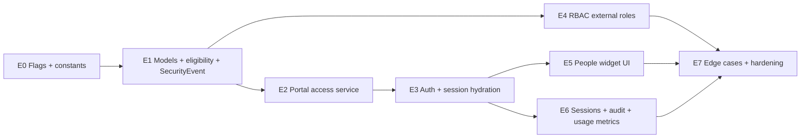

# External User / Portal Framework — Implementation Plan

> **Spec:** [`EXTERNAL_USER_PORTAL_FRAMEWORK.md`](./EXTERNAL_USER_PORTAL_FRAMEWORK.md)  
> **Status:** Ready for engineering execution  
> **Flag:** `PORTAL_FRAMEWORK_V1`  
> **RBAC dependency:** P1+P4 minimum for full security (E4); E0–E3 unblocked with inline permissions

---

## 1. Summary

8 workstreams, ~10–12 weeks. Multi-portal from day one.

**Reuse:**

- `userInviteService` / `userAccountEmailService`
- `authSessionService` / `authController`
- `runtimePermissionResolver` / `rolePermissionProjection`
- **`SecurityEvent`** + `securityAuditService` (not a new portal audit collection)
- `securityLogger` event naming patterns
- Tenant `statusTypes` config (Settings → Organization Status Types)

---

## 2. Guiding rules

1. **Extend User** — no `ExternalUser` / `PortalAuditLog` collections.
2. **People is admin surface** — lifecycle from People widget.
3. **Session-only active role** — `activeExternalRoleId` in JWT; hydrate in memory; **never persist `roleId` on external users**.
4. **Configurable eligibility** — read `portalEligibility` + picklist `portalEligible` flags; no hardcoded `"Active"` strings in code.
5. **V1 usage only** — count external users; no seat blocking until V1.5.
6. **Audit via SecurityEvent** — `securityAuditService.record({ type: 'portal_*', … })`.
7. **SSO-ready** — `authProvider` schema in E1; routes in V2.

---

## 3. Workstream map

---

## 4. Phase breakdown

### E0 — Scaffolding (2 days)

| Task | Files |
|------|-------|
| `PORTAL_FRAMEWORK_V1` flag | `server/utils/portalFeatureFlags.js` (new), `validateEnv.js` |
| Portal SecurityEvent type constants | `server/constants/portalSecurityEventTypes.js` (new) |
| Default `portalEligibility` seed shape | `server/constants/portalEligibilityDefaults.js` (new) |

**Exit:** Flags default `false`. CI green.

---

### E1 — Foundation (1.5 weeks)

#### E1a — Schema

| Task | Files |
|------|-------|
| `People.portalAccess` (no status field) | `server/models/People.js` |
| User external fields; **no roleId usage for EXTERNAL** | `server/models/User.js` |
| External role parent validation | `server/models/Role.js` |
| **`SecurityEvent` model** (platform, tenant-scoped) | `server/models/SecurityEvent.js` (new) |
| **`securityAuditService`** — append-only writer | `server/services/securityAuditService.js` (new) |
| Extend `securityLogger` to optionally persist SecurityEvent | `server/middleware/securityLoggingMiddleware.js` |
| System field exclusions | `moduleController.js`, `globalSystemFields.ts` |

#### E1b — Configurable eligibility

| Task | Files |
|------|-------|
| `resolvePortalEligibility(org, tenantConfig)` | `server/services/organizationPortalEligibilityService.js` (new) |
| Extend status picklist schema with `portalEligible` | settings status-types API + seed |
| Default `portalEligibility` on tenant seed | tenant seeder |
| Unit tests with **custom** picklist values | `__tests__/organizationPortalEligibilityService.test.js` |

#### E1c — Invariants

| Task | Files |
|------|-------|
| Block People delete when portal enabled | `deletionService.js` |
| Org types: DEALER, CONTRACTOR, AUDITOR | `moduleProjections.js` |

**Exit:** Eligibility tests pass with tenant-custom status labels; SecurityEvent writes; People delete blocked.

---

### E2 — Portal access service + API (1.5 weeks)

| Task | Files |
|------|-------|
| `portalAccessService` | `server/services/portalAccessService.js` (new) |
| Audit via `securityAuditService` | same + `securityAuditService.js` |
| People portal routes + controller | `peoplePortalRoutes.js`, `peoplePortalController.js` |
| Org update → eligibility sync | org controller hook |
| **No seat check on enable (V1)** | — |

**Exit:** Enable/disable E2E; SecurityEvent rows queryable; org inactivation sync works.

---

### E3 — Auth + session hydration (2 weeks)

| Task | Files |
|------|-------|
| JWT: `activeExternalRoleId` for external users | `authSessionService.js`, `authController.js` |
| **`externalRoleSessionService.hydrateExternalUserSession`** | new service |
| **`hydrateUserPermissionsFromRole` branch for EXTERNAL** | `rolePermissionProjection.js` |
| **`resolveUserFromToken` pass-through claim** | `resolveUserFromToken.js` |
| Portal select / switch → re-issue JWT | `authRoutes.js`, `authController.js` |
| Client: PortalSelection, PortalSwitcher | Vue components |
| Auth store refresh on switch | `auth.js` |

**Critical:** Verify external user document **`roleId` is never written** in any code path.

**Exit:** Multi-portal login → select → switch; permissions change; single-portal skips selection.

---

### E4 — External roles + RBAC (2 weeks)

Unchanged scope. `externalRoleSessionService` calls `applyProjectionToUser(roleLean)` in memory.

---

### E5 — People widget UI (1 week)

Display **User.status** (fetched via `portalAccess.userId`), not a duplicated People field.

---

### E6 — Sessions, audit UI, usage metrics (1.5 weeks)

| Task | Files |
|------|-------|
| Session store + concurrent limits | `sessionService.js` |
| Terminate sessions on disable/reset/role removal | `portalAccessService` |
| Login history from SecurityEvent | people portal audit endpoint |
| **`usage.externalUsers.active` counter** | `Organization` model + increment/decrement on lifecycle |
| Usage API / admin widget | settings or billing controller |
| PostHog events | portal_* |
| ~~Seat enforcement~~ | **V1.5** |

**Exit:** Usage count accurate; login history from SecurityEvent; sessions enforced.

---

### E7 — Edge cases + hardening (1.5 weeks)

Include test: external user with stale `roleId` in DB is ignored; JWT `activeExternalRoleId` wins.

---

## 5. V1.5 — Seat enforcement (follow-on, ~1 week)

| Task | Files |
|------|-------|
| `limits.externalUserSeats` | `Organization.js` |
| Block enable at limit | `portalAccessService.enable` |
| Billing dashboard integration | billing service |

---

## 6. Testing matrix (additions)

| Case | Expected |
|------|----------|
| Tenant marks "Prospect" as portalEligible | Enable allowed when org status = Prospect |
| External user roleId in DB set incorrectly | Ignored; JWT activeExternalRoleId used |
| Enable over usage limit (V1) | **Allowed**; usage count increments |
| Enable over seat limit (V1.5) | Blocked |

---

## 7. Timeline

| Milestone | Workstreams | Duration |
|-----------|-------------|----------|
| M1 — Foundation | E0, E1, E2 | ~3 weeks |
| M2 — Login + multi-portal | E3 | ~2 weeks |
| M3 — Admin UX | E5 | ~1 week |
| M4 — Security + usage | E4, E6, E7 | ~4 weeks |
| M5 — Seat enforcement | V1.5 | ~1 week |
