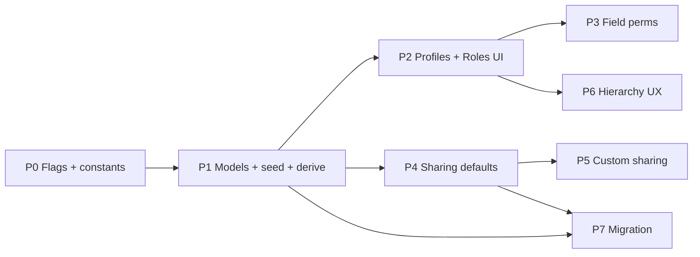

# RBAC v2 — Implementation Plan

> **Spec:** [`RBAC_PROFILES_SHARING.md`](./RBAC_PROFILES_SHARING.md)  
> **Status:** Ready to execute  
> **Flags:** `RBAC_V2`, `SHARING_V1` (env or org feature flag)

---

## 1. Summary

Build in **7 PR-sized workstreams** over ~6–8 weeks. Each workstream is shippable behind flags; production stays on legacy path until P4+P1 are stable.

**Critical path:** P1 (foundation) → P2 (admin UI) → P4 (sharing) → P7 (migration cutover).

**Not in v1:** field-level matrix UI (P3), custom sharing rules UI (P5), drag/drop hierarchy (P6). Backend stubs OK; UI can lag one phase.

---

## 2. Guiding rules

1. **Extend, don’t rewrite** — `runtimePermissionResolver`, `rolePermissionCatalogService`, `RoleFormDrawer`, `tenantSeeder`.
2. **Flag everything** — `RBAC_V2` gates role-as-package; `SHARING_V1` gates list filters.
3. **One PR = one reviewable concern** — model, API, resolver, UI, migration script separate.
4. **Tests before cutover** — extend `runtimePermissionResolver.test.js`; add `sharingResolver.test.js`, `roleSeedService.test.js`.
5. **Profile optional** — `privilegeMode: inline | profile`; seeded roles use profile; custom roles default to profile picker with inline advanced tab.

---

## 3. Workstream map

---

## 4. Phase breakdown

### P0 — Scaffolding (2–3 days)

**Goal:** Feature flags, constants, no behavior change.

| Task | Files |
|------|-------|
| Add `RBAC_V2`, `SHARING_V1` to `server/config/validateEnv.js` (optional booleans) | `server/config/validateEnv.js` |
| `isRbacV2Enabled(org?)` helper | `server/utils/rbacFeatureFlags.js` (new) |
| Profile permission key constants | `server/permissions/profileKeys.js` (new) |
| Link from spec §11 | `RBAC_PROFILES_SHARING.md` |

**Exit:** Flags read; default `false`. CI green.

---

### P1 — Foundation: Profiles, Role packaging, User derive (1.5–2 weeks)

**Goal:** New orgs get Sales Manager / Sales Executive + profiles; invite uses role only when `RBAC_V2=true`.

#### P1a — Profile model + CRUD API

| Task | Files |
|------|-------|
| `Profile` mongoose schema | `server/models/Profile.js` (new) |
| `wrapTenantModel(Profile)` | same |
| Controller: list, get, create, update, delete, clone | `server/controllers/profileController.js` (new) |
| Routes mount | `server/routes/profileRoutes.js` (new), `server/server.js` |
| Permission: `requirePermission('settings', 'manageRoles')` | routes |
| Validation: unique name per org, block delete if roles reference | controller |

**Tests:** `server/utils/__tests__/profileController.test.js` or integration in `server/tests/`.

#### P1b — Role schema extensions

| Task | Files |
|------|-------|
| Add `userType`, `privilegeMode`, `profileId`, `appEntitlements[]`, `recordAssignment`, `isTemplateSeed`, `fieldPermissions` | `server/models/Role.js` |
| Defaults: `privilegeMode: 'profile'`, `userType: 'INTERNAL'` | schema |
| Extend create/update validation in | `server/controllers/roleController.js` |
| Populate `profileId` on GET | roleController |

#### P1c — Seed service (replaces `createDefaultRoles`)

| Task | Files |
|------|-------|
| `roleSeedService.seedForOrganization(org)` | `server/services/roleSeedService.js` (new) |
| Seed system profiles (`platform_full`, `sales_manager`, `sales_standard`, `read_only`) | service |
| Seed roles: Owner, Administrator, Sales Manager, Sales Executive | service |
| Wire `appEntitlements` from `org.enabledApps` + `appRegistry` | service |
| `POST /api/roles/seed` | `roleController.js`, `roleRoutes.js` |
| Call from `tenantSeeder.seedDefaultRoles` when `RBAC_V2` | `server/services/provisioning/tenantSeeder.js` |
| Call from `authController` register when `RBAC_V2` | `server/controllers/authController.js` |
| Keep `createDefaultRoles` for legacy flag off | `Role.js` |

**Profile matrices:** Build from existing `buildFullPrivilegedRolePermissions()` + Manager/User blocks in `Role.createDefaultRoles` — extract to `server/services/profileMatrixBuilders.js` (new).

#### P1d — Materialize from Profile

| Task | Files |
|------|-------|
| Load Profile in `materializeRuntimePermissionsOnUser` when `role.privilegeMode === 'profile'` | `server/services/runtimePermissionResolver.js` |
| `resolveEffectiveRolePermissions(roleLean, profileLean)` | `server/utils/rolePermissionProjection.js` |
| `deriveAppAccessFromRole(role)` → `appAccess[]`, `allowedApps[]` | `server/services/roleEntitlementService.js` (new) |
| On login / `getProfile` / `protect`: materialize + derive | `authMiddleware.js`, `userController.getProfile`, `rolePermissionProjection.syncUserFromRole` |

#### P1e — User invite / update simplification

| Task | Files |
|------|-------|
| When `RBAC_V2`: invite body `{ email, firstName, lastName, roleId }` only | `userController.inviteUser` |
| Derive `userType`, `appAccess`, `allowedApps`, `permissions` from role | invite + update |
| Reject client-sent `appAccess` when `RBAC_V2` (400 + code) | userController |
| Simplify `InviteUserDrawer.vue` — role picker + preview chips | `client/src/components/settings/InviteUserDrawer.vue` |
| Simplify `EditUserModal.vue` — hide app pickers when flag on | `EditUserModal.vue` |
| Read flag from org settings or env | `client/src/config/` or org capabilities API |

**Exit criteria:**
- [ ] New org (flag on): 4 roles + 4 profiles seeded
- [ ] Invite with Sales Executive → user gets SALES USER appAccess without UI picker
- [ ] Legacy org (flag off): unchanged
- [ ] `runtimePermissionResolver` tests pass with profile-sourced role

**PR slice:** P1a → P1b → P1c → P1d → P1e (5 PRs).

---

### P2 — Admin UI: Profiles + Role drawer updates (1–1.5 weeks)

**Goal:** Admins manage profiles; role drawer shows privilege mode + apps tab.

| Task | Files |
|------|-------|
| Settings nav: **Profiles** tab | `SettingsLandingPage.vue`, `UserManagement` or new `ProfilesPermissions.vue` |
| `ProfilesList.vue` + `ProfileFormDrawer.vue` | `client/src/components/settings/` (new) |
| Reuse permission matrix from `RoleFormDrawer` → `PermissionMatrixSection.vue` (extract) | refactor |
| Role drawer: **Overview** — `privilegeMode`, `profileId` select, copy-from-profile | `RoleFormDrawer.vue` |
| Role drawer: **Apps & seats** tab — `appEntitlements` toggles | `RoleFormDrawer.vue` |
| API client methods | `apiClient` or `services/profilesApi.js` |
| i18n keys | `client/src/locales/en/settings.json` + `npm run i18n:sync-keys` |

**Exit criteria:**
- [ ] Create profile, assign to role, linked role users get new permissions on next login
- [ ] `privilegeMode: inline` still works (matrix writes to `Role.appPermissions`)

**PR slice:** extract matrix → Profiles UI → Role drawer tabs (3 PRs).

---

### P3 — Field permissions (1 week, can parallel P4)

**Goal:** Profile/Role field tri-state enforced on API + record forms.

| Task | Files |
|------|-------|
| `fieldPermissions` on Profile schema (already in spec) | `Profile.js` |
| Extend `GET /api/roles/modules` with field catalog per module | `rolePermissionCatalogService.js`, `roleController` |
| `resolveFieldPermission(user, appKey, moduleKey, fieldKey)` | `server/services/fieldPermissionResolver.js` (new) |
| Integrate into `fieldAccessControl.js` | existing |
| Client: `fieldCapabilityEngine.ts` reads materialized field perms | `client/src/platform/fields/` |
| Profile/Role drawer: expandable field rows (MVP: SALES deals + people only) | drawer components |

**Exit criteria:**
- [ ] Field marked `hidden` omitted from API projection and form
- [ ] PATCH with hidden field → 403

**Defer:** full module coverage; ship CRM core first.

---

### P4 — Sharing defaults + Private hierarchy (1.5–2 weeks)

**Goal:** Replace `filterByOwnership` with sharing resolver for deals, people, cases.

#### P4a — Models + seed

| Task | Files |
|------|-------|
| `ModuleSharingDefault` schema | `server/models/ModuleSharingDefault.js` (new) |
| Seed defaults per enabled module (§8.5) | `server/services/sharingSeedService.js` (new) |
| Call on org create + app enable | `tenantSeeder`, org settings hook |

#### P4b — Resolver

| Task | Files |
|------|-------|
| `sharingResolver.js` — build visibility filter | `server/services/sharingResolver.js` (new) |
| `roleHierarchyService.js` — descendant role IDs, user IDs by role | `server/services/roleHierarchyService.js` (new) |
| Owner field map per module (§4.3) | constants in sharingResolver |
| `applySharingFilter(module)` middleware | `permissionMiddleware.js` |
| Wire deals, people, cases list routes | `dealRoutes`, `peopleRoutes`, `caseRoutes` |
| Keep `filterByOwnership` when `SHARING_V1=false` | middleware |

**Tests:** `server/utils/__tests__/sharingResolver.test.js` — private + hierarchy, public_read, record_level, bypass.

#### P4c — Sharing settings UI

| Task | Files |
|------|-------|
| `SharingRulesSettings.vue` — default mode grid per app | `client/src/components/settings/` (new) |
| Settings nav entry | `SettingsLandingPage.vue` |
| API routes | `server/routes/sharingRoutes.js`, controller |

**Exit criteria:**
- [ ] Deals `private`: Sales Manager sees Sales Executive deals
- [ ] Sales Executive sees only own deals
- [ ] `canViewAllData` still bypasses

**PR slice:** P4a → P4b → P4c.

---

### P5 — Custom sharing rules (1 week)

| Task | Files |
|------|-------|
| `ModuleSharingRule` schema | `server/models/ModuleSharingRule.js` (new) |
| CRUD API | `sharingController.js` |
| Union custom rules in `sharingResolver` | `sharingResolver.js` |
| Expandable row + Add Custom Rule modal | `SharingRulesSettings.vue` |
| Group/Role pickers | reuse from `GroupFormModal`, roles API |

**Exit criteria:**
- [ ] Rule: Director role records → Marketing Group read-only works on list

---

### P6 — Hierarchy UX + assignment (1 week)

| Task | Files |
|------|-------|
| `PATCH /api/roles/:id/move` — reparent, cycle check, level recalc | `roleController.js` |
| Drag-and-drop in `OrganizationHierarchy.vue` | client |
| `recordAssignment` on Role — save in drawer | `RoleFormDrawer.vue` |
| `canAssignRecordTo(user, targetUserId)` | `server/services/recordAssignmentService.js` (new) |
| Enforce on deal/people/case assign endpoints | controllers |

**Defer:** co-owners (`recordShares[]`) to post-v1.

---

### P7 — Migration + cutover (1 week)

| Task | Files |
|------|-------|
| Migration script: existing tenants | `server/scripts/migrateRbacV2.js` (new) |
| Map Admin→Administrator, Manager→Sales Manager, User→Sales Executive | script |
| Viewer users → Sales Executive + `read_only` profile | script |
| Create profiles from existing role permissions | script |
| Backfill `appEntitlements` from `user.appAccess` | script |
| Dry-run mode `--dry-run` | script |
| Enable `RBAC_V2` per org in `organization.settings` | optional gradual rollout |
| Remove client appAccess pickers entirely after 100% migration | cleanup PR |

**Exit criteria:**
- [ ] All prod tenants migrated or flag-off documented
- [ ] No writes to `User.appAccess` on invite/update when flag on

---

## 5. PR sequence (recommended)

| # | Title | Phase | Risk |
|---|-------|-------|------|
| 1 | feat(rbac): feature flags + profile key constants | P0 | Low |
| 2 | feat(rbac): Profile model and CRUD API | P1a | Low |
| 3 | feat(rbac): extend Role schema for v2 fields | P1b | Low |
| 4 | feat(rbac): profile matrix builders + seed service | P1c | Med |
| 5 | feat(rbac): materialize permissions from Profile | P1d | Med |
| 6 | feat(rbac): derive appAccess from role; simplify invite | P1e | **High** |
| 7 | feat(rbac): Profiles settings UI | P2 | Low |
| 8 | feat(rbac): Role drawer profile + apps tabs | P2 | Med |
| 9 | feat(rbac): sharing default models + seed | P4a | Low |
| 10 | feat(rbac): sharingResolver + middleware | P4b | **High** |
| 11 | feat(rbac): sharing defaults settings UI | P4c | Low |
| 12 | feat(rbac): custom sharing rules | P5 | Med |
| 13 | feat(rbac): field permissions enforcement | P3 | Med |
| 14 | feat(rbac): hierarchy move + assignment rules | P6 | Low |
| 15 | feat(rbac): migration script + cutover | P7 | **High** |

**Ship to staging after PR 6** (internal dogfood with `RBAC_V2=true`).  
**Ship sharing after PR 10** (`SHARING_V1=true` on staging).

---

## 6. Key file inventory (existing → extend)

| Area | Existing | Change |
|------|----------|--------|
| Role defaults | `Role.createDefaultRoles` | Superseded by `roleSeedService` when flag on |
| Permission runtime | `runtimePermissionResolver.js` | Load Profile |
| Projection | `rolePermissionProjection.js` | Merge profile + entitlements |
| Invite | `userController.inviteUser` | Derive from role |
| Auth | `authMiddleware.protect` | Ensure materialize includes profile |
| Role UI | `RoleFormDrawer.vue`, `RolesPermissions.vue` | Tabs, profile link |
| Hierarchy UI | `OrganizationHierarchy.vue` | Default tab; drag later |
| List filters | `filterByOwnership` | `applySharingFilter` |
| Tenant bootstrap | `tenantSeeder.js`, `authController` register | Call seed service |
| Tests | `runtimePermissionResolver.test.js` | + profile + sharing cases |

---

## 7. Testing strategy

### Unit

- `profileMatrixBuilders` — matrices match legacy Manager/User permissions
- `roleSeedService` — correct tree for SALES-only org
- `deriveAppAccessFromRole` — matches `appRegistry` validation
- `sharingResolver` — private hierarchy, public modes, bypass
- `roleHierarchyService` — descendant IDs, no cycles

### Integration

- Register org → roles + profiles exist
- Invite Sales Executive → login → deals list scoped (with SHARING_V1)
- Change profile → users with linked role get new perms on profile refresh
- Flag off → legacy invite with appAccess still works

---

## 7.1 Regression test checklist (required before cutover)

Run the blocks that apply at each gate. **Flag-off block is mandatory on every PR** until P7 cleanup ships.

### Gate A — Every PR (flags OFF, production path)

Proves deploy did not change behavior for existing tenants.

| # | Test | Pass criteria |
|---|------|----------------|
| A1 | Login as existing owner | Dashboard loads; all org-enabled apps in shell |
| A2 | Login as existing non-owner user | Sidebar modules match pre-deploy |
| A3 | `GET /api/deals` as user without viewAll | Only own deals (current `filterByOwnership`) |
| A4 | Invite user with legacy payload (`appAccess`, `userType`, `roleId`) | User created; correct apps on `user.appAccess` |
| A5 | Edit user — change per-app role in `EditUserModal` | `appAccess` updates; login reflects change |
| A6 | `checkPermission` on deals create/edit/delete | Same 403/200 as before for manager vs user roles |
| A7 | New org register (flag off) | Still seeds Owner/Admin/Manager/User/Viewer via `createDefaultRoles` |
| A8 | CI: `runtimePermissionResolver.test.js` | All existing tests pass unchanged |

### Gate B — After P1 (RBAC_V2 ON, SHARING_V1 OFF)

Pilot org or staging tenant with `organization.settings.rbacV2Enabled = true`.

| # | Test | Pass criteria |
|---|------|----------------|
| B1 | Register new org (flag on) | Roles: Owner, Administrator, Sales Manager, Sales Executive; profiles seeded |
| B2 | Founder login | `isOwner` + Owner role; all enabled apps visible |
| B3 | Invite Sales Executive (role only) | No app picker required; `user.appAccess` = `[{ appKey: SALES, roleKey: USER }]` |
| B4 | Invited rep login | SALES sidebar; can create deal/people per `sales_standard` profile |
| B5 | Invite Sales Manager | `appRoleKey: MANAGER`; can access reports/export per profile |
| B6 | Change user role Executive → Manager | `appAccess` + permissions re-derived; no stale permissions |
| B7 | Edit profile `sales_standard` (remove deals.create) | Linked role users denied create after profile refresh/login |
| B8 | Custom role `privilegeMode: profile` | Permissions match linked profile |
| B9 | Custom role `privilegeMode: inline` | Permissions match inline matrix; no profile required |
| B10 | Seat limit | Invite when SALES seats full → same error as legacy path |
| B11 | HELPDESK enabled on org | `mergeAppProfiles` adds cases perms to Executive/Manager without extra roles |
| B12 | Reject client `appAccess` on invite when flag on | 400 with clear code; server derives only |
| B13 | Owner / Administrator bypass | Unchanged full access |
| B14 | Compare permission envelope | Script: legacy user vs migrated-equivalent role — same `user.permissions` keys |

### Gate C — After P4 (RBAC_V2 + SHARING_V1 ON)

| # | Test | Pass criteria |
|---|------|----------------|
| C1 | Deals default mode `private` | Executive sees only own deals |
| C2 | Sales Manager list deals | Sees own + all Sales Executive deals (subordinate roles) |
| C3 | Administrator list deals | Sees all (bypass or public per config) |
| C4 | `canViewAllData` role flag | Sees all deals regardless of hierarchy |
| C5 | People `assignedTo` filter | Same hierarchy rules as deals `ownerId` |
| C6 | Cases `assigneeId` filter | Agent sees own; manager sees subordinates |
| C7 | Module `public_read` (items) | All users with module view see all items |
| C8 | Module `record_level` (quotes) | Only owner record visible |
| C9 | Edit deal owned by peer Executive | Denied unless profile grants edit + sharing grants visibility |
| C10 | Flag off still uses `filterByOwnership` | C1–C3 not applied; legacy own/viewAll only |

### Gate D — After P5 (custom sharing rules)

| # | Test | Pass criteria |
|---|------|----------------|
| D1 | Rule: Role A records → Group B read | Group B member sees Role A owner records |
| D2 | Rule read_write only | Target can edit visible records if profile allows |
| D3 | Custom rule + private default | Union of both; not subtractive |
| D4 | Disabled rule | Ignored in resolver |

### Gate E — Migration dry-run (P7, production DB copy)

| # | Test | Pass criteria |
|---|------|----------------|
| E1 | `migrateRbacV2.js --dry-run` | Logs counts; no writes |
| E2 | Live run on copy | All users have `roleId`; no null roles for active users |
| E3 | Admin → Administrator rename | Users on Admin role remapped |
| E4 | Manager → Sales Manager | `profileId` set; permissions equivalent |
| E5 | User → Sales Executive | `appAccess` matches pre-migration |
| E6 | Viewer users | Sales Executive + `read_only` profile; cannot create |
| E7 | Owner users | `isOwner` unchanged; still bypass |
| E8 | Spot-check 5 users | Login + deals list + invite flow |
| E9 | Rollback plan documented | Disable org flag + restore DB snapshot |

### Gate F — Client / UX smoke

| # | Test | Pass criteria |
|---|------|----------------|
| F1 | Settings → Roles hierarchy | Tree shows Sales Manager → Sales Executive |
| F2 | Settings → Profiles | CRUD works; clone works |
| F3 | Settings → Sharing rules | Default mode saves per module |
| F4 | Invite drawer (flag on) | Role picker + read-only app preview only |
| F5 | Invite drawer (flag off) | Legacy app pickers still present |
| F6 | `auth.hasPermission` / `hasAppAccess` | No console errors; gating unchanged for flag off |
| F7 | Platform Home / dynamic routes | Registry routes register after login |
| F8 | Generic module list pages | Load with correct empty states |

### Automated coverage targets

| Area | File / command |
|------|----------------|
| Permission materialize | `server/utils/__tests__/runtimePermissionResolver.test.js` |
| Profile matrices | `server/utils/__tests__/profileMatrixBuilders.test.js` (new) |
| Role seed | `server/utils/__tests__/roleSeedService.test.js` (new) |
| App derive | `server/utils/__tests__/roleEntitlementService.test.js` (new) |
| Sharing | `server/utils/__tests__/sharingResolver.test.js` (new) |
| Full server unit suite | `npm test` in `server/` (existing runner) |

### Sign-off before prod pilot

- [ ] Gate A — all items pass on staging with **flags OFF**
- [ ] Gate B — all items pass on pilot org with **RBAC_V2 ON**
- [ ] Gate C — all items pass with **SHARING_V1 ON**
- [ ] Gate E — dry-run + copy DB migration reviewed
- [ ] Gate F — UX smoke on Chrome + one mobile viewport
- [ ] Rollback: org flag disable procedure written in runbook

**Pilot approval:** product + eng sign Gate A + B + C on same staging build. **GA approval:** Gate E on production copy + 72h pilot with no P0 access bugs.

---

## 8. Rollout

| Stage | Action |
|-------|--------|
| **Dev** | Both flags `true` |
| **Staging** | `RBAC_V2=true`, `SHARING_V1=true`; run migration dry-run on copy |
| **Prod pilot** | 1–3 tenants via `organization.settings.rbacV2Enabled` |
| **Prod GA** | Migration script; default `RBAC_V2=true` for **new** orgs only |
| **Legacy sunset** | 90 days post-GA: force migration, remove appAccess invite path |

---

## 9. Risks & mitigations

| Risk | Mitigation |
|------|------------|
| Invite regression breaks seat billing | Keep `accessResolutionService`; derive `appAccess` identically; test seat limits |
| Sharing resolver perf (hierarchy user lookup) | Cache `req._sharingContext` per request; index `User.roleId` |
| Profile delete with linked roles | Block delete; force reassign |
| Admin rename breaks legacy `user.role` shim | Map Administrator→admin in shim until enum removed |
| Viewer users orphaned | Migration script explicit step |

---

## 10. Out of scope (v1)

- LMS profiles/roles
- Per-role permission deltas on top of profile (Open decision #5)
- Co-owners / `recordShares`
- Field permissions for all modules (CRM core only in P3)
- `POST /api/roles/sync-from-org` automation (manual seed OK for v1)
- Platform admin cross-tenant role templates

---

## 11. Suggested start (this week)

1. **PR 1** — P0 flags  
2. **PR 2–3** — Profile model + Role schema (parallel-safe)  
3. **PR 4** — `profileMatrixBuilders` + `roleSeedService` with tests  
4. Spike: confirm `inviteUser` call sites and `EditUserModal` appAccess usage (grep done — primary paths identified)

**First demo milestone (end of week 2):** Staging org with Owner / Administrator / Sales Manager / Sales Executive; invite one Sales Executive; login works with derived SALES access.

---

## 12. Open items to lock before P1c

| Item | Decision needed |
|------|-----------------|
| Flag storage | Env-only vs `organization.settings.rbacV2Enabled` — **recommend org setting for gradual rollout** |
| Administrator vs Admin name | Rename in seed only (new orgs) or migration — **seed new; migrate old** |
| `profileIds[]` multi-profile merge | v1: single `profileId` only; app merge via `mergeAppProfiles` at materialize |
| Client flag source | Expose `organization.settings.rbacV2Enabled` on login payload |
